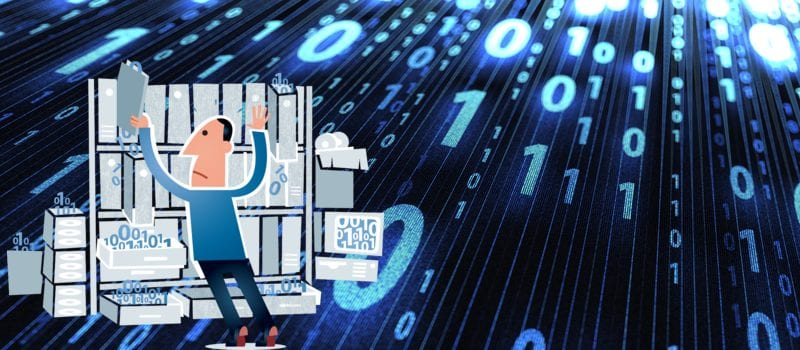

# About the book

## Who this book is written for?

We are living in an era of  information overload. Excess amounts of information are overwhelming and we are even generating data by almost every daily behaviour. Big data has become a buzz word for decade, however, are we getting better at handling data or benefiting more  from data?

**The  answer is no.**

Despite great progress in our ability to collect and store data, we’re still very weak in interpreting data. In 1954, Darrell Huff wrote his best-selling book about how people often intentionally use graphs to spread misinformation, especially in favor of their own products or causes. Today, vastly more misinformation is disseminated unintentionally because people don’t know how to use charts to communicate what they intend.

**Bad communication is everywhere.** We are not ****naturally good at dealing with data or representing. It's just like other knowledge and skills that we obtained during last 20 years. We need to learn how to do  it properly and how to make it better.

That's my main intention to write this book. Visualization is a powerful tool for telling a story about a data set or analysis. If done correctly, visualization not only displays data but also help the audience digest key information.

**The  book is for you**:

* If you have challenges in dealing with numbers
* If you need to presenting quantitative information
* If you are suffering from presentation, report, or your dashboard
* If you want to learn more on data exploration in programming language

## How this book is organized

### **The book contained concept part and practical part.**

* [Chapter 1 ](part-1-introduction-of-data-visualisation/)explains what data visualization is and why it matters
* [Chapter 2 ](tricks-in-visualisation/)explains common tricks in visualization and how to avoid the pitfalls
* [Chapter 3](visualisation-in-python/) is a tutorial on python visualization, including programming
* [Chapter 4](visualisation-in-r/) is a tutorial on R visualization, including programming
* [Chapter 5 ](visualisation-application/)is a tutorial on  visualization application, including programming

### **Prerequisite**

| _**Content**_ | _**Prerequisite**_ |
| :--- | :--- |
| Chapter 1 | None |
| Chapter 2 | Basic Statistics |
| Chapter 3 | Basic Python Programming |
| Chapter 4 | Basic R Programming |
| Chapter 5 | Advanced Python and R Programming |

## About the author

