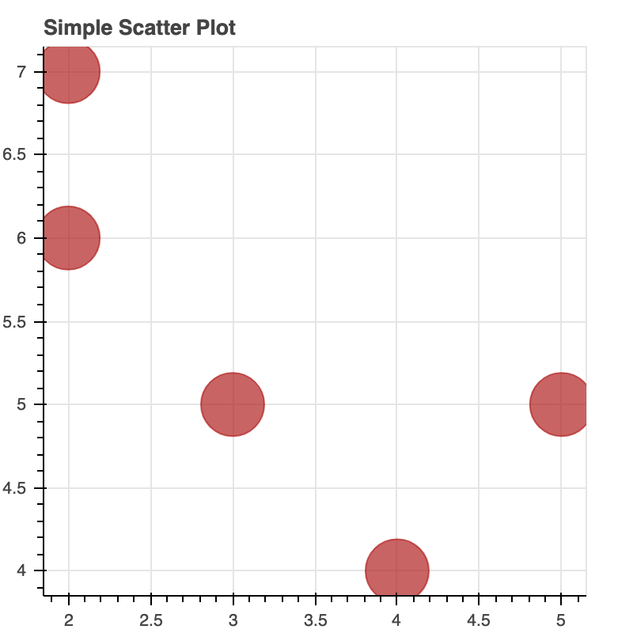
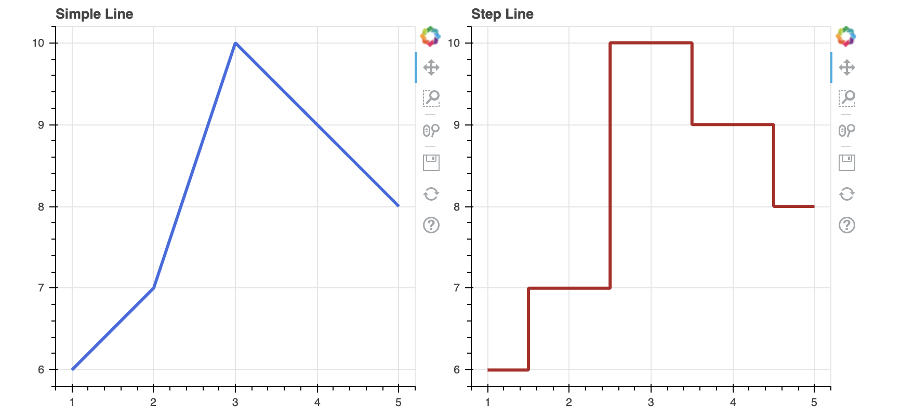
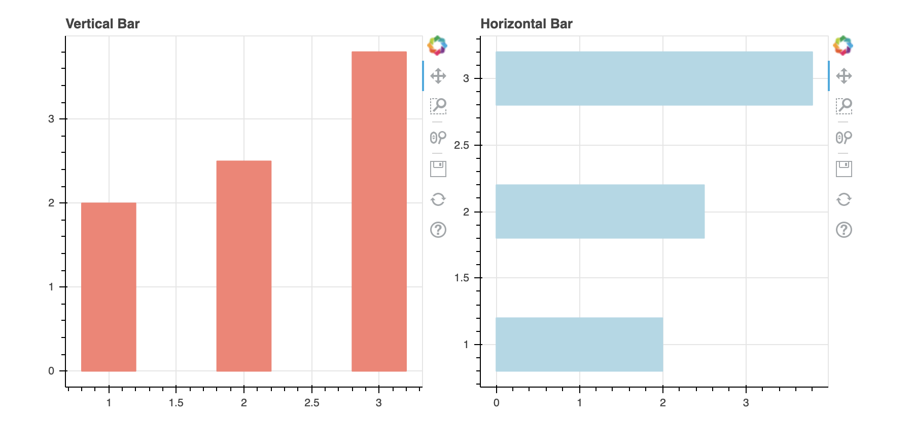
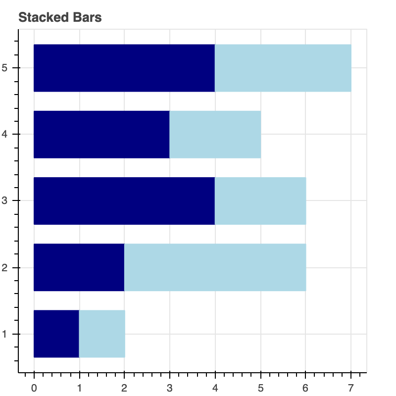
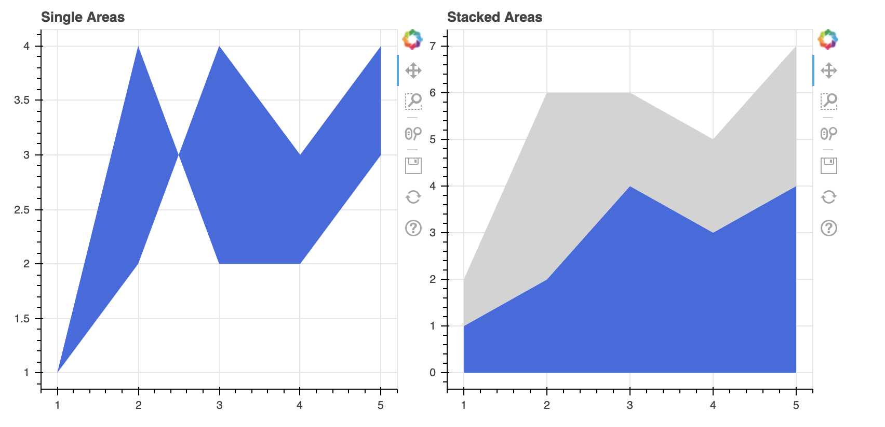
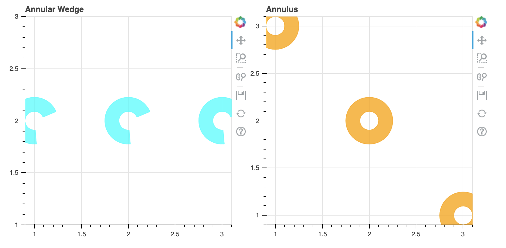
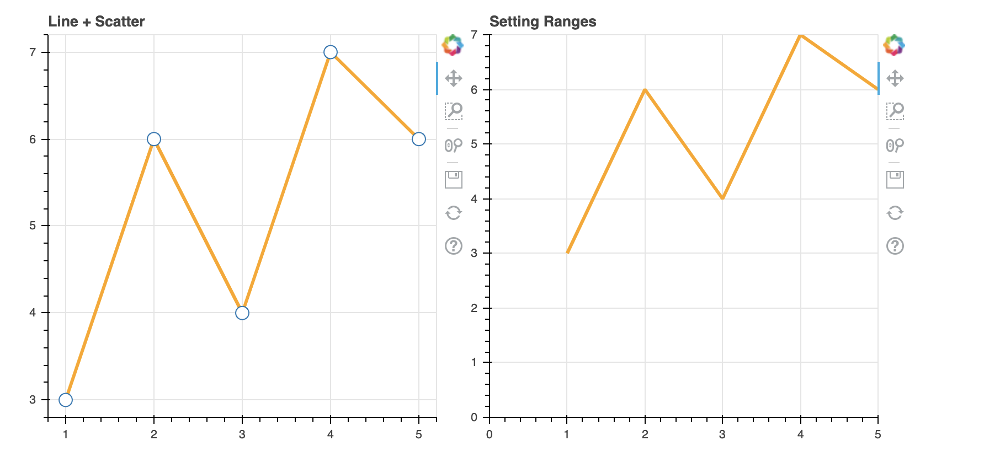

# 5.1 Basic Plotting

## Creating Figures

Note that Bokeh plots created using the `bokeh.plotting` interface come with a default set of tools, and default visual styles. Later we will learn  **Styling Visual Attributes** for information about how to customize the visual style of plots.

### 1. Scatter  and  Markers

All the markers have the same set of properties: `x`, `y`, `size`, and `angle` \(radians by default\).

```text
# Standard import
from bokeh.plotting import figure, output_file, show
output_notebook()
```

```text
# set the figure size and title
p = figure(plot_width=400, plot_height=400,title="Simple Scatter Plot")

# add a circle renderer with a size, color, and alpha
p.circle([2, 2, 3, 4, 5], [6, 7, 5, 4, 5], size=40, color="firebrick", alpha=0.7)
show(p)
```




**There are lots of marker types available in Bokeh:**

<table>
  <thead>
    <tr>
      <th style="text-align:left">
        <ul>
          <li><a href="https://docs.bokeh.org/en/latest/docs/reference/plotting.html#bokeh.plotting.figure.Figure.asterisk"><code>asterisk()</code></a>
          </li>
          <li><a href="https://docs.bokeh.org/en/latest/docs/reference/plotting.html#bokeh.plotting.figure.Figure.circle"><code>circle()</code></a>
          </li>
          <li><a href="https://docs.bokeh.org/en/latest/docs/reference/plotting.html#bokeh.plotting.figure.Figure.circle_cross"><code>circle_cross()</code></a>
          </li>
          <li><a href="https://docs.bokeh.org/en/latest/docs/reference/plotting.html#bokeh.plotting.figure.Figure.circle_dot"><code>circle_dot()</code></a>
          </li>
          <li><a href="https://docs.bokeh.org/en/latest/docs/reference/plotting.html#bokeh.plotting.figure.Figure.circle_x"><code>circle_x()</code></a>
          </li>
          <li><a href="https://docs.bokeh.org/en/latest/docs/reference/plotting.html#bokeh.plotting.figure.Figure.circle_y"><code>circle_y()</code></a>
          </li>
          <li><a href="https://docs.bokeh.org/en/latest/docs/reference/plotting.html#bokeh.plotting.figure.Figure.cross"><code>cross()</code></a>
          </li>
          <li><a href="https://docs.bokeh.org/en/latest/docs/reference/plotting.html#bokeh.plotting.figure.Figure.dash"><code>dash()</code></a>
          </li>
          <li><a href="https://docs.bokeh.org/en/latest/docs/reference/plotting.html#bokeh.plotting.figure.Figure.dot"><code>dot()</code></a>
          </li>
        </ul>
      </th>
      <th style="text-align:left">
        <ul>
          <li><a href="https://docs.bokeh.org/en/latest/docs/reference/plotting.html#bokeh.plotting.figure.Figure.diamond"><code>diamond()</code></a>
          </li>
          <li><a href="https://docs.bokeh.org/en/latest/docs/reference/plotting.html#bokeh.plotting.figure.Figure.diamond_cross"><code>diamond_cross()</code></a>
          </li>
          <li><a href="https://docs.bokeh.org/en/latest/docs/reference/plotting.html#bokeh.plotting.figure.Figure.diamond_dot"><code>diamond_dot()</code></a>
          </li>
          <li><a href="https://docs.bokeh.org/en/latest/docs/reference/plotting.html#bokeh.plotting.figure.Figure.hex"><code>hex()</code></a>
          </li>
          <li><a href="https://docs.bokeh.org/en/latest/docs/reference/plotting.html#bokeh.plotting.figure.Figure.hex_dot"><code>hex_dot()</code></a>
          </li>
          <li><a href="https://docs.bokeh.org/en/latest/docs/reference/plotting.html#bokeh.plotting.figure.Figure.inverted_triangle"><code>inverted_triangle()</code></a>
          </li>
          <li><a href="https://docs.bokeh.org/en/latest/docs/reference/plotting.html#bokeh.plotting.figure.Figure.plus"><code>plus()</code></a>
          </li>
          <li><a href="https://docs.bokeh.org/en/latest/docs/reference/plotting.html#bokeh.plotting.figure.Figure.square"><code>square()</code></a>
          </li>
          <li><a href="https://docs.bokeh.org/en/latest/docs/reference/plotting.html#bokeh.plotting.figure.Figure.square_cross"><code>square_cross()</code></a>
          </li>
        </ul>
      </th>
      <th style="text-align:left">
        <p></p>
        <ul>
          <li><a href="https://docs.bokeh.org/en/latest/docs/reference/plotting.html#bokeh.plotting.figure.Figure.square_dot"><code>square_dot()</code></a>
          </li>
          <li><a href="https://docs.bokeh.org/en/latest/docs/reference/plotting.html#bokeh.plotting.figure.Figure.square_pin"><code>square_pin()</code></a>
          </li>
          <li><a href="https://docs.bokeh.org/en/latest/docs/reference/plotting.html#bokeh.plotting.figure.Figure.square_x"><code>square_x()</code></a>
          </li>
          <li><a href="https://docs.bokeh.org/en/latest/docs/reference/plotting.html#bokeh.plotting.figure.Figure.triangle"><code>triangle()</code></a>
          </li>
          <li><a href="https://docs.bokeh.org/en/latest/docs/reference/plotting.html#bokeh.plotting.figure.Figure.triangle_dot"><code>triangle_dot()</code></a>
          </li>
          <li><a href="https://docs.bokeh.org/en/latest/docs/reference/plotting.html#bokeh.plotting.figure.Figure.triangle_pin"><code>triangle_pin()</code></a>
          </li>
          <li><a href="https://docs.bokeh.org/en/latest/docs/reference/plotting.html#bokeh.plotting.figure.Figure.x"><code>x()</code></a>
          </li>
          <li></li>
        </ul>
      </th>
    </tr>
  </thead>
  <tbody></tbody>
</table>


### 2. Line Graphs

#### Single line and  step line

Here  is  an  example to  generate a single line glyph from one dimensional sequences of _x_ and _y_ points using the `line()` glyph method and how to draw discrete steps between data points with   `step()` method.

```text
from bokeh.layouts import row    #  create a multiple layouts

p1 = figure(plot_width=400, plot_height=400,title =  'Simple Line')
p1.line([1, 2, 3, 4, 5], [6, 7, 10, 9, 8], line_width=3,color =  'royalblue')

p2 = figure(plot_width=400, plot_height=400,title  = 'Step Line')
p2.step([1, 2, 3, 4, 5], [6, 7, 10, 9, 8], line_width=3,color =  'firebrick', mode='center')

show(row(p1,p2))  # show two figures in a row
```



#### Multiple lines and stacked lines

Sometimes it is useful to plot multiple lines all at once.  Then we can use`multi_line()`to accomplish.  In some instances, it is desirable to stack lines that are aligned on a common index \(e.g. time series of percentages\). Then we use `vline_stack()` or  `hline_stack().`

```text
from bokeh.models import ColumnDataSource   # create a simple dataset in Bokeh
source = ColumnDataSource(data=dict(
    x=[1, 2, 3, 4, 5],
    y1=[1, 2, 4, 3, 4],
    y2=[3, 4, 2, 5, 5],
))
```

```text
p1 = figure(plot_width=400, plot_height=400, title ='Multiple Lines')

p1.multi_line([[2, 3, 4], [3, 4, 5, 6]], [[3, 4, 5], [6, 7, 8, 3]],
             color=["firebrick", "royalblue"], line_width=3)

p2 =  figure(plot_width=400, plot_height=400, title ='Stacked Lines')
p2.vline_stack(['y1', 'y2'], x='x',line_width  = 4, source=source)

show(row(p1,p2))
```


### 3. Bars

#### Vertical Bar and Horizontal Bar

When drawing rectangular bars \(often representing intervals\) it is often more convenient to have coordinates that are a hybrid of the two systems above.

* to draw vertical bars by specifying a \(center\) x-coordinate, width, and top and bottom endpoints, use the [`vbar()`](https://docs.bokeh.org/en/latest/docs/reference/plotting.html#bokeh.plotting.figure.Figure.vbar)  function.
* to draw horizontal bars by specifying a \(center\) y-coordinate, height, and left and right endpoints, use the [`hbar()`](https://docs.bokeh.org/en/latest/docs/reference/plotting.html#bokeh.plotting.figure.Figure.hbar) function.

```text
p1 = figure(plot_width=400, plot_height=400,title  ='Vertical Bar')
p1.vbar(x=[1, 2, 3], width=0.4, bottom=0,
       top=[2, 2.5, 3.8], color="salmon")

p2 = figure(plot_width=400, plot_height=400,title  ='Horizontal Bar')
p2.hbar(y=[1, 2, 3], height=0.4, left=0,
       right=[2, 2.5, 3.8], color="lightblue")
show(row(p1,p2))
```



#### Stacked Bar

```text
source = ColumnDataSource(data=dict(
    y=[1, 2, 3, 4, 5],
    x1=[1, 2, 4, 3, 4],
    x2=[1, 4, 2, 2, 3],
))

p = figure(plot_width=400, plot_height=400,title  = 'Stacked Bars')
p.hbar_stack(['x1', 'x2'], y='y', height=0.7, 
        color=("navy", "lightblue"), source=source)

show(p)
```



### 4. Directed Areas

Directed areas are filled regions between two series that share a common index. For instance, a vertical directed area has one x coordinate array, and two y coordinate arrays, y1 and y2, which will be filled between.

* A single directed area between two aligned series can be created in the vertical direction with `varea()` or in the horizontal direction with `harea()`
* The stacked  area can be accomplished with the `varea_stack()` and `harea_stack()`

#### Single Area and Stacked Areas

```text
source = ColumnDataSource(data=dict(
    x=[1, 2, 3, 4, 5],
    y1=[1, 2, 4, 3, 4],
    y2=[1, 4, 2, 2, 3],
))

p1 = figure(plot_width=400, plot_height=400,title ='Single Areas')
p1.varea(x='x',  y1='y1', y2='y2',source  = source, color = 'royalblue')

p2 = figure(plot_width=400, plot_height=400,title ='Stacked Areas')

p2.varea_stack(['y1', 'y2'], x='x', 
            color=("royalblue", "lightgrey"), source=source)

show(row(p1,p2))
```



### 5. Polygons

Below is an example that shows how to generate a single polygonal patch glyph from one- dimensional sequences of _x_ and _y_ points using the `patch()`  method  and  how to plot multiple polygonal patches all at once  using `patches()`

```text
p1 = figure(plot_width=400, plot_height=400, title = 'Single Patch')

# add a patch renderer with an alpha an line width
p1.patch([1, 2, 3, 4,5], [3,2,3,4,3], color = 'salmon',  alpha=0.8, line_width=2)

p2 = figure(plot_width=400, plot_height=400,title  = 'Multiple Patches')

p2.patches([[1, 3, 2], [3, 4, 6, 6]], [[2, 1, 4], [4, 7, 8, 5]],
          color=["Salmon", "cyan"], alpha=[0.8, 0.5])


show(row(p1,p2))
```


### 6. Wedges and Arcs

```text
p1 = figure(plot_width=400, plot_height=400,title  = 'Annular Wedge')
p1.annular_wedge(x=[1, 2, 3], y=[2, 2, 2], inner_radius=0.1, outer_radius=0.25,
                start_angle=0.4, end_angle=4.8, color="cyan", alpha=0.7)

p2 = figure(plot_width=400, plot_height=400,title = 'Annulus')
p2.annulus(x=[1, 2, 3], y=[3, 2, 1], inner_radius=0.1, outer_radius=0.25,
          color="orange", alpha=0.8)

show(row(p1,p2))
```



### 7. Combining Glyphs and Setting Range

* Combining multiple glyphs on a single plot is a matter of calling more than one glyph method on a single `Figure`
* By default, Bokeh will attempt to automatically set the data bounds of plots to fit snugly around the data. Sometimes, you may need to set a plot’s range explicitly. Then we  use `x_range`  and `y_range`

```text
x = [1, 2, 3, 4, 5]
y = [3, 6, 4, 7,6 ]

p1 = figure(plot_width=400, plot_height=400,title  = 'Line + Scatter')
# add both a line and circles on the same plot
p1.line(x, y, line_width=3,color = 'orange')
p1.circle(x, y, fill_color="white", size=12)

p2 = figure(plot_width=400, plot_height=400, x_range=(0,5), y_range = (0,7),title = 'Setting Ranges')
p2.line(x, y, line_width=3,color = 'orange')
show(row(p1,p2))
```



As we can see from the graph,  the left one combines line chart and circle chart together to show the trends. Also,  the  X-axis and Y-axis of the left one do not start with 0. We set the range in the right one and make sure the graph has not been misinterpreted.

