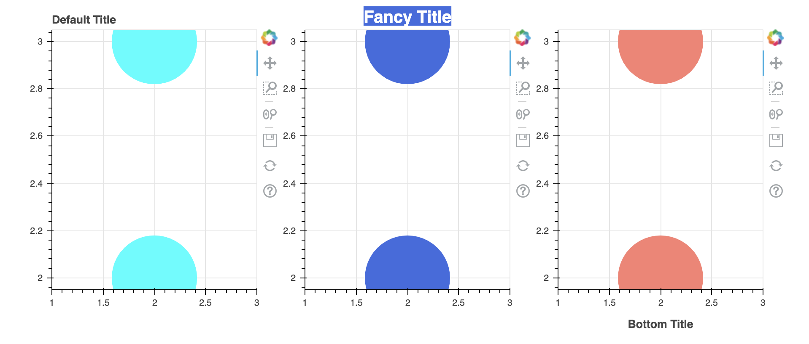
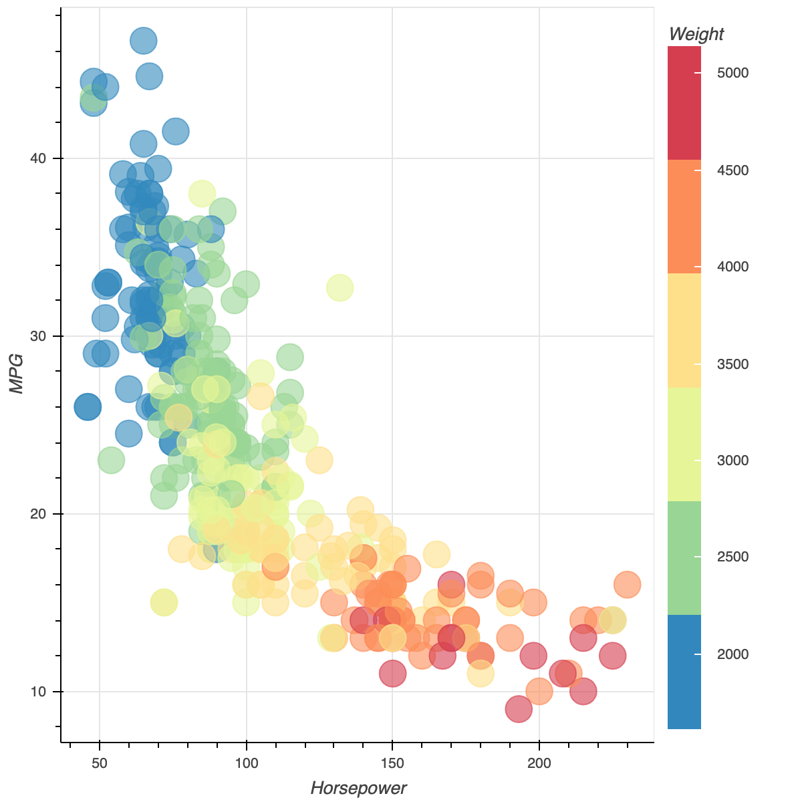
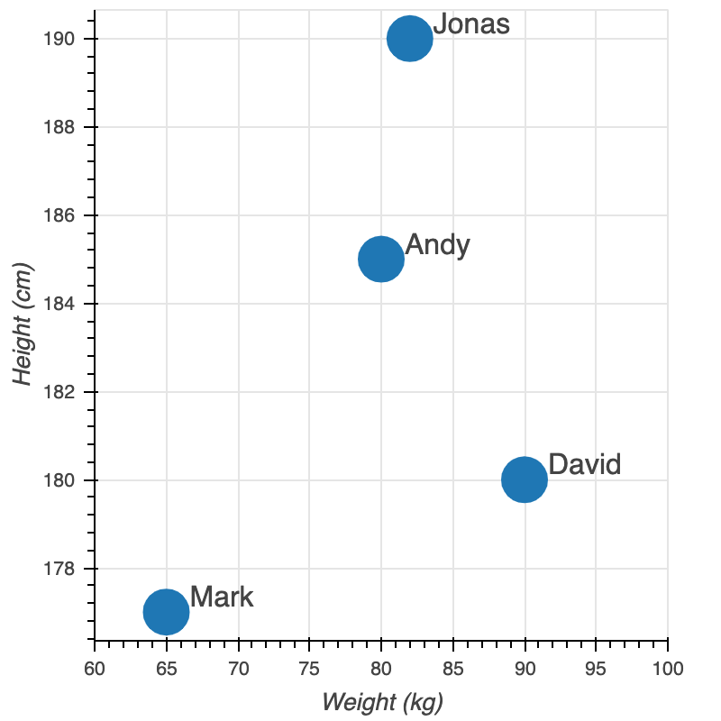

# 5.3 Annotations

Sometimes we want to add visual cues \(boundary lines, shaded regions, labels, and arrows, etc.\) to our plots to call out some feature or other. Bokeh has several annotation types available for uses like this. Typically to add annotations we create the "low level" annotation object directly, and add it to our plot using `add_layout`.

### 1. Title

There are three ways to add and customize a title.    

When using `bokeh.plotting` , the quickest way to add a basic title is to pass the text as the `title` parameter to `Figure`. The default title is normally on the top of a plot, aligned to the left. But which side of the plot the default title appears on can be controlled by the `title_location` parameter.

```text
p1 = figure(title="Default Title", plot_width=300, plot_height=300)
p1.circle([2,2], [2,3],size=100, color="cyan")
```

Visual properties for **font, border, background, and others** can be set directly on `.title`.Here is an example that sets font, background properties, and others using 

```text
p2 = figure(plot_width=300, plot_height=300)
p2.circle([2,2], [2,3],size=100, color="royalblue")

p2.title.text = "Fancy Title"
p2.title.align = "center"
p2.title.text_color = "white"
p2.title.text_font_size = "20px"
p2.title.background_fill_color = "royalblue"
```

In addition to the default title, it is possible to create and add additional`Title`objects to plots using the`add_layout`method.  You just need to add a new layout to the graph.

```text
from bokeh.models import Title
p3 = figure(plot_width=300, plot_height=300)
p3.circle([2,2], [2,3],size=100, color="salmon")
p3.add_layout(Title(text="Bottom Title", align="center"), "below")
```

In the end, use `show()` and `row()` to combine the three graphs in alignment. 

```text
show(row(p1,p2,p3))
```



### 2. Legend

#### Basic Legend Label

* To provide a simple explicit label for a glyph, pass the `legend_label` keyword argument
* If multiple glyphs are given the same label, they will all be combined into a single legend item with that label.

Here is an example. Firstly,  we download the stock data and process the DateTime format using Pandas and Numpy.          

```text
from bokeh.sampledata.stocks import AAPL,GOOG, IBM
import pandas as pd
import numpy as np

def datetime(x):
    return np.array(x, dtype=np.datetime64)
```

Then, we plot the three different lines together and give them legends, respectively. At last, we relocate the legend to the top left.       

```text
p = figure(x_axis_type="datetime", title="Stock Price",plot_width=900, plot_height=400)
p.xaxis.axis_label = 'Date'
p.yaxis.axis_label = 'Price'

p.line(datetime(AAPL['date']), AAPL['adj_close'], color='cyan', legend_label='AAPL')
p.line(datetime(GOOG['date']), GOOG['adj_close'], color='royalblue', legend_label='GOOG')
p.line(datetime(IBM['date']), IBM['adj_close'], color='salmon', line_width = 3, legend_label='IBM')
p.legend.location = "top_left"

show(p)
```


#### Manual Legend

It is also possible to not specify any of the legend arguments, and manually build a `Legend` by hand. In particular, if you want to draw multiple legend items for “multi” glyphs,  you can specify an`index`for the legend item.

```text
from bokeh.models import Legend, LegendItem
p = figure(plot_width=400, plot_height=400, title ='Manual Legend')

s = p.multi_line([[2, 3, 4], [3, 4, 5, 6]], [[3, 4, 5], [6, 6, 5, 3]],
             color=["firebrick", "royalblue"], line_width=3)
legend = Legend(items=[
    LegendItem(label="firebrick", renderers=[s], index=0),
    LegendItem(label="royalblue", renderers=[s], index=1),
])
p.add_layout(legend)
show(p)
```


### 3. Color Bar

Color bars are especially useful if we vary the color of a glyph according to some color mapping. Bokeh color bars are configured with a color mapper and added to plots with the `add_layout` method. 

The example below shows a complete example that also uses the color mapper to transform the glyph color.

```text
from bokeh.sampledata.autompg import autompg
from bokeh.models import LinearColorMapper, ColorBar
from bokeh.transform import transform

source = ColumnDataSource(autompg)
color_mapper = LinearColorMapper(palette="Spectral6", low=autompg.weight.min(), high=autompg.weight.max())

p = figure(x_axis_label='Horsepower', y_axis_label='MPG')
p.circle(x='hp', y='mpg', color=transform('weight', color_mapper), size=20, alpha=0.6, source=autompg)

color_bar = ColorBar(color_mapper=color_mapper, label_standoff=12, location=(0,0), title='Weight')
p.add_layout(color_bar, 'right')

show(p)
```



### 4. Arrow

The `Arrow` annotation allows you to "point" at different things on your plot and can be especially useful in conjunction with labels. This arrow has three types that are  [`OpenHead`](https://bokeh.pydata.org/en/latest/docs/reference/models/arrow_heads.html#bokeh.models.arrow_heads.OpenHead) , [`NormalHead`](https://bokeh.pydata.org/en/latest/docs/reference/models/arrow_heads.html#bokeh.models.arrow_heads.NormalHead) , and [`VeeHead`](https://bokeh.pydata.org/en/latest/docs/reference/models/arrow_heads.html#bokeh.models.arrow_heads.VeeHead).  

```text
from bokeh.models import Arrow, NormalHead, OpenHead, VeeHead
from bokeh.plotting import figure, output_file, show


p = figure(plot_width=400, plot_height=400)

p.circle(x=[0, 0.6, 0.6], y=[0, 0, 0.6], radius=0.1,
         color=["royalblue", "yellow", "green"], fill_alpha=0.4)

p.add_layout(Arrow(end=OpenHead(line_color="firebrick", line_width=4),
                   x_start=0, y_start=0, x_end=0.6, y_end=0))

p.add_layout(Arrow(end=NormalHead(fill_color="blue"),
                   x_start=0.6, y_start=0, x_end=0, y_end=0.6))

p.add_layout(Arrow(end=VeeHead(size=35), line_color="black",
                   x_start=0.6, y_start=0.6, x_end=0, y_end=0))

show(p)
```


### 5. Box Annotation

A `BoxAnnotation` can be linked to either data or screen coordinates to emphasize specific plot regions. By default, box annotation dimensions \(e.g. `left` or `top`\) default will extend the annotation to the edge of the plot area.

```text
from bokeh.models import BoxAnnotation

p = figure(x_axis_type="datetime", title="Stock Price",plot_width=900, plot_height=400)
p.line(datetime(AAPL['date']), AAPL['adj_close'], color = 'firebrick',line_width = 2, legend_label='AAPL')

low_box = BoxAnnotation(top=100, fill_alpha=0.1, fill_color='grey')
mid_box = BoxAnnotation(bottom=100, top=450, fill_alpha=0.1, fill_color='firebrick')
high_box = BoxAnnotation(bottom=45, fill_alpha=0.1, fill_color='grey')

p.add_layout(low_box)
p.add_layout(mid_box)
p.add_layout(high_box)

p.xaxis.axis_label = 'Date'
p.yaxis.axis_label = 'Price'
show(p)
```


### 6. Label

Labels are text elements that can be used to annotate either glyphs or plot regions. The position and text to display are configured as `x`, `y`, and `text`.

```text
from bokeh.models import ColumnDataSource, Label, LabelSet, Range1d


source = ColumnDataSource(data=dict(height=[177, 185, 190, 180, ],
                                    weight=[65, 80, 82, 90],
                                    names=['Mark', 'Andy', 'Jonas', 'David']))

p = figure(plot_width=400, plot_height=400, x_range=Range1d(60, 100))
p.scatter(x='weight', y='height', size=25, source=source)

p.xaxis[0].axis_label = 'Weight (kg)'
p.yaxis[0].axis_label = 'Height (cm)'

labels = LabelSet(x='weight', y='height', text='names', level='glyph',
              x_offset=13, y_offset=0, source=source, render_mode='canvas')
p.add_layout(labels)
show(p)
```

With the name label,  we can easily figure out the height and weight of each student.   



### 7.  Span

`Span` annotations are lines that have a single dimension \(width or height\) and extend to the edge of the plot area. You need to specify the `dimension` that should be spanned \(i.e., `width` or `height`\), any visual line properties for the appearance, and the location along the dimension where the line should be drawn.

```text
from bokeh.models.annotations import Span
x = np.linspace(0, 20, 200)
y = np.sin(x)

p = figure(plot_width=400, plot_height=400,y_range=(-2, 2))
p.line(x, y, color = 'hotpink')

upper = Span(location=1, dimension='width', line_color='dodgerblue', line_width=4)
p.add_layout(upper)

lower = Span(location=-1, dimension='width', line_color='forestgreen', line_width=4)
p.add_layout(lower)

show(p)
```


