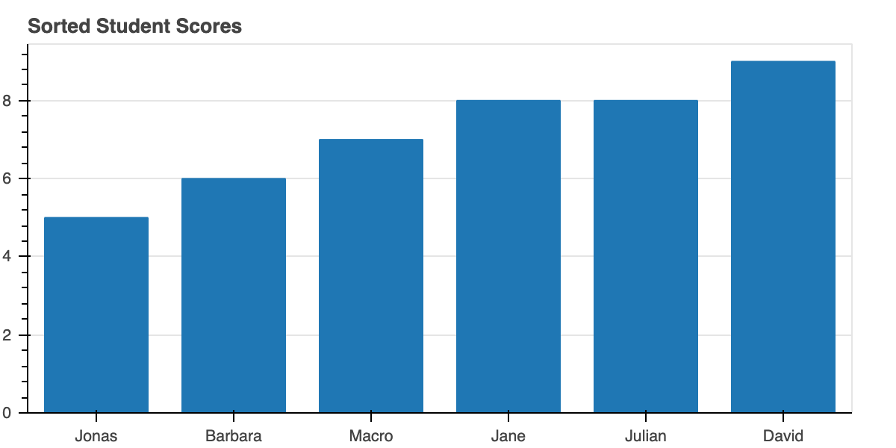
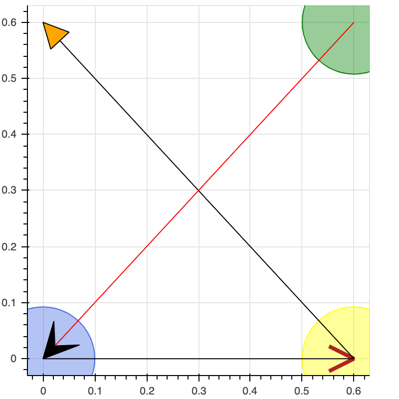
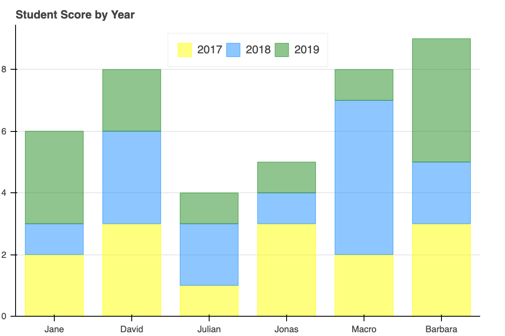

# 5.4 Categorical Data

## Bar Chart

### 1. Sorted Bar

```text
# Here is a list of categorical values (or factors)
names = ['Jane', 'David', 'Julian', 'Jonas', 'Macro', 'Barbara']
scores = [8, 9, 8, 5, 7, 6]
```

```text
# sorting the bars means sorting the range factors
sorted_names = sorted(names, key=lambda x: scores[names.index(x)])
```

```text
p = figure(x_range=sorted_names, plot_height=300, title="Sorted Student Scores")

# Categorical values can also be used as coordinates
p.vbar(x=names, top=scores, width=0.75)

# Set some properties to make the plot look better
p.xgrid.grid_line_color = None
p.y_range.start = 0
show(p)
```



### 2. Filled Bar 

Often times we may want to have bars that are shaded some color. This can be accomplished in different ways. One way is to supply all the colors upfront. This can be done by putting all the data, including the colors for each bar, in a `ColumnDataSource`. 

```text
from bokeh.palettes import Spectral6
source = ColumnDataSource(data=dict(names = names, scores=scores, color=Spectral6))

p = figure(x_range=names, y_range=(0,10), plot_height=400, title="Student Scores")
p.vbar(x='names', top='scores', width=0.75, color='color', legend_field="names", source=source)

p.xgrid.grid_line_color = None
p.legend.orientation = "horizontal"
p.legend.location = "top_center"
show(p)
```



### 3. Stacked Bar

Another common operation or bar chart is to stack bars on top of one another. Bokeh makes this easy to do with the specialized `hbar_stack()` and `vbar_stack()` .

```text
years = ["2017", "2018", "2019"]
colors = ['yellow','dodgerblue','forestgreen']
data = {'names' : names,
        '2017'   : [2, 3, 1, 3, 2, 3],
        '2018'   : [1, 3, 2, 1, 5, 2],
        '2019'   : [3, 2, 1, 1, 1, 4]}
```

```text
p = figure(x_range=names, plot_height=400, title="Student Score by Year")

p.vbar_stack(years, x='names', width=0.75, color=colors,alpha = 0.5, source=data,
             legend_label=years)

p.y_range.start = 0
p.xgrid.grid_line_color = None
p.axis.minor_tick_line_color = None
p.outline_line_color = None
p.legend.location = "top_center"
p.legend.orientation = "horizontal"
show(p)
```



### 4. Grouped Bar

When creating bar charts, it is often desirable to visually display the data according to sub-groups. 

```text
from bokeh.models import ColumnDataSource, FactorRange

# this creates [ ("Apples", "2015"), ("Apples", "2016"), ("Apples", "2017"), ("Pears", "2015), ... ]
x = [ (name, year) for name in names for year in years ]
counts = sum(zip(data['2017'], data['2018'], data['2019']), ()) # like an hstack

source = ColumnDataSource(data=dict(x=x, counts=counts))
```

```text
p = figure(x_range=FactorRange(*x), plot_height=400, title="Student Score by Year")
           #toolbar_location=None, tools="")

p.vbar(x='x', top='counts', width=0.75,color ='dodgerblue', source=source)
p.y_range.start = 0
p.x_range.range_padding = 0.1
p.xaxis.major_label_orientation = 1
p.xgrid.grid_line_color = None

show(p)

```


#### Color Mapping 

We can also apply a `color mapping`, similar to the earlier example. 

```text

p.vbar(x='x', top='counts', width=0.75, source=source, line_color="white",

       # use the palette to colormap based on the the x[1:2] values
       fill_color=factor_cmap('x', palette=Spectral6, factors=years, start=1, end=2))
```


#### Factor Mapping

Another way we can set the color of the bars is to use a transform. Here we use a new one `factor_cmap` that accepts the name of a column to use for color mapping, as well as the palette and factors that define the color mapping.

Additionally, we can configure it to map just the sub-factors if desired. we want to only shade based on the `year`. So we pass `start=1` and `end=2` to specify the slice range of each factor to use when color mapping.

```text
from bokeh.transform import factor_cmap

p = figure(x_range=FactorRange(*x), plot_height=400, title="Student Score by Year")

p.vbar(x='x', top='counts', width=0.75, source=source, line_color="white",

       # use the palette to colormap based on the the x[1:2] values
       fill_color=factor_cmap('x', palette=['salmon', 'forestgreen', 'dodgerblue'], factors=years, start=1, end=2))

p.y_range.start = 0
p.x_range.range_padding = 0.1
p.xaxis.major_label_orientation = 1
p.xgrid.grid_line_color = None

show(p)
```


### 5. Stacked and Grouped Bar

We've already discussed stacked bar and grouped bar, respectively. In fact, it is also possible to combine these two together, if you have a piece of complicated information to show.  Here is an example, let's add a new factor called "city" for the dataset. It will show you  Berlin's and Munich's performance in the 4 quarters and each month.         

```text
cities = ['Berlin', 'Munich']
source = ColumnDataSource(data=dict(
    x=factors,
    Berlin=[ 5, 5, 6, 5, 5, 4, 5, 6, 7, 8, 6, 9 ],
    Munich=[ 6, 8, 7, 5, 6, 4, 4, 7, 7, 6, 7, 8 ],
))
```

```text
p = figure(x_range=FactorRange(*factors), plot_height=350)

p.vbar_stack(cities, x='x', width=0.75, alpha=0.5, color=["dodgerblue", "salmon"], source=source,
             legend_label=cities)
p.y_range.start = 0
p.y_range.end = 18
p.x_range.range_padding = 0.2
p.xaxis.major_label_orientation = 0
p.xgrid.grid_line_color = None
p.legend.location = "top_center"
p.legend.orientation = "horizontal"

show(p)
```


### 6. Mixed Factors

If you have created a range with nested categories as above, it is possible to plot glyphs using only the "outer" categories. Additionally, if you want to address other information, for example, the average performance of each quarter, you can overlay a line directly.

Let's create a quarterly dataset.

```text
factors = [("Q1", "Jan"), ("Q1", "Feb"), ("Q1", "Mar"),
           ("Q2", "Apr"), ("Q2", "May"), ("Q2", "Jun"),
           ("Q3", "Jul"), ("Q3", "Aug"), ("Q3", "Sep"),
           ("Q4", "Oct"), ("Q4", "Nov"), ("Q4", "Dec")]

p = figure(x_range=FactorRange(*factors), plot_height=350)

x = [ 10, 12, 14, 9, 10, 8, 12, 13, 7, 18, 13, 15 ]
```

```text
p.vbar(x=factors, top=x, width=0.75, alpha=0.5)

qs, aves = ["Q1", "Q2", "Q3", "Q4"], [12, 9, 13, 14]
p.line(x=qs, y=aves, color="firebrick", line_width=3,legend_label='pretend to be AVG')
p.circle(x=qs, y=aves, line_color="firebrick", fill_color="white", size=10)

p.y_range.start = 0
p.x_range.range_padding = 0.1
p.xgrid.grid_line_color = None
p.legend.location = "top_left"

show(p)
```


 

### 7. Intervals

```text
from bokeh.sampledata.sprint import sprint

sprint.Year = sprint.Year.astype(str)
group = sprint.groupby('Year')
source = ColumnDataSource(group)
```

```text
p = figure(y_range=group, x_range=(9.5,12.7), plot_width=400, plot_height=550, 
           title="Time Spreads for Sprint Medalists (by Year)")
p.hbar(y="Year", left='Time_min', right='Time_max', height=0.4, source=source,color = 'royalblue')

p.ygrid.grid_line_color = None
p.xaxis.axis_label = "Time (seconds)"
p.yaxis.axis_label = "Year"
p.outline_line_color = None

show(p)
```


## Scatter Chart

Let's continue using the student score dataset and create an intuitive lollipop chart.

```text
names = ['Jane', 'David', 'Julian', 'Jonas', 'Macro', 'Barbara']
scores = [8, 9, 8, 5, 7, 6]
```

```text
dot = figure( plot_width=400, plot_height=400, title="Student Score: Lollipop",
            y_range=names, x_range=[0,10])

dot.segment(0, names, scores, names, line_width=2, line_color="blue", )
dot.circle(scores, names, size=25, fill_color="pink", line_color="blue", line_width=3 )
show(dot)
```


 

 

