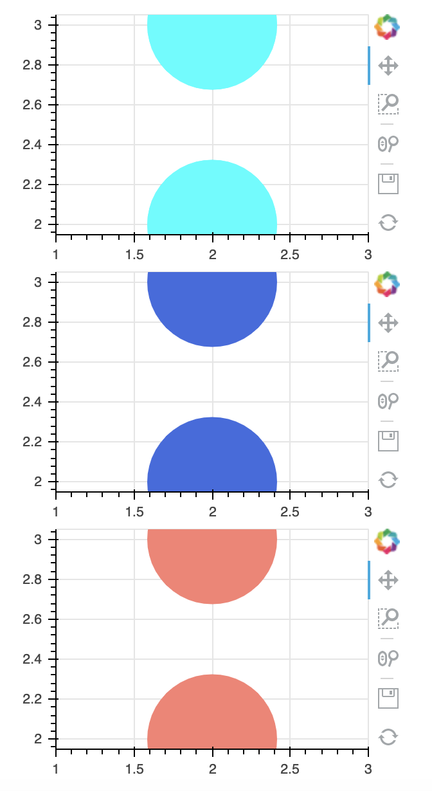
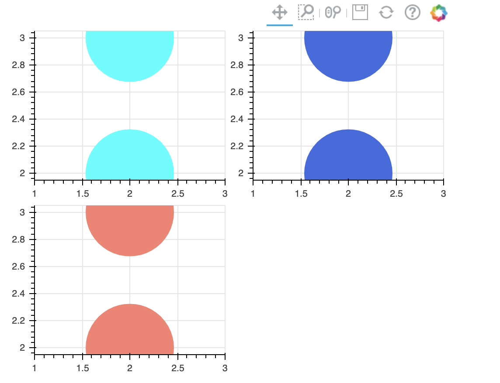

# 5.5 Presentation and Layouts

Bokeh includes several layout options for arranging plots and widgets. They make it possible to arrange multiple components to create interactive dashboards or data applications.

You've seen some examples in the last sessions. We can nest as many rows, columns, or grids of plots together as we like.

### 1. Row Layout     

To display plots horizontally, use the `row()` function.

```text
from bokeh.layouts import row

p1 = figure(plot_width=300, plot_height=300)
p1.circle([2,2], [3,2],size=100, color="cyan")

p2 = figure(plot_width=300, plot_height=300)
p2.circle([2,2], [3,2],size=100, color="royalblue")

p3 = figure(plot_width=300, plot_height=300)
p3.circle([2,2], [3,2],size=100, color="salmon")

show(row(p1,p2,p3))
```


### 2. Column Layout

To display plots or widgets in a vertical, use the `column()` function.

```text
from bokeh.layouts import column

p1 = figure(plot_width=300, plot_height=200)
p1.circle([2,2], [3,2],size=100, color="cyan")

p2 = figure(plot_width=300, plot_height=200)
p2.circle([2,2], [3,2],size=100, color="royalblue")

p3 = figure(plot_width=300, plot_height=200)
p3.circle([2,2], [3,2],size=100, color="salmon")

show(column(p1,p2,p3))
```



### 3. Grid Layout

The`gridplot()`function can be used to arrange Bokeh Plots in the grid layout. It also collects all tools into a single toolbar, and the currently active tool is the same for all plots in the grid. It is possible to leave “empty” spaces in the grid by passing`None`instead of a plot object.

```text
from bokeh.layouts import gridplot

# make a grid
grid = gridplot([[p1, p2], [p3,None]], plot_width=250, plot_height=200)

show(grid)
```



### 4.Multiple Objects

Below is a sophisticated example of a nested layout with different sizing modes. 


