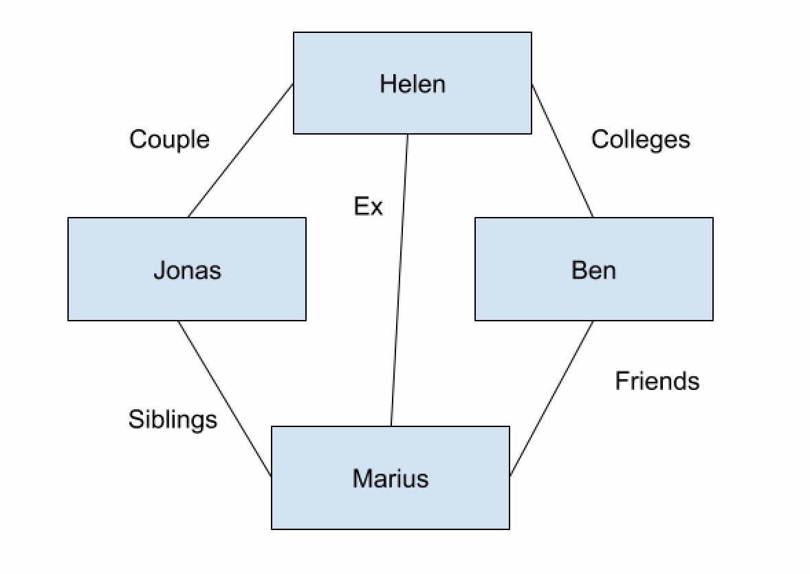
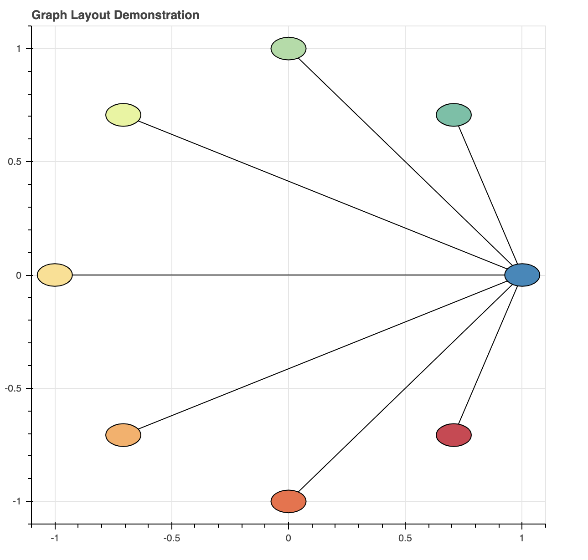
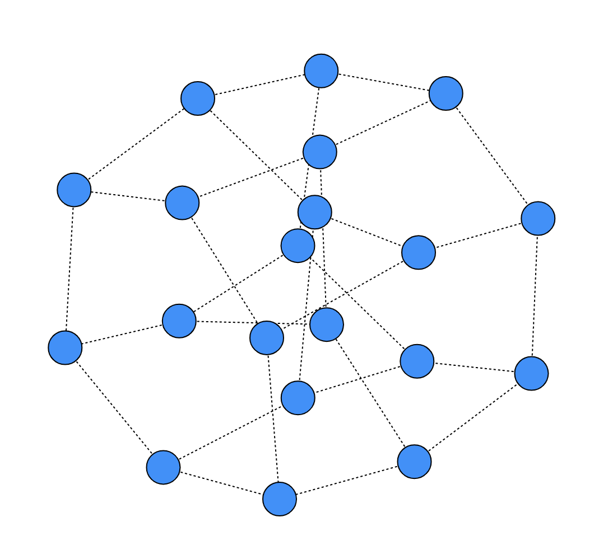
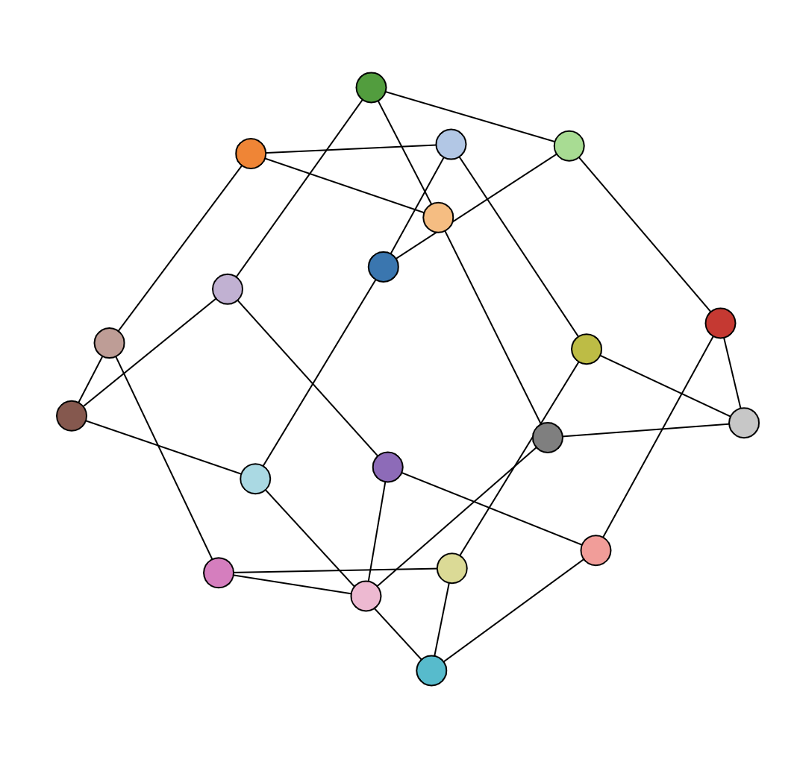
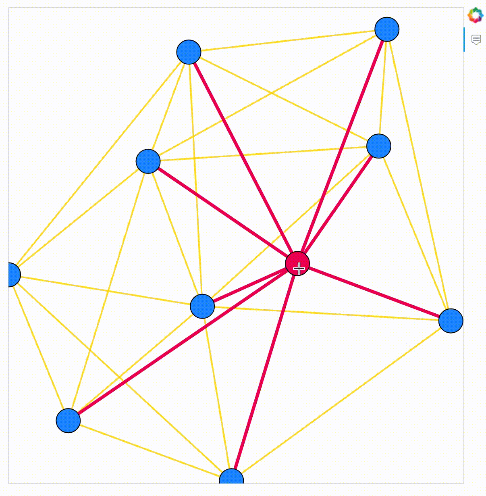

# 5.7 Network Graph

### 1. Network 

Networks help us visualize relationships between people and items. For example, a simple network can show you how people are related to each other. This is illustrated for you in the following diagram.

We can see Helen and Marius used to date but Helen is with Jonas, while Jonas and Marius are siblings. Marius and Ben are friends but Ben has no connection with Jonas.



Bokeh supports for creating network graph visualizations with configurable interactions between edges and nodes. One way is to connect two nodes with default straight lines, the other is to connect these networks by defining a shape for the path that we choose.

### 2. Edge and Node Renderers

The key feature of the `GraphRenderer` is that it maintains separate sub-GlyphRenderers for the graph nodes and the graph edges. This allows for customizing the nodes by modifying the GraphRenderer’s `node_renderer`property. 


* The ColumnDataSource associated with the node sub-renderer must have a column named**`"index"`**that contains the unique indices of the nodes.
* The ColumnDataSource associated with the edge sub-renderer has two required columns: **`"start"`** and **`"end"`**. These columns contain the node indices for the start and end of the edges.


### 3. Basic Network Graph

```text
import math

from bokeh.io import output_file, show
from bokeh.models import GraphRenderer, Oval, StaticLayoutProvider
from bokeh.palettes import Spectral4
from bokeh.plotting import figure
```

```text
node_indices = list(range(N))

plot = figure(title='Graph Layout Demonstration', x_range=(-1.1,1.1), y_range=(-1.1,1.1),
              tools='', toolbar_location=None)

graph = GraphRenderer()

graph.node_renderer.data_source.add(node_indices, 'index')
graph.node_renderer.data_source.add(Spectral8, 'color')
graph.node_renderer.glyph = Oval(height=0.1, width=0.2, fill_color='color')

graph.edge_renderer.data_source.data = dict(
    start=[0]*N,
    end=node_indices)

### start of layout code
circ = [i*2*math.pi/8 for i in node_indices]
x = [math.cos(i) for i in circ]
y = [math.sin(i) for i in circ]

graph_layout = dict(zip(node_indices, zip(x, y)))
graph.layout_provider = StaticLayoutProvider(graph_layout=graph_layout)

plot.renderers.append(graph)
show(plot)
```



### 4. NetworkX: Zachary’s Karate Club graph

```text
import networkx as nx
from bokeh.io import output_file, show
from bokeh.plotting import figure, from_networkx

G = nx.karate_club_graph()

plot = figure(title="Networkx Integration", x_range=(-2,2), y_range=(-2,2))

graph = from_networkx(G, nx.spring_layout, scale=2, center=(0,0))
plot.renderers.append(graph)

show(plot)
```


### 5. NetworkX

The easiest way to plot network graphs with Bokeh is to use the`from_networkx`function. The example below shows a Bokeh plot of`nx.desargues_graph()`, setting some of the node and edge properties.

```text
import networkx as nx
from bokeh.models import Range1d, Plot
from bokeh.plotting import from_networkx

G = nx.desargues_graph()

plot = Plot(x_range=Range1d(-2.5, 2.5), y_range=Range1d(-2.5, 2.5))

# Create a Bokeh graph from the NetworkX input using nx.spring_layout
graph = from_networkx(G, nx.spring_layout, scale=2, center=(0,0))
plot.renderers.append(graph)

# Set some of the default node glyph (Circle) properties
graph.node_renderer.glyph.update(size=30, fill_color="dodgerblue")

# Set some edge properties too
graph.edge_renderer.glyph.line_dash = [2,2]

show(plot)
```



**Adding Extra Data Columns**

```text
import networkx as nx
from bokeh.models import Range1d, Plot
from bokeh.plotting import from_networkx

G = nx.desargues_graph()

# We could use figure here but don't want all the axes and titles
plot = Plot(x_range=Range1d(-2.5, 2.5), y_range=Range1d(-2.5, 2.5))

# Create a Bokeh graph from the NetworkX input using nx.spring_layout
graph = from_networkx(G, nx.spring_layout, scale=2, center=(0,0))
plot.renderers.append(graph)

# Set some of the default node glyph (Circle) properties
graph.node_renderer.glyph.update(size=30, fill_color="dodgerblue")

# Set some edge properties too
graph.edge_renderer.glyph.line_dash = [2,2]

show(plot)
```



### 6. Inspection and Selection

It’s possible to configure the selection or inspection behavior of graphs by setting the GraphRenderer’s `selection_policy` and `inspection_policy` attributes. These policy attributes accept a special`GraphHitTestPolicy`model instance.

For example, setting`selection_policy=NodesAndLinkedEdges()` will cause a selected node to also select the associated edges. Similarly, setting`inspection_policy=EdgesAndLinkedNodes()`will cause the start and end nodes of an edge to also be inspected upon hovering an edge with the HoverTool.

```text
from bokeh.models.graphs import NodesAndLinkedEdges
from bokeh.models import Circle, HoverTool, MultiLine

G = nx.gnm_random_graph(10, 30)

# We could use figure here but don't want all the axes and titles
plot = Plot(x_range=Range1d(-2, 2), y_range=Range1d(-2 ,2))

# Create a Bokeh graph from the NetworkX input using nx.spring_layout
graph = from_networkx(G, nx.spring_layout, scale=1.8, center=(0,0))
plot.renderers.append(graph)

# Blue circles for nodes, and light grey lines for edges
graph.node_renderer.glyph = Circle(size=30, fill_color='#1E90FF')
graph.edge_renderer.glyph = MultiLine(line_color="#FFD700", line_alpha=0.8, line_width=2)

# green hover for both nodes and edges
graph.node_renderer.hover_glyph = Circle(size=25, fill_color='#f0005d')
graph.edge_renderer.hover_glyph = MultiLine(line_color='#f0005d', line_width=4)

# When we hover over nodes, highlight adjecent edges too
graph.inspection_policy = NodesAndLinkedEdges()

plot.add_tools(HoverTool(tooltips=None))

show(plot)
```



