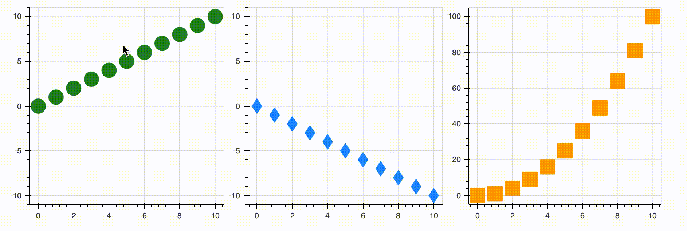
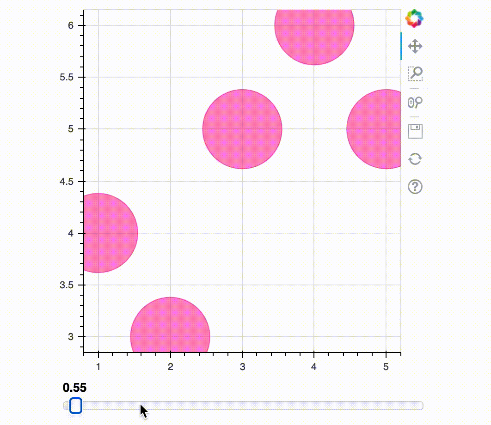
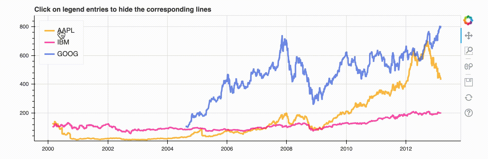

# 5.6 Linking and Interactions

### 1. Linked Panning

It’s often useful to link plots to add connected interactivity between plots. We can link pan or zooming actions across plots.All that is needed to enable this feature is to share range objects between `figure()` calls.

Let's prepare some data  firstly

```text
x = list(range(11))
y0 = x
y1 = [xx*(-1) for xx in x]
y2 = [xx**2 for xx in x]
```

```text
# create a new plot
s1 = figure(plot_width=300, plot_height=300, title=None)
s1.circle(x, y0, size=20, color="forestgreen", alpha=0.5)
```

```text
# create a new plot and share both ranges
s2 = figure(plot_width=300, plot_height=300, x_range=s1.x_range, y_range=s1.y_range, title=None)
s2.diamond(x, y1, size=20, color="dodgerblue", alpha=0.5)

# create a new plot and share only one range
s3 = figure(plot_width=300, plot_height=300, x_range=s1.x_range, title=None)
s3.square(x, y2, size=20, color="orange", alpha=0.5)

p = gridplot([[s1, s2, s3]], toolbar_location=None)
show(p)
```


### 2. Linked Brushing

Linked brushing is expressed by sharing data sources between glyph renderers. This is all needs to understand that selections acted on one glyph must pass to all other glyphs that share that same source.

```text
TOOLS = "box_select,lasso_select,help"
```

```text
# the rest are similar,  only we add  "tools  = TOOLS" here.
s1 = figure(tools=TOOLS, plot_width=300, plot_height=300, title=None)
s1.circle(x, y0, size=20, color="forestgreen")
```



### 3. Linked Properties  

It is also possible to link values of Bokeh model properties together so that they remain synchronized. We need to use the `js_link` method.

```text
rom bokeh.models import Slider   # Slide is a widget
```

```text
plot = figure(plot_width=400, plot_height=400)
r = plot.circle([1,2,3,4,5,], [4,3,5,6,5], radius=0.2, alpha=0.5,color = 'deeppink')

#  create a slider
slider = Slider(start=0.5, end=2, step=0.05, value=0.5)

# link with js_link function
slider.js_link('value', r.glyph, 'radius')

show(column(plot, slider))
```



### 4.Hiding Glyphs

Sometimes it is valuable to be able to hide or mute glyphs by clicking on an entry in a `Legend`. Thus,  your audience can pay more attention on what  you want  them to focus.   Let's use the stock graph for example.

```text
import pandas as pd
from bokeh.sampledata.stocks import AAPL, GOOG, IBM

p = figure(plot_width=900, plot_height=300, x_axis_type="datetime")
p.title.text = 'Click on legend entries to hide the corresponding lines'
colors = ['orange','deeppink','royalblue']

for data, name, color in zip([AAPL, IBM, GOOG], ["AAPL","IBM", "GOOG"], colors):
    df = pd.DataFrame(data)
    df['date'] = pd.to_datetime(df['date'])
    p.line(df['date'], df['close'], line_width=3, color=color, alpha=0.7, legend_label=name)

p.legend.location = "top_left"
p.legend.click_policy="hide"

show(p)
```



### 


