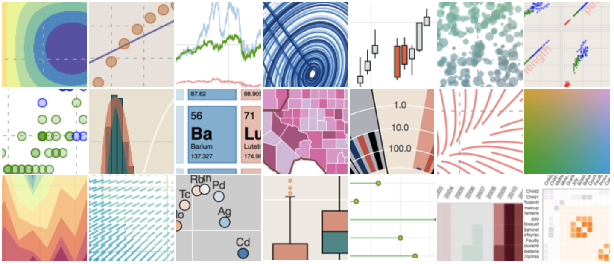

# 5. Bokeh



### 1. Introduction

**Bokeh** is an interactive visualization library for modern web browsers. It provides elegant, concise construction of versatile graphics, and affords high-performance interactivity over large or streaming datasets. Bokeh can help anyone who would like to quickly and easily make interactive plots, dashboards, and data applications.

_**NO JAVASCRIPT REQUIRED**_

To offer both simplicity and the powerful and flexible features needed for advanced customizations, Bokeh exposes two interface levels to users:

* [`bokeh.models`](https://docs.bokeh.org/en/latest/docs/reference/models.html#bokeh-models)`:`A _low-level_ interface that provides the most flexibility to application developers.
* [`bokeh.plotting`](https://docs.bokeh.org/en/latest/docs/user_guide/plotting.html#userguide-plotting)`:`A _higher-level_ interface centered around composing visual glyphs.

### 2. Installation

There are multiple ways to install Bokeh, and the easiest one is to use Anaconda

```text
conda install bokeh
```

If you are confident that you have installed all needed dependencies, you may instead use `pip` at the command line:

```text
pip install bokeh
```

Standard import and check whether the installation is completed.


### 3. Content
















