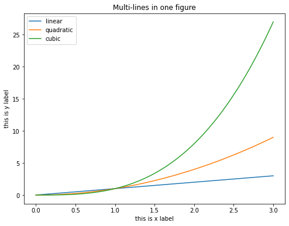
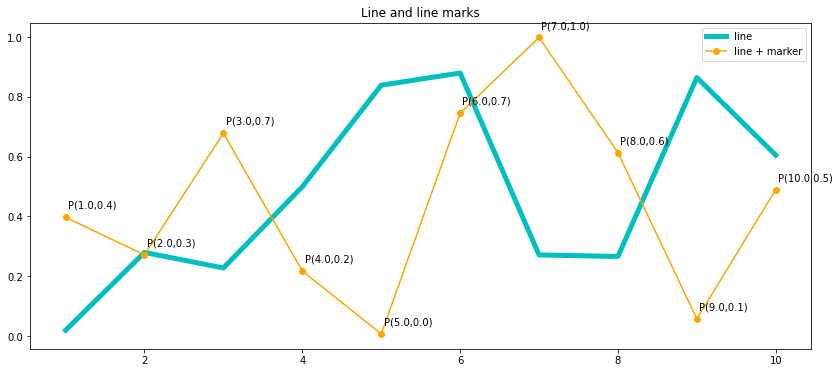
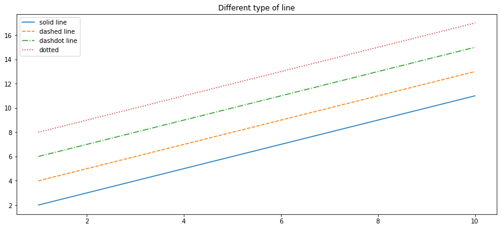

# 3.2 Line Chart

A **line chart** or **line graph** is a type of chart that displays information as a series of data points called ‘markers’ connected by straight **line segments**. It is a basic type of chart common in many fields.


**What to learn:**

*  Add multiple lines on one figure
* Set  x-label name and y-label  
* Set  title name
* Set and show legend


```text
x = np.linspace(0, 3, 100)
plt.plot(x, x, label='linear')       # Plot  'linear line' on axes.
plt.plot(x, x**2, label='quadratic') # plot 'quadratic line' on the same axes
plt.plot(x, x**3, label='cubic')     #etc
plt.xlabel('this is x label')                      # set the xlabel
plt.ylabel('this is y label')                      # set the ylabel
plt.title('Multi-lines in one figure')             # set the title
plt.legend()                         # show legend
```




**What to learn:**

* change width of a line
* change color of a line
* add markers on a line
* add annotation on line 
* change location of the legend


```text
x = np.arange(1,11)
y1 = np.random.random(10)
y2 = np.random.random(10)

# plot line 1
plt.plot(x, y1,linewidth =5, color = 'c', label = 'line')
# plot line 2
plt.plot(x, y2, marker = 'o',color = 'orange',label = 'line + marker')

# add annotation for line 2
for i in range(len(x)):
    xi = "{:.1f}".format(x[i])
    yi = "{:.1f}".format(y2[i])
    s = str("P(" + str(xi) + ',' + str(yi) + ')' )
    plt.text(x[i] + 0.03, y2[i] + 0.03, s)
    
plt.legend(loc='upper right')    # set legend location
plt.title('Line and line marks') # set title name
plt.show()
```




**What to learn:**

* set different type of lines  \( solid, dashed, dash-dot,  and dotted\)


```text
plt.plot(x, x + 1, linestyle='-',label = 'solid line')  # solid
plt.plot(x, x + 3, linestyle='--',label = 'dashed line') # dashed
plt.plot(x, x + 5 , linestyle='-.',label = 'dashdot line') # dashdot
plt.plot(x, x + 7, linestyle=':',label = 'dotted')         # dotted
plt.title('Different type of line')                       # title
plt.legend()                                             # show legend
plt.show()
```




If you find the font size is too small,  you can customize it like this:

```text
plt.rcParams.update({'font.size': 20}) # You can change 20 to other values
```



