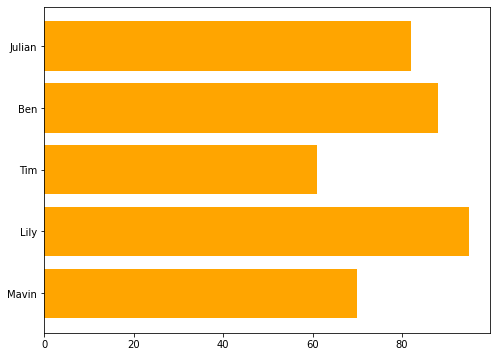
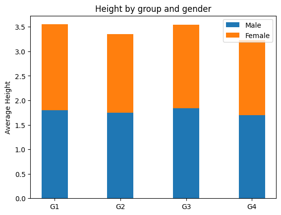
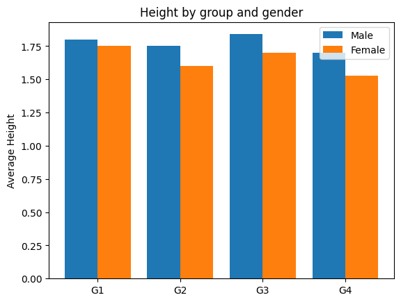

# 3.4 Column Chart

### 1. Column Chart


**What to learn:**

* Set figure size 
* Plot with numerical  variables and categorical variables
* Change column color
* Create a horizontal bar chart


```text
plt.figure(figsize = (8,6))                     # set the figure size

performance = [70,95, 61, 88,82]                # y_axis values
student = ['Mavin','Lily','Tim','Ben','Julian'] # x_axis values
y_pos = np.arange(len(student))                 # calculate number of "student"

plt.bar(y_pos,performance,color = 'orange')  # create bars, set the orange color 
plt.xticks(y_pos,student)       #Create names on the x-axis
plt.show()
```


### 2. Horizontal Column Chart

```text
# Create horizontal bars
plt.barh(y_pos, height)     # just add  a 'h' (horizontal)
plt.yticks(y_pos,student)   # we need to set students'name on the y-axisStacked Column Chart
```



### 3. Stacked Column Chart


**What to learn:**

* The difference of Stacked Column Chart and Grouped Column Chart
* Plot two groups of bars on one figure
* Choose  the proper chart 


```text
labels =['G1', 'G2', 'G3', 'G4']
male_avg = [1.80,1.75, 1.84,1.7]
female_avg =[1.75, 1.6, 1.70, 1.53]

width =0.4   # set the width of the bars

fig, ax = plt.subplots()
ax.bar(labels, male_avg, width,  label ='Male')
ax.bar(labels, female_avg, width,  bottom=  male_avg,
       label='Female')
       
ax.set_ylabel('Average Height')
ax.set_title('Height by group and gender')
ax.legend()

plt.show()
```



**Obviously, this is a bad choice.** The stacked bar can't show the trends nor differences clearly. Meanwhile. the stack makes y\_axis value non-sense.  Nobody grows to 3.5 meters!

So we should alternate to the **grouped bar chart.**

### **4. Grouped Column Chart**

```text
width =0.4
x = np.arange(len(labels))  # the label locations

fig, ax = plt.subplots()
rects1 = ax.bar(x - width/2, male_avg, width, label='Male')
rects2 = ax.bar(x + width/2, female_avg, width, label='Female')

ax.set_xticks(x)
ax.set_xticklabels(labels)  # set the categorical variable on x_axis
       
ax.set_ylabel('Average Height')
ax.set_title('Height by group and gender')
ax.legend()

plt.show()
```

Now, it looks much better and makes more sense.



