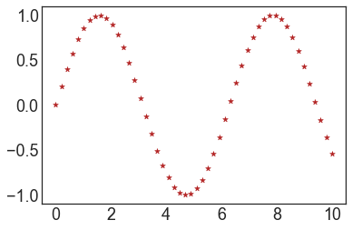

# 3.5  Scatter Chart Plot

### Scatter Plot

In the [Line Chart Plot ](1.2-line-chart-plot.md)session,  we discussed  how to use **plt.plot\(\)** to draw the line chart.  It also can be used  to produce scatter chart. Since it is scatter plot, we can use **plt.scatter\(\)** as well. 


```text
x = np.linspace(0, 10, 50)
y = np.sin(x)

fig,(ax1,ax2) =plt.subplots(1, 2, figsize = (12,6))

ax1.plot(x, y, 'o', color='firebrick')  # plt.plot()
ax1.set_title('plt.plot way')

ax2.scatter(x, y, marker='o', color='m'); # plt.scatter()
ax2.set_title('plt.scatter way')
```

### 

### Markers

We can use **Markers** to customize a scatter plot, make it more sense and stylish.



For example, we use  "star" to draw the same curve.

```text
plt.scatter(x, y, marker='*',color='firebrick');
```



**More Marker Types**





```text
plt.figure(1,figsize = (12,6))
plt.plot( x, y, marker='s', markersize=8,label = 'with line')
plt.plot( x+1, y+1, marker='o', markersize=18,linestyle='none',
          label = 'without line')
plt.legend()
```





```text

x = [3,6,5,7,9,10]
y =[4,2,14, 6,7,3]

sizes = [3080,7000,5000,1000,3200,440]
colors = ['r','y','orange','g','b','c']
plt.figure(figsize =(8,8))
plt.scatter(x, y, c = colors, s = sizes, alpha = 0.7)
plt.title('Marker Colors')
```


**Most Used Colors**





* The color is controlled by the **markerfacecolor** and **markeredgecolor** arguments. 
* The edge size is controlled by **markeredgewidth**

```text
plt.figure(1, figsize =(12,6))

plt.plot( x, y, markerfacecolor='skyblue', marker="D", 
         markeredgecolor="black", markersize=16, markeredgewidth =3,
         label = 'thick edge')
         
plt.plot( x+1, y+1, linestyle='none', marker="*", 
         markerfacecolor='yellow', markeredgecolor="black", 
         markersize=24, label = 'thin edge')
plt.legend()
```






