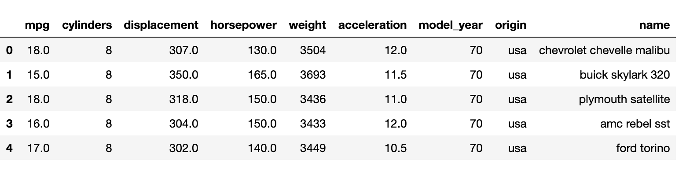

# 3.10 Waffle Chart

A waffle chart shows progress towards a target or a completion percentage. There is a grid of small cells, of which colored cells represent the data.

A chart can consist of one category or several categories. Multiple waffle charts can be put together to show a comparison between different charts.

We can use [PyWaffle](http://github.com/gyli/PyWaffle) to plot fancy waffle charts.

#### Installation

```text
pip install pywaffle
```

#### Example

Let's create a dictionary \(simple key-value structure\) that includes randomly German Parties information.

```text
# This is randomly made up! 
data = {'CDU': 45,'SPD': 34,'Die Linke': 10,'Die Grünen': 7, 'others': 4}
```

```text
import matplotlib.pyplot as plt
from pywaffle import Waffle
```

```text
fig = plt.figure(figsize = (14,6),
            FigureClass=Waffle,
            rows = 5,
            values = data,
            colors = ('#EC2272','yellow','#5ac9ff','#76ecbe','#fd5f00'),
            title ={'label': 'Politische Parteien in Deutschland','loc':'left'},
            labels = ["{0}({1}%)".format(k,v) for k,v in data.items()],
            legend = {'loc': 'lower left', 'bbox_to_anchor': (0, -0.4), 'fontsize': 14, 'ncol': len(data)},
            starting_location = 'NW')
```


Also, we can add a`icon`parameter to make it more attractive.

```text
fig = plt.figure(figsize = (14,6),
            FigureClass=Waffle,
            rows = 5,
            values = data,
            colors = ('#EC2272','yellow','#5ac9ff','#76ecbe','#fd5f00'),
            title ={'label': 'Politische Parteien in Deutschland','loc':'left'},
            labels = ["{0}({1}%)".format(k,v) for k,v in data.items()],
            legend = {'loc': 'upper left', 'bbox_to_anchor': (1.05, 1), 'fontsize': 14},
            icons = 'child',
            icon_legend = True)
```


The above is showing how to draw a waffle chart with a `Dictionary`. It's also possible to draw with a`DataFrame`. Here is an example, let's use the embedded dataset called "mpg".

```text
import seaborn as sns
mpg = sns.load_dataset('mpg')
```



Let's make a graph based on the **"cylinders**" variable. Firstly, we need to group by it and calculate the "counts". Then pass it to the figure.

```text
df_cyl = mpg.groupby('cylinders').size().reset_index(name='counts_cyl')

fig = plt.figure(figsize = (14,6),
    FigureClass=Waffle,
    rows = 10,
    values= df_cyl['counts_cyl'],
    labels = ["{1}".format(n[0], n[1]) for n in df_cyl[['cylinders', 'counts_cyl']].itertuples()],
    legend = {'loc': 'upper left', 'bbox_to_anchor': (1.05, 1), 'fontsize': 12, 'title':'cylinders'},
    title = {'label': 'Vehicles by Cyl', 'loc': 'center', 'fontsize':18},
    colors = ('#EC2272','yellow','#5ac9ff','#76ecbe','#fd5f00'))
```


Similarly, we can make a graph based on the "**origin**" variable.

```text
df_origin = mpg.groupby('origin').size().reset_index(name='counts_origin')
n_categories = df_origin.shape[0]

fig = plt.figure(figsize = (14,6),
    FigureClass=Waffle,
    rows = 10,
    values= df_origin['counts_origin'],
    labels = ["{1}".format(n[0], n[1]) for n in df_origin[['origin', 'counts_origin']].itertuples()],
    legend = {'loc': 'upper left', 'bbox_to_anchor': (1.05, 1), 'fontsize': 12, 'title':'cylinders'},
    title = {'label': 'Vehicles by origin', 'loc': 'center', 'fontsize':18},
    colors = ('yellow','#5ac9ff','#fd5f00'))
```


