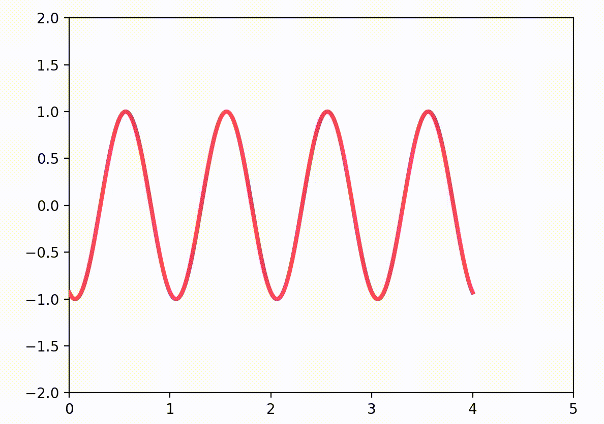
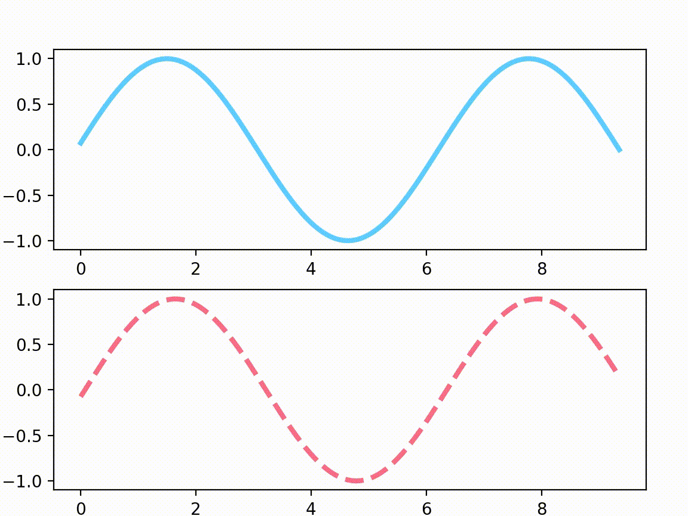
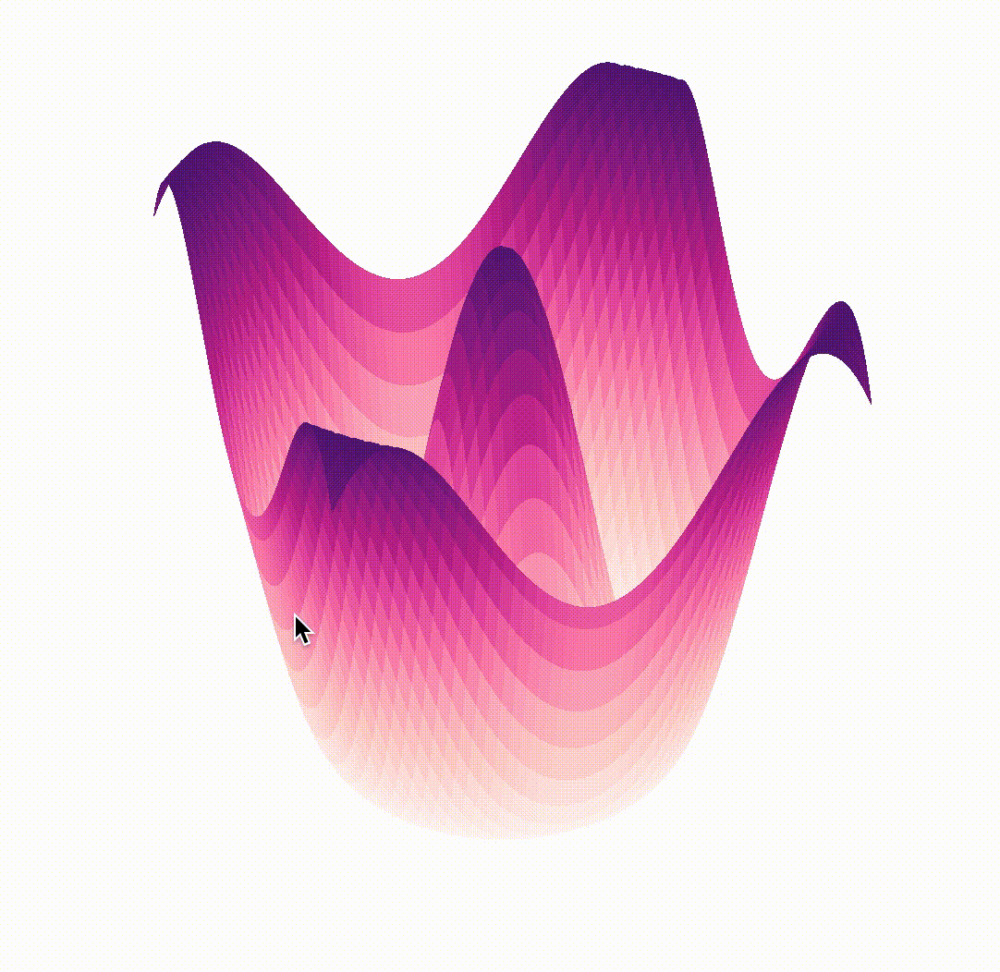
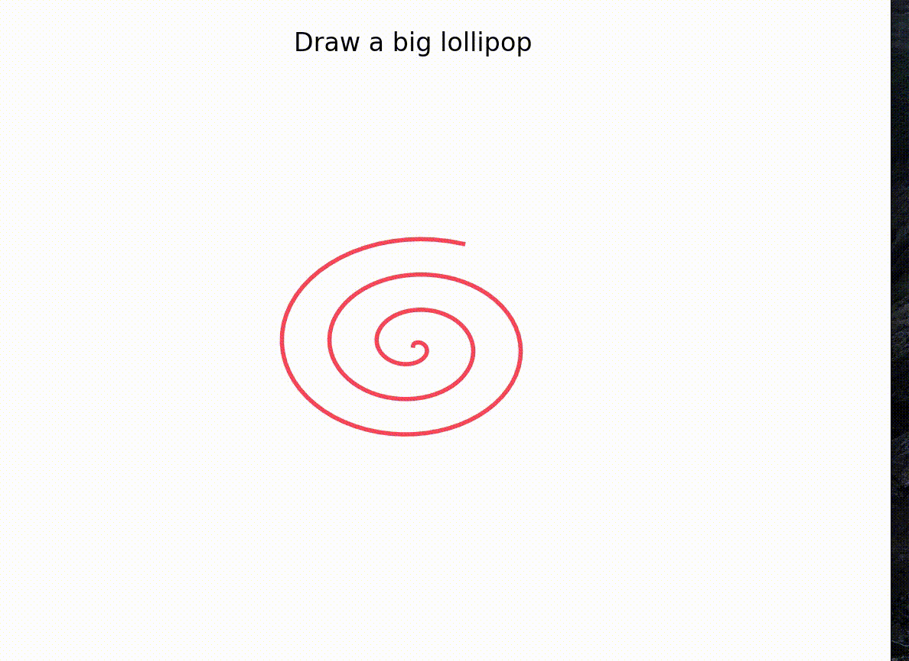

# 3.11 Animation


### 1. Why Animation?

Exploring datasets is a big part of what many scientists do these days. In many cases, these datasets will have more than two dimensions. For example, temperature or salinity in an ocean circulation model has four dimensions: _`x, y, z, t.`_ It’s futile to try and display these in a single plot. That’s where animation can help.

### 2. Animations in matplotlib

Matplotlib’s `animation`  deals with the animation part. It provides a framework around which the animation functionality is built. There are two main interfaces to achieve that using:

[`FuncAnimation`](https://matplotlib.org/api/_as_gen/matplotlib.animation.FuncAnimation.html#matplotlib.animation.FuncAnimation): makes an animation by repeatedly calling a function _`func`_. It is the most convenient one to use.

[`ArtistAnimation`](https://matplotlib.org/api/_as_gen/matplotlib.animation.ArtistAnimation.html#matplotlib.animation.ArtistAnimation): Animation using a fixed set of `Artist` objects.

### 3. Basic Animation


### An animation  in six steps:

1. **import the necessary modules**
2. **set up the plotting area**
3. **create some data to plot**
4. **plot the first line**
5. **create a function to update the line**
6. **call FuncAnimation and show**


```text
# step 1
import numpy as np
import matplotlib.pyplot as plt
from matplotlib.animation import FuncAnimation

# step 2
fig = plt.figure()
ax = plt.axes(xlim=(0, 5), ylim=(-2, 2))


# step 3
line, = ax.plot([], [], lw=3,color = '#f93753')


# step 4
def init():
    line.set_data([], [])
    return line
    
# step 5    
def animate(i):
    x = np.linspace(0, 4, 1000)
    y = np.sin(2 * np.pi * (x - 0.01 * i))
    line.set_data(x, y)
    return line,

# step 6
anim = FuncAnimation(fig, animate, init_func=init,
                               frames=200, interval=10, blit=True)
plt.show()
```



### 4. Subplots Animation

We can use [Celluloid](https://github.com/jwkvam/celluloid) to simplify the process of creating animations in matplotlib. It creates a figure and creates a `camera`. Then it reuses figure and after each frame is created, take a snapshot with the camera. Finally, an animation is created with all the captured frames.

```text
pip install Celluloid
```

```text
import numpy as np
from matplotlib import pyplot as plt
from celluloid import Camera

fig, axes = plt.subplots(2)
camera = Camera(fig)
t = np.linspace(0, 3 * np.pi, 128, endpoint=False)
for i in t:
    axes[0].plot(t, np.sin(t + i), color='#5ac9ff',linewidth = 3)
    axes[1].plot(t, np.sin(t - i), color='#f96080',linewidth = 3, linestyle='dashed')
    camera.snap()
    
    
animation = camera.animate()  
plt.show()
```



### 5. 3D Animation

Let's draw a 3D tulip this time.

```text
from matplotlib import animation,cm
from mpl_toolkits.mplot3d import Axes3D
```

```text
# create a figure
fig = plt.figure(figsize = (6,6))
# initialise 3D Axes
ax = Axes3D(fig)
# remove background grid, fill and axis
ax.grid(False)
ax.xaxis.pane.fill = ax.yaxis.pane.fill = ax.zaxis.pane.fill = False
plt.axis('off')

# Make data
X = np.arange(-5, 5, 0.1)
Y = np.arange(-5, 5, 0.1)
xx, yy = np.meshgrid(X, Y)
r = np.sqrt(xx**2 + yy**2)
z = np.cos(r)


# create the initialiser with the surface plot
def init():
    ax.plot_surface(xx, yy, z, cmap=cm.RdPu,
                    linewidth=0, antialiased=False)
    return fig,


# create animate function, this will adjust the view one step at a time
def animate(i):
    ax.view_init(elev=30.0, azim=i)
    return fig,


# create the animated plot
anim = animation.FuncAnimation(fig, animate, init_func=init,
                               frames=360, interval=20, blit=True)
```



### 6. Fun Examples

```text
fig = plt.figure() 
ax = plt.axes(xlim=(-50, 50), ylim=(-50, 50)) 
line, = ax.plot([], [], lw=2,color = '#f93753') 

# initialization function 
def init(): 
	line.set_data([], []) 
	return line, 

# lists to store x and y axis points 
xdata, ydata = [], [] 

# animation function 
def animate(i): 
	# t is a parameter 
	t = 0.1*i 
	
# x, y values to be plotted 
	x = t*np.sin(t) 
	y = t*np.cos(t) 
	
# appending new points to x, y axes points list 
	xdata.append(x) 
	ydata.append(y) 
	line.set_data(xdata, ydata) 
	return line, 
	
# setting a title for the plot 
plt.title('Draw a big lollipop') 
# hiding the axis details 
plt.axis('off') 

# call the animator	 
anim = animation.FuncAnimation(fig, animate, init_func=init, 
							frames=500, interval=10, blit=True)
plt.show()
```




