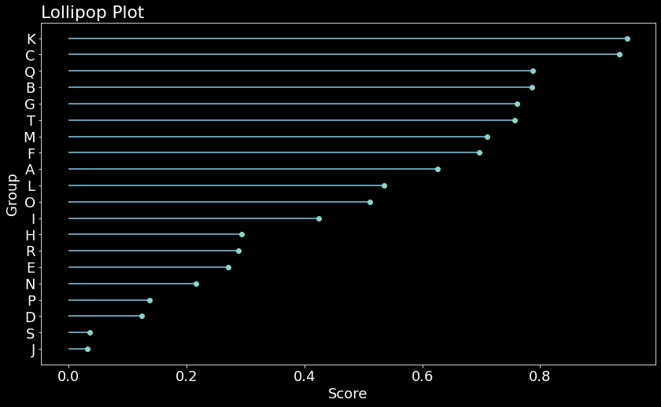
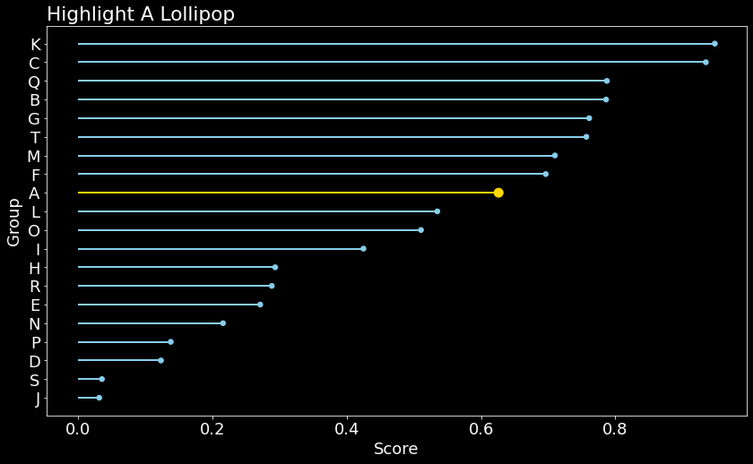
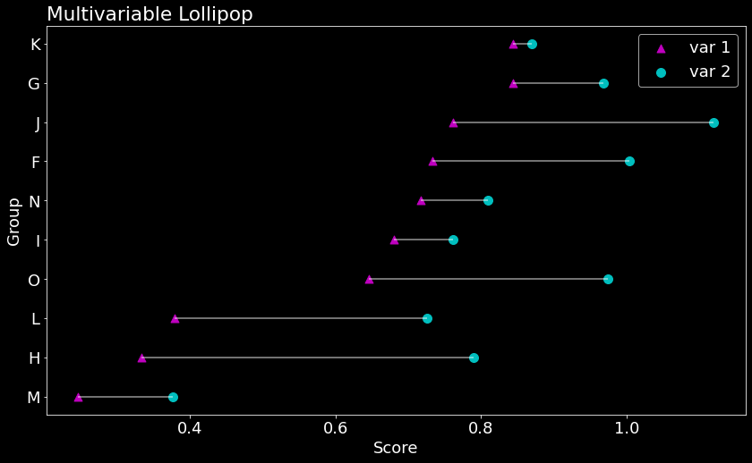

# 3.7 Lollipop Plot

A **lollipop plot** is an hybrid between a [scatter plot ](1.5-pie-chart-plot.md)and a [barplot](1.3-column-chart-plot.md). It shows the relationship between a numerical variable and another variable, numerical or categorical. It's better to decrease the order and represent with horizontal lines.

First, Let's create a dataset. 

```text
# Create a dataset
df = pd.DataFrame({'group':list(map(chr, range(70, 90))), 'values':np.random.uniform(size=20)})

ordered_df = df.sort_values(by='values')  # reorder it by 'values'   
my_range=range(1,len(df.index)+1)         # calcaulate data range
```

### Uni-variable Lollipop

```text
plt.style.use('dark_background')  # set the figure style 
plt.figure(figsize = (14,8))      # set the figure size

#create lollipop bar and lollipop head  
plt.hlines(y=my_range, xmin=0, xmax=ordered_df['values'], color='skyblue')
plt.plot(ordered_df['values'], my_range, "o") 

plt.yticks(my_range, ordered_df['group'])   # reset yticks 
plt.title("Lollipop Plot", loc='left')      # set title and title location
plt.xlabel('Score')
plt.ylabel('Group')
```



### Highlight Lollipop

Moreover,  we .can add some eye-catching features for storytelling. For example,  highlight a group that specifically interests you with a bigger size and different color.

```text
# Create a color if the group is "A"
A_color=np.where(ordered_df ['group']=='A', 'gold', 'skyblue')
A_size=np.where(ordered_df ['group']=='A', 100, 30)

plt.hlines(y=my_range, xmin=0, xmax=ordered_df['values'], color=my_color, linewidth =2)
plt.scatter(ordered_df['values'], my_range, color=A_color, s=A_size)
 
# Add title and axis names
plt.yticks(my_range, ordered_df['group'])
plt.title("Highlight A Lollipop", loc='left')
plt.xlabel('Score')
plt.ylabel('Group')
```



### Multivariable Lollipop

We can use multi-variables lollipop if you have **more than one observation** for each groups. Instead of displaying the values of both groups one beside each other, show them on the same line and **represent the difference.**

Now we need to create a new dataset with two variables.

```text
# Create a dataframe
var1 =np.random.uniform(size=15)
var2=value1+np.random.uniform(size=15)/ 3
df = pd.DataFrame({'group':list(map(chr, range(70, 80))), 
                'value1':var1 , 'value2':var2 })
 
ordered_df = df.sort_values(by='value1')
my_range=range(1,len(df.index)+1)
```

```text
# create white color lollipop bar
plt.hlines(y=my_range, xmin=ordered_df['value1'], xmax=ordered_df['value2'], color='w',alpha = 0.6)

# create lollipop head1 in magnet color and set size =80
plt.scatter(ordered_df['value1'], my_range, color='m', s = 80,label='var 1',marker='^')

# create lollipop head2 in cyan color and set size = 100 
plt.scatter(ordered_df['value2'], my_range, color='c',s = 100, label='var 2')

plt.legend() # show legend 
 
# Add title and axis names
plt.yticks(my_range, ordered_df['group'])
plt.title("Multivariable Lollipop", loc='left')
plt.xlabel('Score')
plt.ylabel('Group')
```



\*\*\*\*


