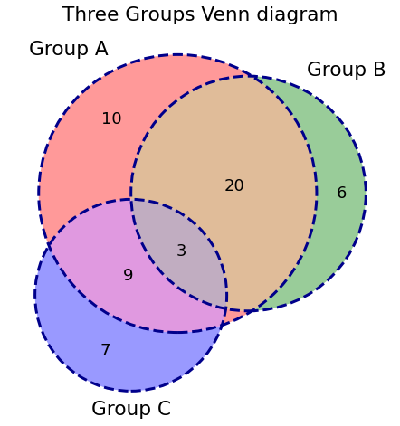

# 3.9 Venn Chart

A Venn diagram is an illustration that uses circles to show the **relationships** among things or finite groups of things. Venn diagrams help to visually represent the similarities and differences between the two concepts.

We can use[`matplotlib-venn`](https://pypi.org/project/matplotlib-venn/)the library to draw a Venn chart. It contains four main functions: `venn2`, `venn2_circles`, `venn3` and `venn3_circles`.

### 1.  Installation

```text
pip install matplotlib-venn
```

### 2. 2-Group Venn Chart

There are two ways to draw a  Venn Chart. One is to give directly the size of your group and their intersection. The other is to give 2 sets of values, python will calculate itself the length of each set \(each group\) and the number of common values \(their intersection\). 

The functions venn2 and venn2\_circles accept as their only required argument a 3-element list \(Ab, aB, AB\) of subset sizes

```text
# import library to draw a  2-group Venn chart
from matplotlib_venn import venn2
```

**Option 1**

```text
plt.figure(figsize = (6,6))
venn2(subsets = (3, 2, 1),set_labels = ('Group A', 'Group B'))
plt.show()
```

**Option 2**

```text
plt.figure(figsize = (6,6))
venn2([set(['A', 'B', 'C', 'D']), set(['D', 'E', 'F'])])
plt.show()
```


### 3. 3-Group  Venn Chart

Similarly, the functions venn3 and venn3\_circles take a 7-element list of subset sizes \(Abc, aBc, ABc, abC, AbC, aBC, ABC\)

```text
from matplotlib_venn import venn3, venn3_circles
```

```text
#  make a basic 3 groups Venn chart

plt.figure(figsize = (8,8))
plt.title("Three Groups Venn diagram")

v=venn3(subsets = (10, 6, 20, 7,9,1,3), 
        set_labels = ('Group A', 'Group B', 'Group C'))
```

```text
# add some customization
c=venn3_circles(subsets = (10, 6, 20, 7,9,1,3), 
                linestyle='dashed', linewidth=3, color="darkblue")
```



