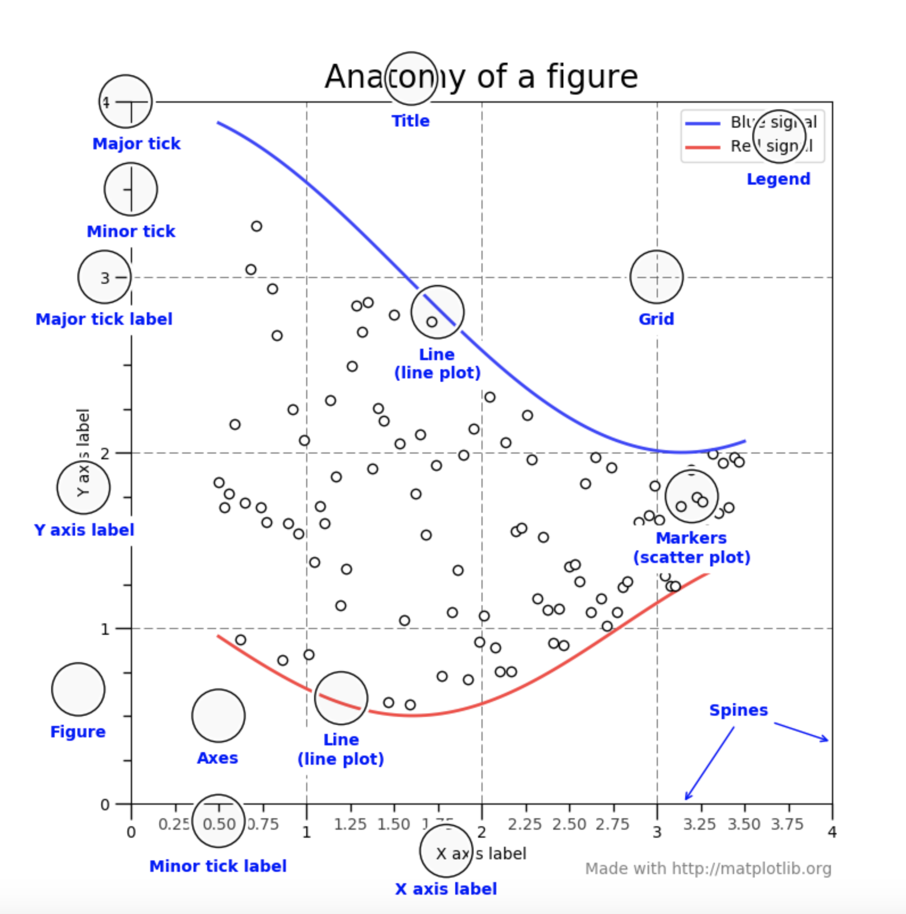

# 3. Matplotlib


\*\*\*\*[Matplotlib ](https://matplotlib.org/tutorials/index.html)is a plotting library for the [Python](https://en.wikipedia.org/wiki/Python_%28programming_language%29) programming language and its numerical mathematics extension [NumPy](https://en.wikipedia.org/wiki/NumPy).  

**`Pyplot`** is a Matplotlib module which provides a MATLAB-like interface. Matplotlib is designed to be as usable as MATLAB, with the ability to use Python and the advantage of being free and open-source.

### 1. Installing an official release

Matplotlib and its dependencies are available as wheel packages for macOS, Windows and Linux distributions:

```text
python -m pip install -U pip
python -m pip install -U matplotlib
```

### 

### 2. Elements of Figure

Matplotlib graphs your data on ****[**`Figure`**](https://matplotlib.org/api/_as_gen/matplotlib.figure.Figure.html#matplotlib.figure.Figure)s \(i.e., windows\), each of which can contain one or more [**`Axes`**](https://matplotlib.org/api/axes_api.html#matplotlib.axes.Axes) \(i.e., an area where points can be specified in terms of x-y coordinates \(or theta-r in a polar plot, or x-y-z in a 3D plot, etc.\). The most simple way of creating a figure with axes is using [**`pyplot.subplots`**](https://matplotlib.org/api/_as_gen/matplotlib.pyplot.subplots.html#matplotlib.pyplot.subplots).


let's have a deeper look at the components of a Matplotlib figure.




### 3. Check and Quickstart

```text
import matplotlib.pyplot as plt   # import the data exploration package
import numpy as np                # import the data computing package
```

### 4. Content

* [3.1 Basic Concepts](basic-plot.md)
* [3.2 Line Chart](1.2-line-chart-plot.md)
* [3.3 Area Chart](3.3-area-plot.md)
* [3.4 Column Chart](1.3-column-chart-plot.md)
* [3.5 Histogram Chart](1.4-histogram-plot.md)
* [3.6 Scatter Chart](1.5-pie-chart-plot.md)
* [3.7 Lollipop Chart](3.7-lollipop-plot.md)
* [3.8 Pie Chart](untitled.md)
* [3.9 Venn Chart](3.9-venn-chart.md)
* [3.10 Waffle Chart](3.10-waffle-chart.md)
* [3.11 Animation](3.11-animation.md)

