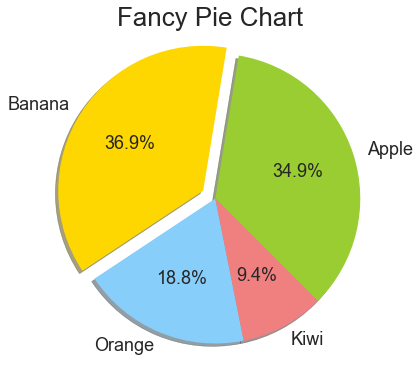
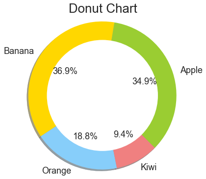

# 3.8 Pie Chart

A Pie Chart can only display one series of data. Pie charts show the size of items \(called wedge\) in one data series, proportional to the sum of the items.

<table>
  <thead>
    <tr>
      <th style="text-align:left">Parameters</th>
      <th style="text-align:left">Description</th>
    </tr>
  </thead>
  <tbody>
    <tr>
      <td style="text-align:left">x</td>
      <td style="text-align:left">array-like. The wedge sizes.</td>
    </tr>
    <tr>
      <td style="text-align:left">labels</td>
      <td style="text-align:left">A list. A sequence of strings providing the labels for each wedge.</td>
    </tr>
    <tr>
      <td style="text-align:left">colors</td>
      <td style="text-align:left">A sequence of matplotlibcolorargs through which the pie chart will cycle.</td>
    </tr>
    <tr>
      <td style="text-align:left">autopac</td>
      <td style="text-align:left">
        <p>A string, used to label the wedges with their numeric value.</p>
        <p>The label will be placed inside the wedge.</p>
      </td>
    </tr>
  </tbody>
</table>

### Basic Pie Chart

```text
plt.figure(1,figsize = (6,6))

labels = ['Apple', 'Banana', 'Orange', 'Kiwi']
sizes = [38.4, 40.6, 20.7, 10.3]
colors = ['yellowgreen', 'gold', 'lightskyblue', 'lightcoral']
patches, texts = plt.pie(sizes, colors=colors, shadow=True, startangle=90)
plt.legend(patches, labels, loc="best")
plt.axis('equal')
plt.tight_layout()
plt.show()
```


Now  we have a basic pie chart. Of course it can be and should be presented better. 

For example, the legend position is weird and overlapped  with the pie. Also, we  can not see  any numbers from it  and we don't know which part we should focus on.  Therefore, Let's do some change.

### Fancy Pie Chart

```text
plt.figure(1,figsize = (6,6))
labels = ['Apple', 'Banana', 'Orange', 'Kiwi']
sizes = [38.4, 40.6, 20.7, 10.3]
colors = ['yellowgreen', 'gold', 'lightskyblue', 'lightcoral']
explode = (0, 0.1, 0, 0)  #explode 1st slice

plt.pie(sizes, explode=explode, labels=labels, colors=colors,
autopct='%1.1f%%', shadow=True, startangle=-45)  # add shadow, show percentage
plt.axis('equal')
plt.title('Fancy Pie Chart')
```



### Donut Chart

```text
plt.figure(1,figsize = (6,6))
labels = ['Apple', 'Banana', 'Orange', 'Kiwi']
sizes = [38.4, 40.6, 20.7, 10.3]
colors = ['yellowgreen', 'gold', 'lightskyblue', 'lightcoral']

plt.pie(sizes, labels=labels, colors=colors,
autopct='%1.1f%%', startangle=-45, shadow=True) 

#draw circle
centre_circle = plt.Circle((0,0),0.75,fc='white') #0.75 is the circle size
fig = plt.gcf()
fig.gca().add_artist(centre_circle)

plt.axis('equal')
plt.title('Donut Chart')
```




As we discussed  in [Features of Pie Chart,](../tricks-in-visualisation/features-of-different-charts/2.4-pie-chart.md)  Pie charts are poor at communicating data, especially for the complicated data.  Although it looks awesome, it  delivers less information than tables or column charts.

* **Simple is better than complex.** 
* **Readability counts.** Do not make it hard to read.


