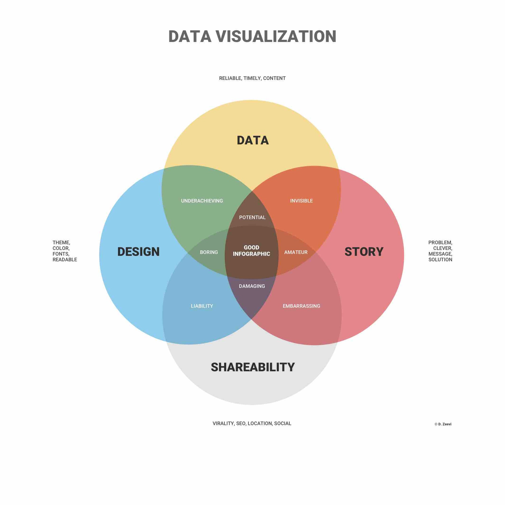

# 1.1 What is data visualization?

**Data visualization is very common in your daily life.** It appears in advertisement, newspaper,  scientific  journal, or any school book. Normally, people recognize it as charts and graphs.

**Data visualization refers to techniques that illustrate insights from data**. It delivers a quick and effective way to communicate information in a universal manner using visual information. 

**A good visualization provides meaningful insights into intuitive methods.** The American statistician and Yale professor [Edward Tufte](https://www.edwardtufte.com/tufte/) believes that excellent data visualisations consist of 'complex ideas communicated with clarity, precision, and efficiency.'

