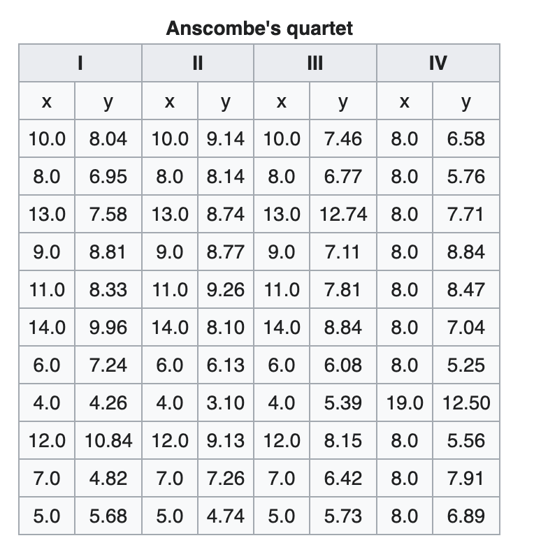
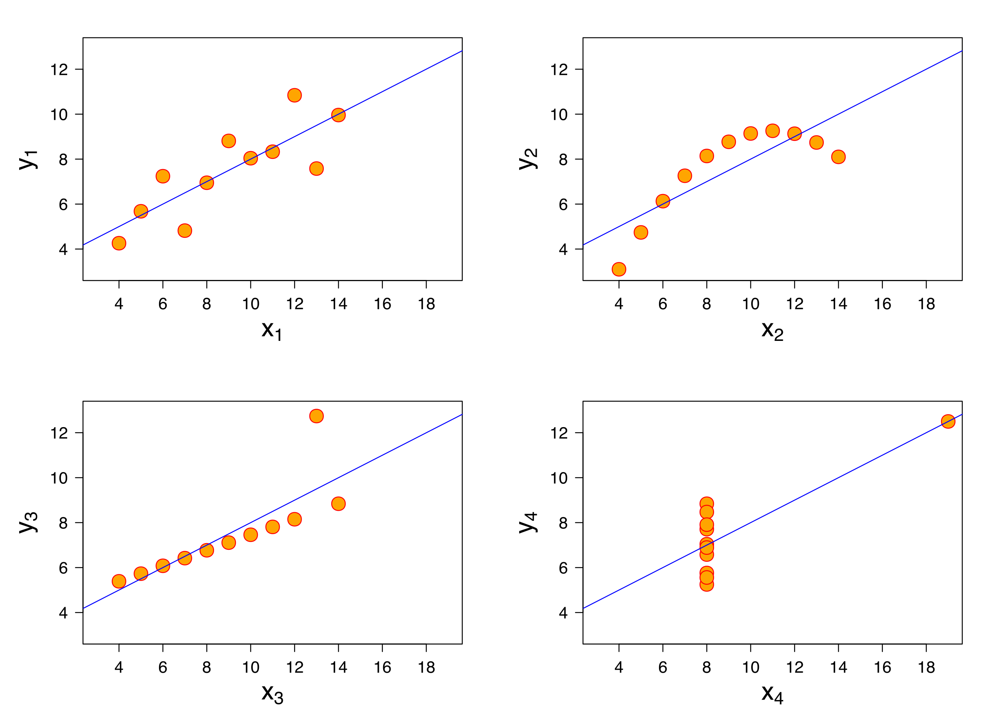
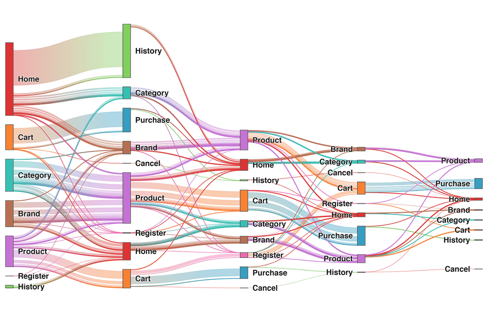
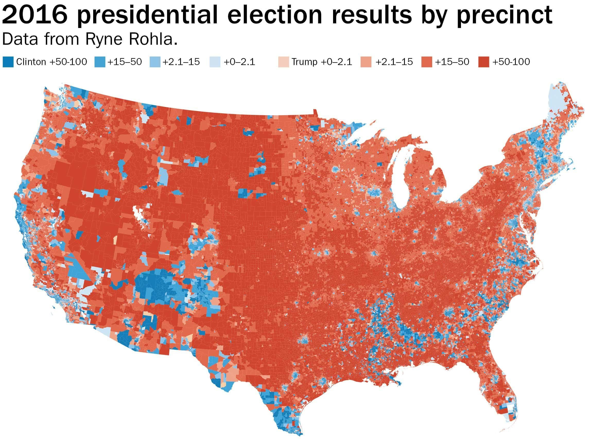
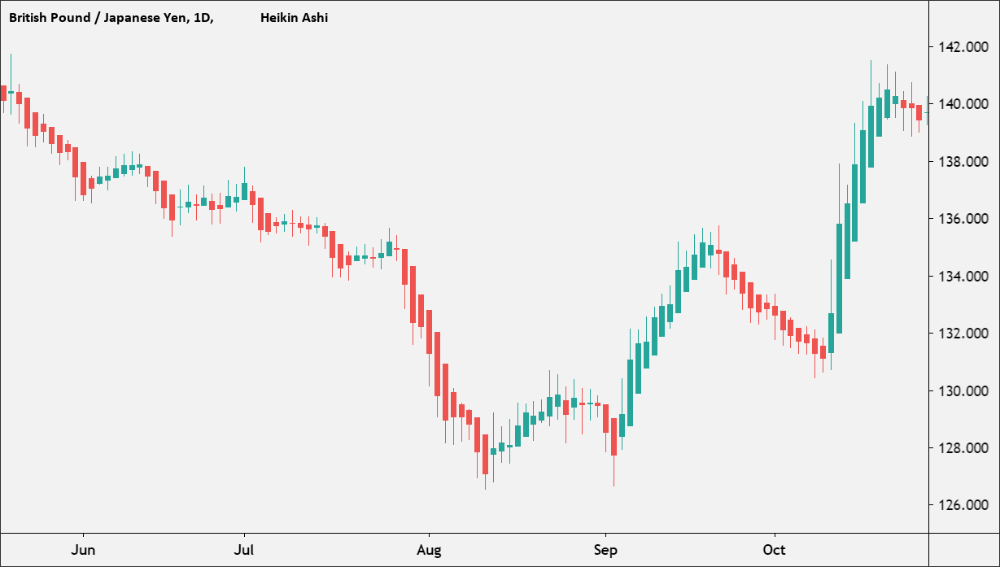

# 2. Why does visualization matter?

**The world produces 2.5 quintillion bytes of data every day, and 90% of all data has been created in the last two years.** The increased popularity of big data and data analysis projects have made visualization more important than ever. It is unlikely for any single person to wade through data line-by-line and and make observations.

### Better illustrate insights

Data visualization can illustrate insights better than  traditional descriptive statistics ways. A perfect example of this is [Anscombe’s Quartet](https://en.wikipedia.org/wiki/Anscombe%27s_quartet), created by Francis Anscombe in 1973. The table includes four different datasets with almost identical variance, mean, correlation between X and Y coordinates, and linear regression lines. **All four sets are identical when examined using simple summary statistics. It's hard to catch distinct patterns.** 

**However, the patterns vary considerably in visualization.** You can see a linear regression model applies to graphs x1 and x3, but a polynomial regression model fits for x2. The graph x4 shows a high correlation coefficient, even though the other data points do not indicate any relationship between the variables.

### **Common use cases** 

* **Sales and marketing.** Research from the media agency Magna predicts that 50% of all global advertising dollars will be spent online by 2020. As a result, marketing teams must pay close attention to sources of web traffic and how their web properties generate revenue. Data visualization makes it easier to see traffic trends over time as a result of marketing efforts.

* **Politics.** A common use of data visualization in politics is a geographic map that displays the party each state or district voted for.

* **Finance.** Finance professionals must track the performance of their investment decisions. For example, the candlestick chart is used to analyze price movements over time and display essential trends.

  

