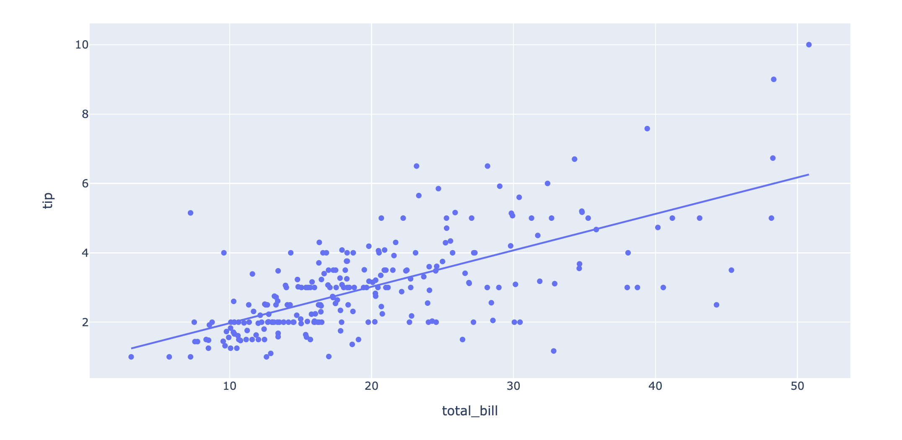
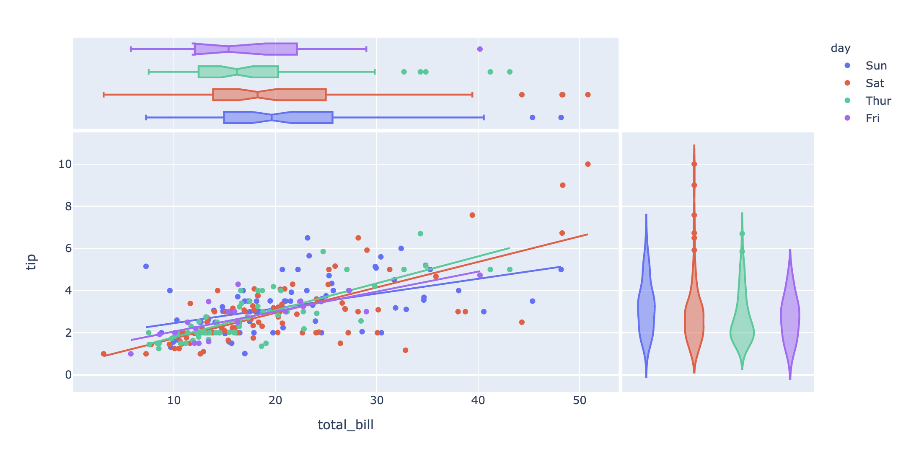
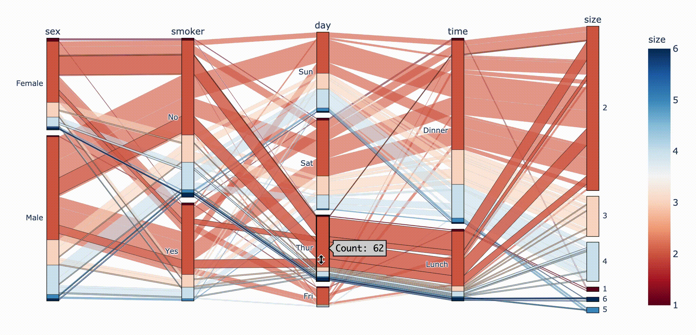
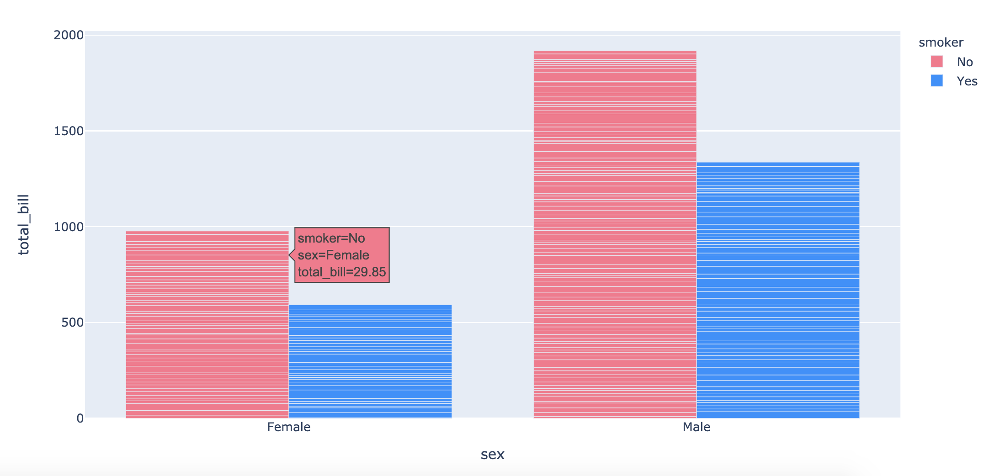
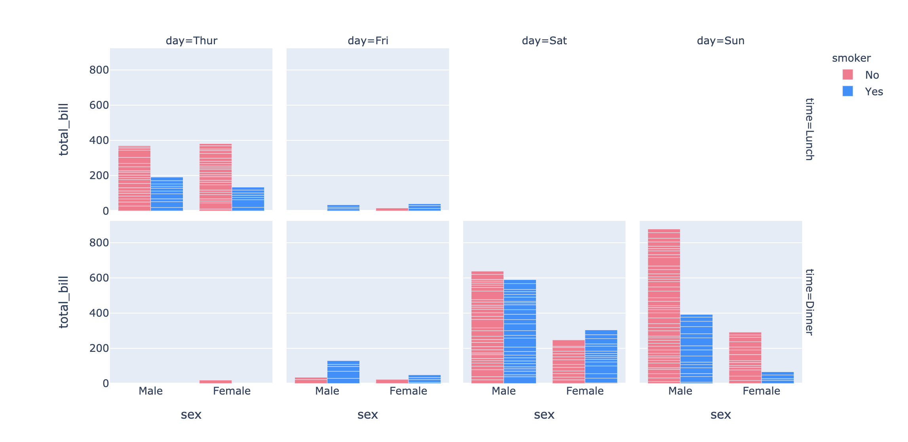
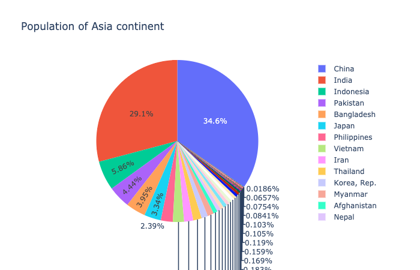
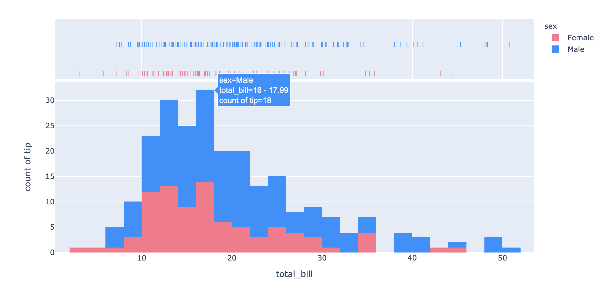
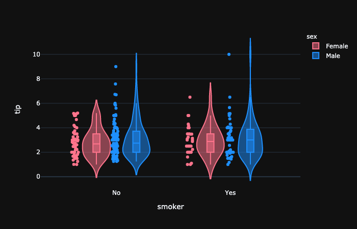
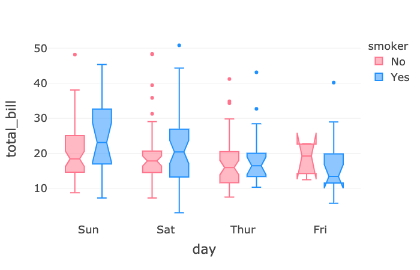

# 6.1.1 Plotly Express

> **Plotly** _describes_ **Plotly-express** _as a_ _**“terse, consistent, high-level API for rapid data exploration and figure generation”**_.

 **Plotly Express \(px\)** is a built-in part of the `plotly`library, and is the recommended starting point for creating most common figures. Every Plotly Express function uses [graph objects ](6.1.2-plotly-graph-objects.md)internally and returns a figure instance.

Plotly Express provides more than 30 functions for creating different types of figures, from a scatter plot to a bar chart to a histogram to a sunburst chart throughout a data exploration session.


**Plotly Express currently includes the following functions:**

* **Basics**: `scatter`, `line`, `area`, `bar`, `funnel`, `timeline`
* **Part-of-Whole**: `pie`, `sunburst`, `treemap`, `funnel_area`
* **1D Distributions**: `histogram`, `box`, `violin`, `strip`
* **2D Distributions**: `density_heatmap`, `density_contour`
* **Matrix Input**: `imshow`
* **3-Dimensional**: `scatter_3d`, `line_3d`
* **Multidimensional**: `scatter_matrix`, `parallel_coordinates`, `parallel_categories`
* **Tile Maps**: `scatter_mapbox`, `line_mapbox`, `choropleth_mapbox`, `density_mapbox`
* **Outline Maps**: `scatter_geo`, `line_geo`, `choropleth`
* **Polar Charts**: `scatter_polar`, `line_polar`, `bar_polar`
* **Ternary Charts**: `scatter_ternary`, `line_ternary`


Let's still use the **tips** dataset  and **gapmind** dataset for example.

```text
import plotly.express as px
tips = px.data.tips()
```

### 1. Scatter and Line

```text
fig = px.scatter(tips, x="total_bill", y="tip",trendline="ols")
fig.show()

```



```text
fig = px.scatter(tips, x="total_bill", y="tip", color="day", marginal_y="violin",
           marginal_x="box", trendline="ols")
fig.show()
```

```text

```



```text
fig = px.parallel_categories(df, color="size", 
                color_continuous_scale=px.colors.sequential.RdBu )
fig.show()
```



### 2. Bar Chart

**Grouped Bar**

```text
fig = px.bar(tips, x="sex", y="total_bill", color="smoker", 
                barmode="group",color_discrete_sequence =['#ff748c','#1e90ff'])
fig.show()
```



\*\*\*\*

**Stacked Bar**  

```text
# without "barmode" parameter
fig = px.bar(tips, x="sex", y="total_bill", color="smoker",
                color_discrete_sequence =['#ff748c','#1e90ff'])
fig.show()
```


**Facet Barplot**

```text
fig = px.bar(tips, x="sex", y="total_bill", color="smoker", barmode="group",
              facet_row="time", facet_col="day",
              category_orders={"day": ["Thur", "Fri", "Sat", "Sun"], 
                            "time": ["Lunch", "Dinner"]} ,
              color_discrete_sequence =['#ff748c','#1e90ff'])
fig.show()
```



### 3. Pie Chart



```text
fig = px.sunburst(df, path=['continent', 'country'], values='pop',
                  color='lifeExp', hover_data=['iso_alpha'])
fig.show()
```


### 4. Distributions

```text
fig = px.histogram(tips, x="total_bill", y="tip", color="sex", 
                   marginal="rug", hover_data=tips.columns
                   ,color_discrete_sequence =['#ff748c','#1e90ff'])
fig.show()
```



```text
fig = px.violin(tips, y="tip", x="smoker", color="sex", box=True, points="all", 
              hover_data=tips.columns, color_discrete_sequence =['#ff748c','#1e90ff'], 
              template= 'plotly_dark')
fig.show()
```



```text
fig = px.box(tips, x="day", y="total_bill", color="smoker", notched=True,
            color_discrete_sequence =['#ff748c','#1e90ff'],template = 'presentation')
fig.show()
```



