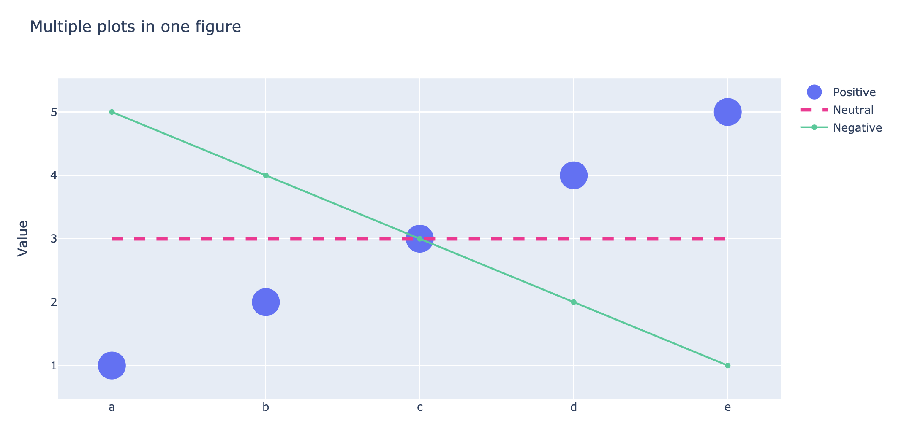
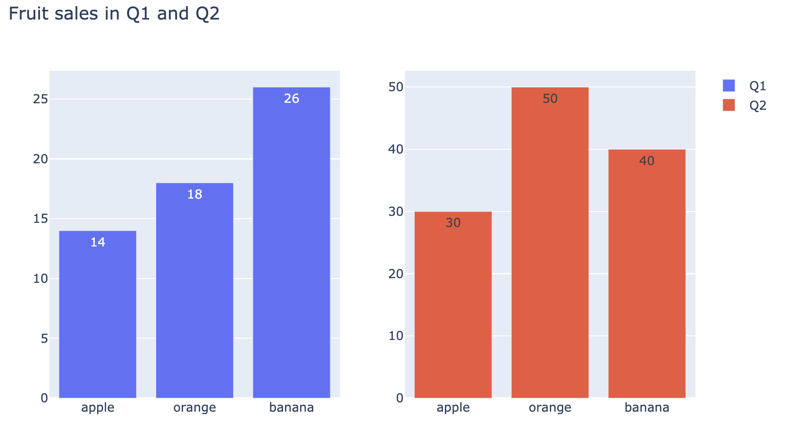
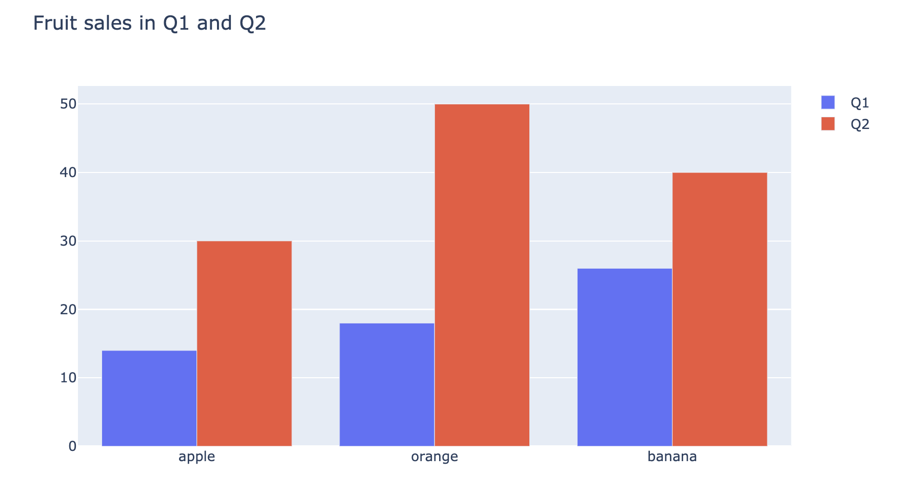
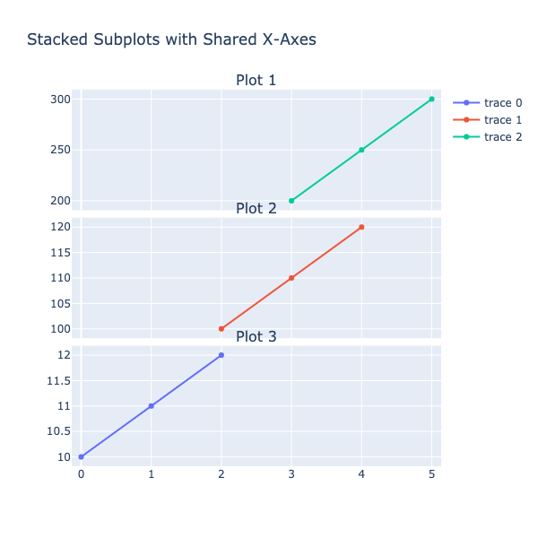
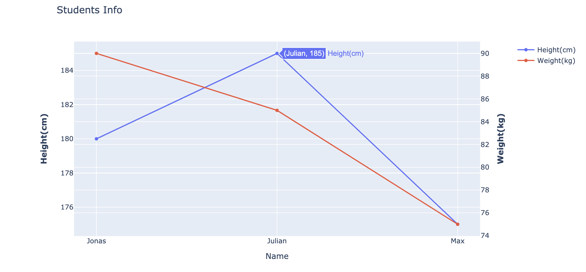
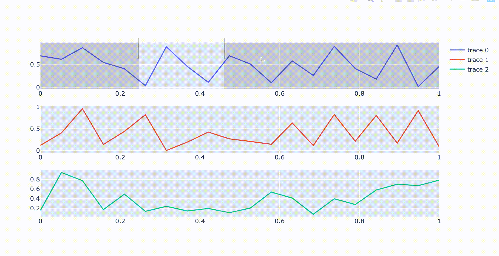

# 6.1.2 Plotly Graph Objects

## About Graph Objects

The `plotly.graph_objects` module \(typically imported as `go`\) contains an automatically-generated hierarchy of Python classes that represent non-leaf nodes in this figure schema. 


Every non-leaf attribute of a figure is represented by an instance of a class in the `plotly.graph_objects`hierarchy.

Functions in [Plotly Express](https://plotly.com/python/plotly-express/), which is the recommended entry-point into the `plotly` library, are all built on top of graph objects, and all return instances of `plotly.graph_objects.Figure`.


#### Advantage

* Graph objects provide precise data validation. If you provide an invalid property name or an invalid property value as the key to a graph object, an exception will be raised with a helpful error message describing the problem.
* Graph objects contain descriptions of each valid property as Python docstrings, with a [full API reference available](https://plotly.com/python-api-reference/). 
* Properties of graph objects can be accessed using both dictionary-style key lookup \(e.g. `fig["layout"]`\) or class-style property access \(e.g. `fig.layout`\).
* Graph objects support higher-level convenience functions and "magic underscores" for making updates to already constructed figures

## When to use Graph Objects 

### **1. Multiple plots in one figure**


**What to learn:**

* Add traces in figure
* Distinguish scatter plot with  "markers", "lines", and "default" mode 
* Set the color or line and size of scatters
* Add legend name, axes name


```text
import plotly.graph_objects as go

fig = go.Figure()

# add trace 1
fig.add_trace(go.Scatter(
    x=['a', 'b', 'c', 'd', 'e'], y=[1, 2, 3, 4, 5],
    mode='markers', marker_size= 30,
    name="Positive"
))

fig.add_trace(go.Scatter(
    x=['a', 'b', 'c', 'd', 'e'], y=[3, 3, 3, 3, 3],
    mode='lines',
    name="Neutral",
    line = dict(color='deeppink', width=4, dash='dash')
))

fig.add_trace(go.Scatter(
    x=['a', 'b', 'c', 'd', 'e'], y=[5, 4, 3, 2, 1],
    name="Negative"
))

# Edit the layout
fig.update_layout(title='Multiple plots in one figure',
                   yaxis_title='Value')

fig.show()
```



### **2. Multiple plots in multiple figures**


**What to learn:**

* Make subplots
* Deal with categorical data
* Add text on figure
* Change bar mode


Firstly, we create a subplots figure contains 1 row and 2 columns. Then we create a list named "fruit" and pass two different lists of value to it. 

```text
from plotly.subplots import make_subplots
import plotly.graph_objects as go

fruit = ['apple','orange','banana']

fig = make_subplots(rows=1, cols=2)
fig.add_trace(
    go.Bar(name = 'Q1', x= fruit, y=[14, 18, 26],  
    text=[14, 18, 26],textposition='auto'),
    row=1, col=1)

fig.add_trace(
    go.Bar(name = 'Q2', x= fruit, y=[30, 50, 40], 
    text= [30, 50, 40],textposition='auto'),
    row=1, col=2)

fig.update_layout(height=500, width=800, title_text="Fruit sales in Q1 and Q2")
fig.show()
```

Although the chart looks good and clear, it is quite tricky, our audience will easily ignore ticks of Y-axis and have wrong impressions. Therefore, it's better to let the two plots share the Y-axis.



After changing the bar mode and sharing the Y-axis 

```text
fig = go.Figure(data=[
    go.Bar(name='Q1', x= fruit, y=[14, 18, 26]),
    go.Bar(name='Q2', x= fruit, y=[30, 50, 40])
])
# Change the bar mode
fig.update_layout(barmode='group', height=500, width=800, 
                    title_text="Fruit sales in Q1 and Q2")
fig.show()
```



### 3. Share X-axis Subplots


**What to learn:**

* Make vertical subplots
* Add subplot titles


```text
fig = make_subplots(rows=3, cols=1, 
                    shared_xaxes=True, 
                    vertical_spacing=0.02,
                   subplot_titles=("Plot 1", "Plot 2", "Plot 3"))

fig.add_trace(go.Scatter(x=[0, 1, 2], y=[10, 11, 12]),
              row=3, col=1)

fig.add_trace(go.Scatter(x=[2, 3, 4], y=[100, 110, 120]),
              row=2, col=1)

fig.add_trace(go.Scatter(x=[3, 4, 5], y=[200, 250, 300]),
              row=1, col=1)

fig.update_layout(height=600, width=600,
                  title_text="Stacked Subplots with Shared X-Axes")
fig.show()
```



### 4. Dual-axis plots

Even though some people believe that the dual-axis chart is a great way to easily illustrate the relationship between two ****different variables and illustrate a lot of information with limited space,  I  would suggest you not to, unless you had a thoughtful consideration. The Dual-axis chart is hard for most people to intuitively make right statements about two data series. ****In fact, you can just use two charts to deliver the same information. 

Remember? Simple is better than complex. 


**What to learn:**

* Create a dual-axis plot
* Add the main title
* Change the primary and secondary Y-axis title


```text
# Create figure with secondary y-axis
fig = make_subplots(specs=[[{"secondary_y": True}]])

# Add traces
fig.add_trace(
    go.Scatter(x=['Jonas', 'Julian', 'Max'], y=[180, 185, 175], name="Height(cm)"),
    secondary_y=False,
)

fig.add_trace(
    go.Scatter(x=['Jonas', 'Julian', 'Max'], y=[90, 85, 75], name="Weight(kg)"),
    secondary_y=True)

# Add figure title
fig.update_layout(title_text="Students Info")

# Set x-axis title
fig.update_xaxes(title_text="Name")

# Set y-axes titles
fig.update_yaxes(title_text="<b>Height</b> ", secondary_y=False)
fig.update_yaxes(title_text="<b>Weight</b>", secondary_y=True)

fig.show()
```

As we can see, the left Y-axis represents students' height, the right one means weight. It's hard to read the message without the legend.



### 5. Synchronizing axes in subplots

```text
import plotly.graph_objects as go
from plotly.subplots import make_subplots
import numpy as np

N = 20
x = np.linspace(0, 1, N)

fig = make_subplots(3, 1)
for i in range(1, 4):
    fig.add_trace(go.Scatter(x=x, y=np.random.random(N)), i, 1)
fig.update_xaxes(matches='x')  # use "match" to sync
fig.show()
```



