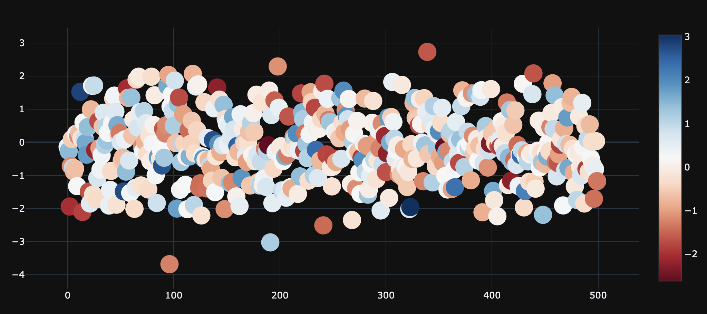
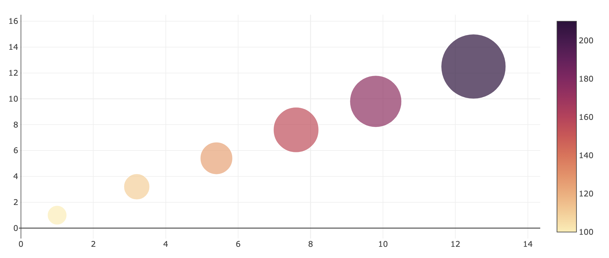
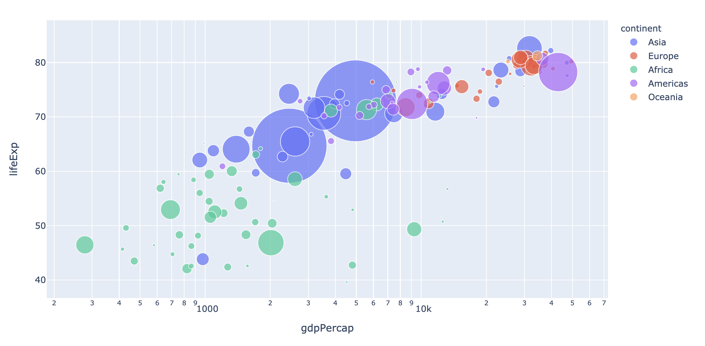

# 6.2.1 Advanced Scatter Chart

### 1. Bubble Chart with Colorbar

```text
fig = go.Figure(data=go.Scatter(
    y = np.random.randn(500),mode='markers',
    marker=dict(
        size=24,
        color=np.random.randn(500), #set color equal to a variable
        colorscale='RdBu', # one of plotly colorscales
        showscale=True)
))
fig.update_layout(template= 'plotly_dark')
fig.show()
```



### 2. Bubble Charts with Colorscale

```text
fig = go.Figure(data=[go.Scatter(
    x=[1, 3.2, 5.4, 7.6, 9.8, 12.5],
    y=[1, 3.2, 5.4, 7.6, 9.8, 12.5],
    mode='markers',
    marker=dict(
        color=[100, 110, 125, 155, 175, 210],
        size=[30, 40, 50, 70, 80, 100],
        colorscale='matter', # one of plotly colorscales
        showscale=True )
)])
fig.update_layout(template= 'none')  # let's try a new template

fig.show()
```



### 3. Bubble chart

```text
df = px.data.gapminder()
fig = px.scatter(df.query("year==2007"), x="gdpPercap", y="lifeExp", size="pop", color="continent",
           hover_name="country", log_x=True, size_max=80)
fig.show()
```



### 4. Bubble Chart Animation

```text
fig = px.scatter(df, x="gdpPercap", y="lifeExp", animation_frame="year", 
                      animation_group="country", size="pop", color="continent", 
                      hover_name="country", facet_col="continent",
           log_x=True, size_max=60, range_x=[100,100000], range_y=[40,90])
fig.show()
```


