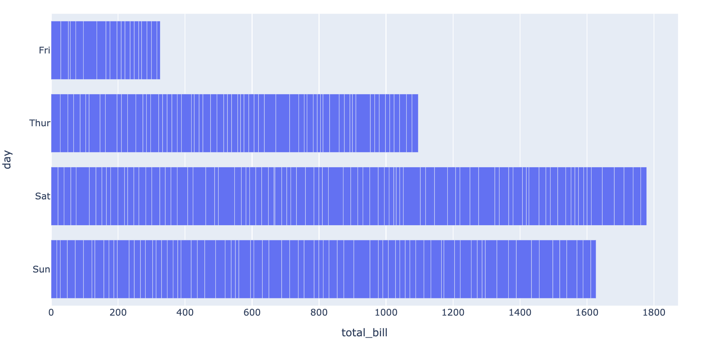
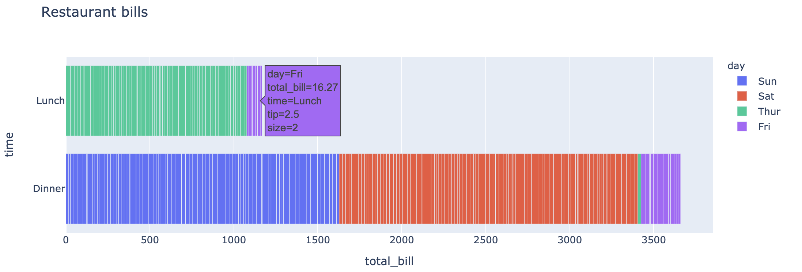
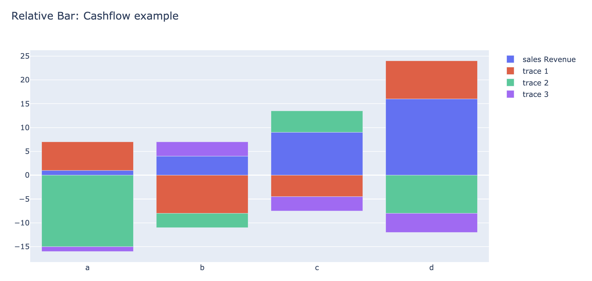
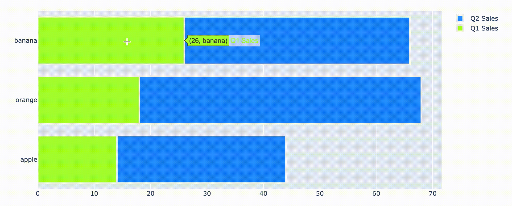
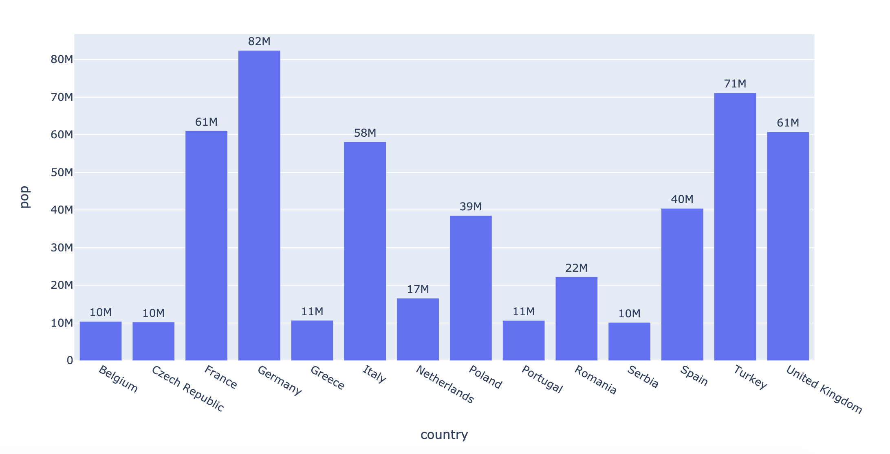
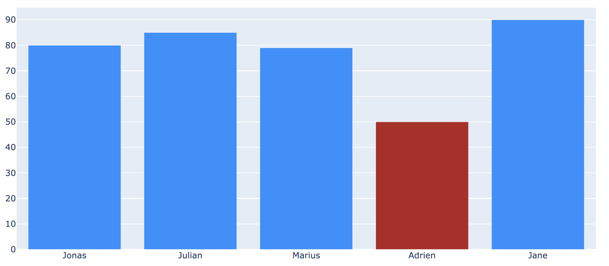

# 6.2.2 Advanced Bar Chart

### 1. Horizontal Bar

In [chapter 6.1.1](../6.1-fundamental-concepts/6.1.1-plotly-express.md#2-bar-chart) we have shown several regular bar charts. To make a horizontal bar is very intuitive, you just need to add a `'orientation='h'`

```text
import plotly.express as px
import plotly.graph_objects as go
```

```text
df = px.data.tips()
fig = px.bar(df, x="total_bill", y="day", orientation='h')
fig.show()
```



```text
fig = px.bar(df, x="total_bill", y="time", color='day', orientation='h',
             hover_data=["tip", "size"], height=400, title='Restaurant bills')
fig.show()
```



### 2. Relative Bar

```text
x = ['a', 'b', 'c', 'd']

fig = go.Figure()
fig.add_trace(go.Bar(x=x, y=[1, 4, 9, 16],name = 'sales Revenue'))
fig.add_trace(go.Bar(x=x, y=[6, -8, -4.5, 8]))
fig.add_trace(go.Bar(x=x, y=[-15, -3, 4.5, -8]))
fig.add_trace(go.Bar(x=x, y=[-1, 3, -3, -4]))

fig.update_layout(barmode='relative', title_text='Relative Bar: Cashflow example')
fig.show()
```



### 3. Customized Bar

```text
fruit = ['apple','orange','banana']
fig = go.Figure()

fig.add_trace(go.Bar(
    y=fruit ,x=[14, 18, 26],
    name='Q1 Sales', orientation='h',
    marker=dict(
        color='greenyellow', line=dict(color='#f3f3f3', width=3)
    )
))
fig.add_trace(go.Bar(
    y=fruit, x=[30, 50, 40],
    name='Q2 Sales', orientation='h',
    marker=dict(
        color='dodgerblue', line=dict(color='#f3f3f3', width=3)
    )
))
fig.update_layout(barmode='stack')
fig.show()
```



```text
# bar with annotations
df = px.data.gapminder().query("continent == 'Europe' and year == 2007 and pop > 10.e6")
fig = px.bar(df, y='pop', x='country', text='pop')
fig.update_traces(texttemplate='%{text:.2s}', textposition='outside')
fig.update_layout(uniformtext_minsize=8, uniformtext_mode='hide')
fig.show()
```



```text
colors = ['dodgerblue',] * 5
colors[3] = 'firebrick'

fig = go.Figure(data=[go.Bar(
    x=['Jonas', 'Julian', 'Marius',
       'Adrien', 'Jane'],
    y=[80, 85, 79, 50, 90],
    marker_color=colors # marker color can be a single color value or an iterable
)])
fig.update_layout(title_text= 'Students Score')
```




