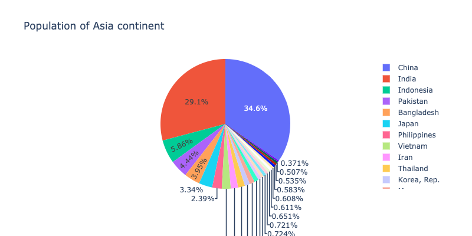
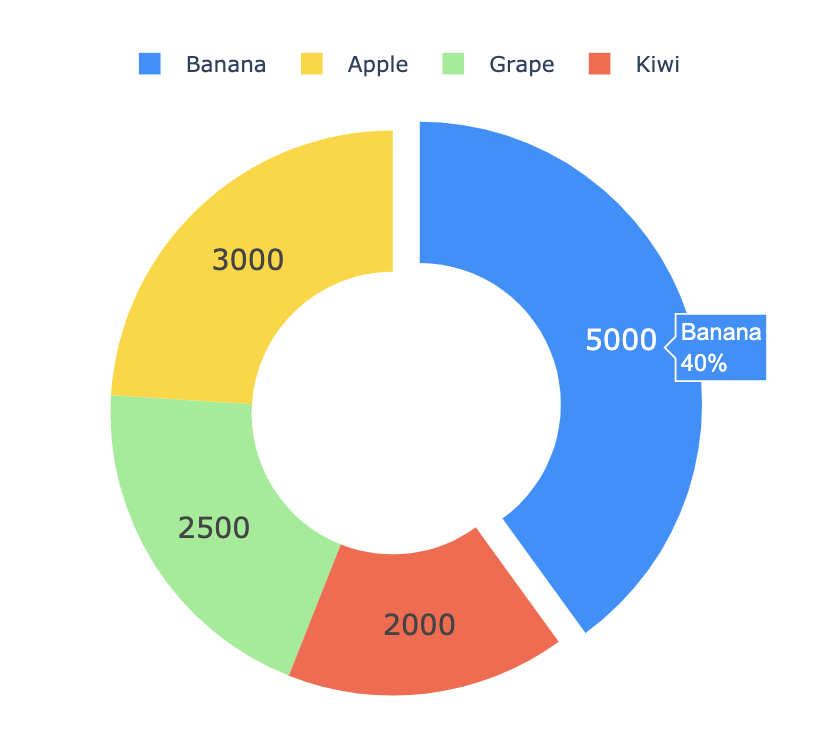
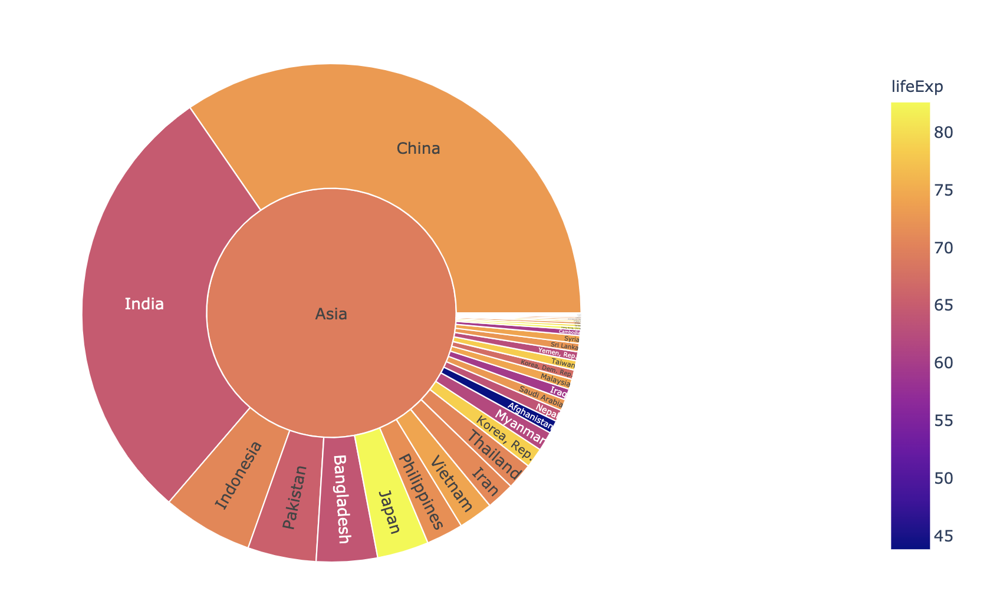

# 6.2.3 Advanced Pie Chart

### Pie Chart

In chapter 2, we discussed why the pie chart is easy to be messed up. Here is another example. When the observations are more than 5, the pie chart will become hard to read or deliver information. You should be very careful before using it. 

```text
df = px.data.gapminder().query("year == 2007").query("continent == 'Asia'")
df.loc[df['pop'] < 10.e6, 'country'] = 'Other countries' # Represent only large countries
fig = px.pie(df, values='pop', names='country', title='Population of Asia continent',width=800, height=400)
fig.show()
```



### Donut Chart

Let's start with a simple donut chart.

```text
import plotly.graph_objects as go

labels = ['Apple','Banana','Kiwi','Grape']
values = [3000, 5000, 2000, 2500]

# Use `hole` to create a donut-like pie chart
fig = go.Figure(data=[go.Pie(labels=labels, values=values, hole=.3)])
fig.show()
```


This donut chart is not sweet enough, we can add some customization to make it look better. For example,

* change the color set
* make the font size bigger `update_traces`
* make the donut hole bigger `hole`
* cut a slice out `pull`
* put the legend closer to the donut `update_layout`

```text
fig = go.Figure(data=[go.Pie(labels=labels, values=values, hole=.5, pull=[0, 0.1, 0, 0])])
colors = ['gold', 'dodgerblue', 'tomato', 'lightgreen']

fig.update_traces(hoverinfo='label+percent', textinfo='value', 
                  textfont_size=16,marker=dict(colors=colors))
fig.update_layout(legend=dict(orientation="h",yanchor="bottom",y=1.02,
    xanchor="right",x=0.7))
fig.show()
```



### Sunburst Chart

**Sunburst plots** visualize hierarchical data spanning outwards radially from root to leaves. It looks fancy and stylish, however, it could be even messer than a pie chart. Be careful!

```text
fig = px.sunburst(df, path=['continent', 'country'], values='pop',
                  color='lifeExp', hover_data=['iso_alpha'])
fig.show()
```



