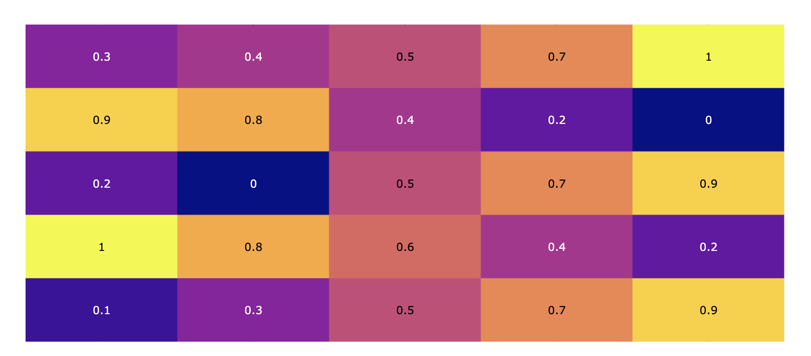
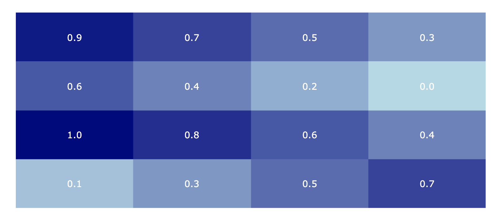
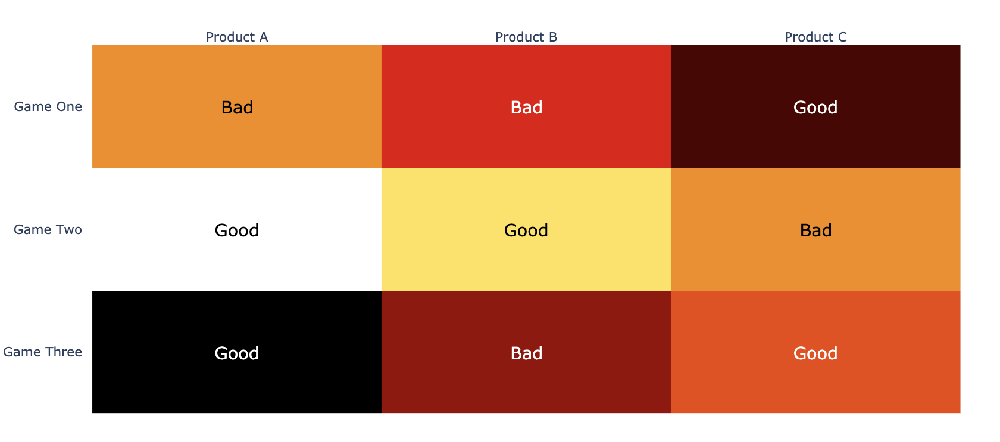

# 6.2.4 Advanced Heatmap

### 1. Basic Annotated Heatmap

```text
## Annotated heatmap
import plotly.figure_factory as ff

z = [[.1, .3, .5, .7, .9],
     [1, .8, .6, .4, .2],
     [.2, 0, .5, .7, .9],
     [.9, .8, .4, .2, 0],
     [.3, .4, .5, .7, 1]]

fig = ff.create_annotated_heatmap(z)
fig.show()
```



### 2. Heatmap with defined color-scale

```text
z = [[.1, .3, .5, .7],
     [1.0, .8, .6, .4],
     [.6, .4, .2, 0.0],
     [.9, .7, .5, .3]]

colorscale = [[0, 'lightblue'], [1, 'navy']]
font_colors = ['white']
fig = ff.create_annotated_heatmap(z, colorscale=colorscale, font_colors=font_colors)

# Make text size larger
for i in range(len(fig.layout.annotations)):
    fig.layout.annotations[i].font.size = 16
fig.show()
```



### 3. Customized Heatmap

```text
z = [[.1, .3, .5],
     [1.0, .8, .6],
     [.6, .4, .2]]

x = ['Product A', 'Product B', 'Product C']
y = ['Game Three', 'Game Two', 'Game One']

z_text = [['Good', 'Bad', 'Good'],
          ['Good', 'Good', 'Bad'],
          ['Bad', 'Bad', 'Good']]

fig = ff.create_annotated_heatmap(z, x=x, y=y, annotation_text=z_text, colorscale='hot')
# Make text size larger
for i in range(len(fig.layout.annotations)):
    fig.layout.annotations[i].font.size = 16
fig.show()
```



