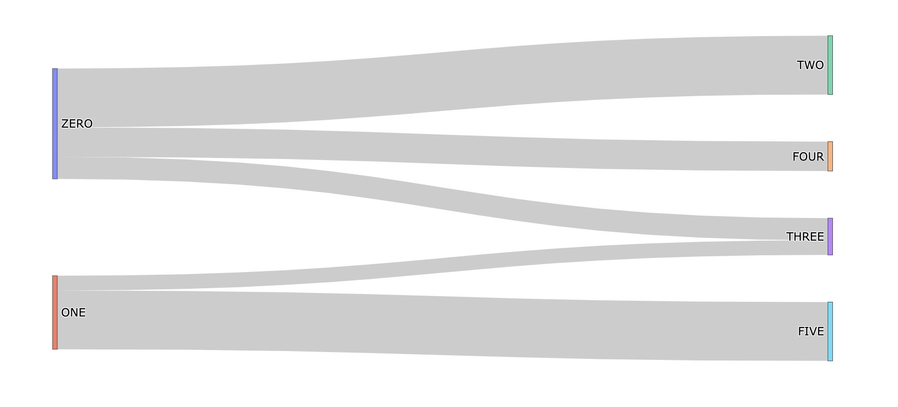
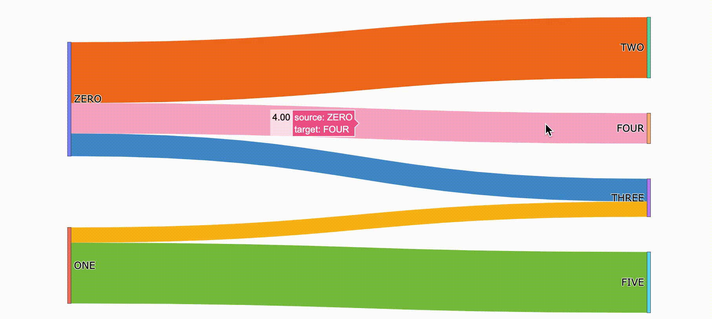
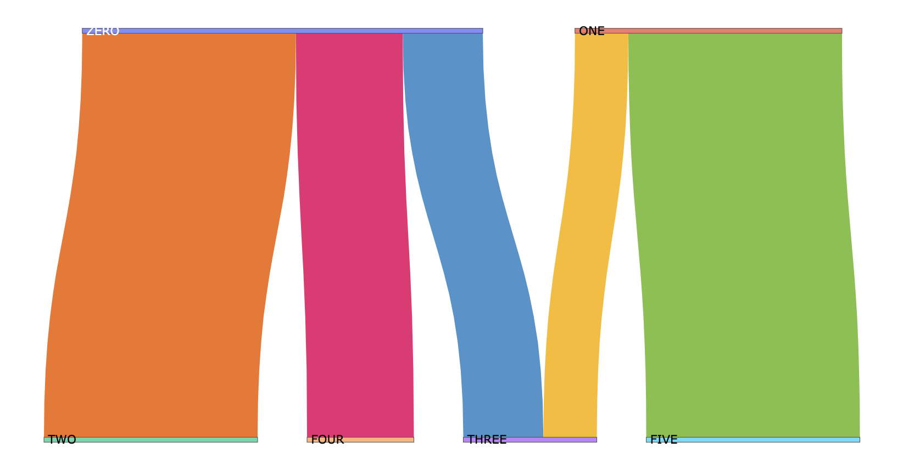

# 6.2.5 Sankey Chart

Sankey diagrams visualize the contributions to flow by defining `source` to represent the source node,  `target` for the target node, `value` to set the flow volume, and label that shows the node name.

if a flow is twice as wide it represents double the quantity. Flows in the diagram can show e.g. energy, materials, water, or costs.


* The link is a dictionary containing data about the connections we want to draw.
* The source and target are lists of indexes for the nodes Plotly will connect.
* The value is a list of numbers that will define the width of these connections.


### 1. Basic Sankey Chart

```text
label = ["ZERO", "ONE", "TWO", "THREE", "FOUR", "FIVE"]
source = [0, 0, 1, 1, 0]
target = [2, 3, 3, 5, 4]
value = [8, 3, 2, 8, 4]

link = dict(source = source, target = target, value = value)
node = dict(label = label, pad=50, thickness=5)
data = go.Sankey(link = link, node=node)

fig = go.Figure(data)
fig.show()
```



### 2. Customized Sankey Chart

```text
label = ["ZERO", "ONE", "TWO", "THREE", "FOUR", "FIVE"]
source = [0, 0, 1, 1, 0]
target = [2, 3, 3, 5, 4]
value = [8, 3, 2, 8, 4]

# add color list
colors = ['#F27420','#4994CE','#FABC13','#7FC241','#EC2272']

# data to dict, dict to sankey
link = dict(source = source, target = target, value = value,color = colors)
node = dict(label = label, pad=50, thickness=5)
data = go.Sankey(link = link, node=node)
# plot
fig = go.Figure(data)
fig.update_layout(height=600,font_size = 14) # set figure and font size
fig.show()
```



### 3. Vertical Sankey Chart

It's very easy to make the chart in vertical, just address **`orientation = 'v'`**. However,  the horizontal Sankey chart is in common use.

```text
link = dict(source = source, target = target, value = value,color = colors)
node = dict(label = label, pad=50, thickness=5)
data = go.Sankey(link = link, node=node, orientation = 'v')
# plot
fig = go.Figure(data)
```



