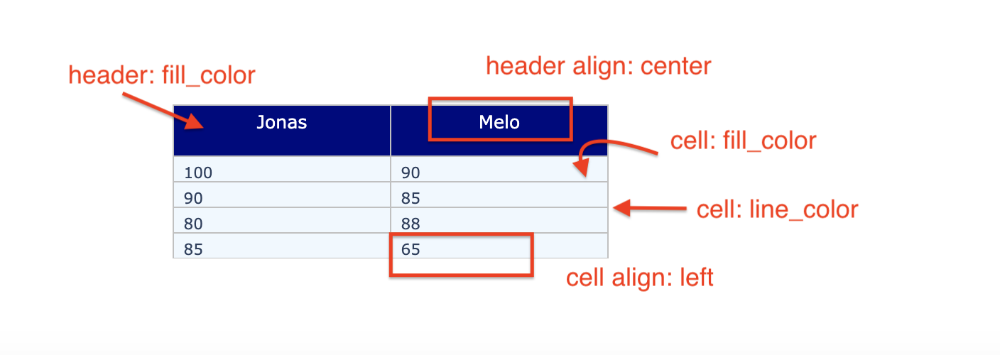

# 6.2.6 Tables

There are two methods to create a table in Plotly. One is `plotly.graph_objects,` the other is `plotly.figure_factory`

## Graph Objects

### 1. Basic Table

```text
import plotly.graph_objects as go

fig = go.Figure(data=[go.Table(header=dict(values=['Jonas', 'Melo']),
                 cells=dict(values=[[100, 90, 80, 85], [90, 85, 88, 65]]))
                     ])
fig.show()
```


### 2. Customized Table

```text
fig = go.Figure(data=[go.Table(
    header=dict(values=['Jonas', 'Melo'],
                line_color='silver',
                fill_color='navy',
                align='center',
                font=dict(color='white', size=14),
                height=40),
    cells=dict(values=[[100, 90, 80, 85], # 1st column
                       [90, 85, 88, 65]], # 2nd column
               line_color='silver',
               fill_color='aliceblue',
               align='left'))
])

fig.update_layout(width=500, height=300)
fig.show()
```



## Figure Factory

### 3. Basic Table

```text
import plotly.figure_factory as ff
data_matrix = [['Name', 'Semester', 'Score'],
               ['Jonas', 1, 'A+'],
               ['Melo', 1, 'B+'],
               ['Jonas', 2, 'A'],
               ['Melo', 2, 'A']]

fig = ff.create_table(data_matrix)
fig.show()
```


### 4. Table with LaTeX


The default row height is 30 pixels. We can use \ **height\_constant**  to change the height of each row.


```text
data_matrix = [['Name', 'Equation'],
               ['Pythagorean Theorem', '$a^{2}+b^{2}=c^{2}$'],
               ['Euler\'s Formula', '$F-E+V=2$'],
               ['The Origin of Complex Numbers', '$i^{2}=-1$'],
               ['Einstein\'s Theory of Relativity', '$E=m c^{2}$']]

fig =  ff.create_table(data_matrix,height_constant=40)
fig.show()
```


### 5. Customized Table


**`colorscale` for the table :**

*  value 0 is the header color
* .5 is the first table color
* 1 is the second table color


```text
# load dataset and sample it
df = pd.read_csv('https://raw.githubusercontent.com/plotly/datasets/master/diabetes.csv')
df_sample = df[100: 110]

colorscale = [[0, '#0080ff'],[.5, 'silver'],[1, '#ffffff']]
fig =  ff.create_table(df_sample, colorscale=colorscale)

fig.show()
```



* Customize font size
* Customize height of each row.
* Address index in the table


```text
data_matrix = [['Name', 'Equation'],
               ['Pythagorean Theorem', '$a^{2}+b^{2}=c^{2}$'],
               ['Euler\'s Formula', '$F-E+V=2$'],
               ['The Origin of Complex Numbers', '$i^{2}=-1$'],
               ['Einstein\'s Theory of Relativity', '$E=m c^{2}$']]

fig =  ff.create_table(data_matrix,height_constant=40,index=True)
# Make text size larger
for i in range(len(fig.layout.annotations)):
    fig.layout.annotations[i].font.size = 16

fig.show()
```


