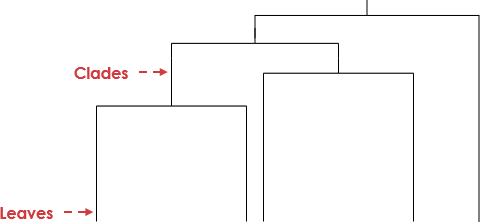
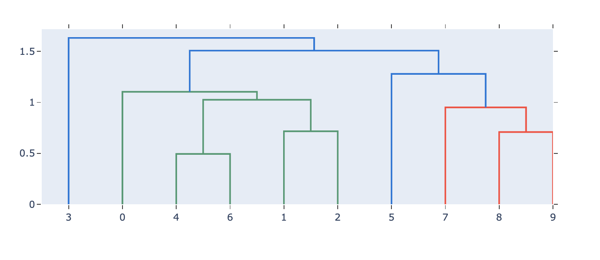
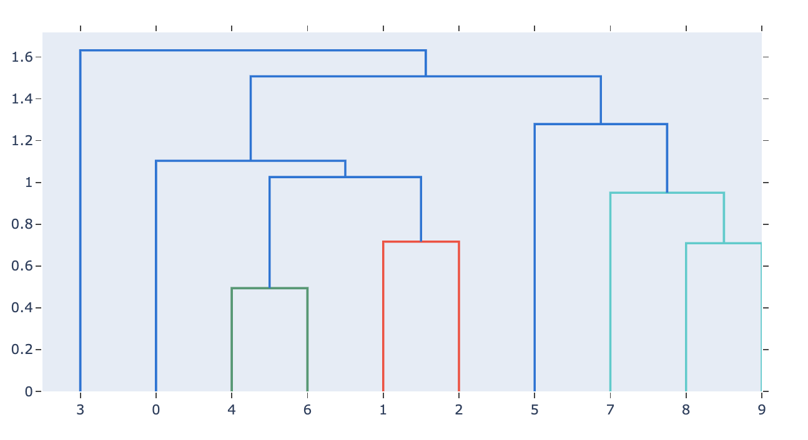
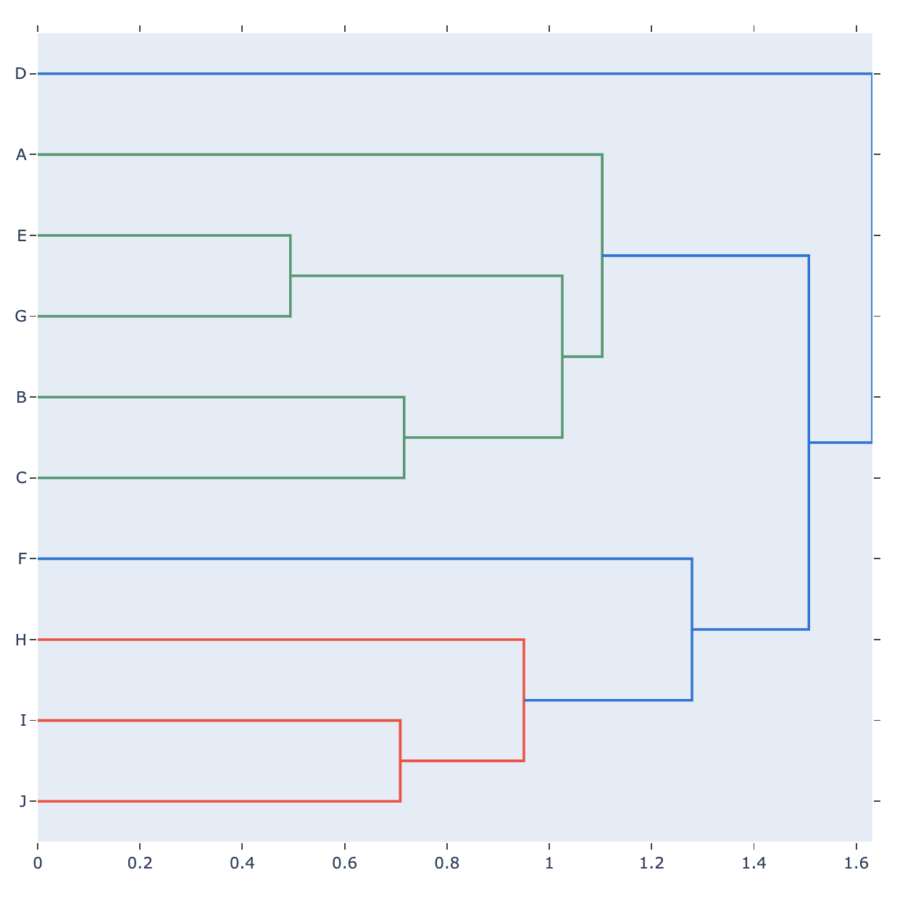

# 6.3.2 Dendrograms

The dendrogram is a tree diagram used to visualize and classify taxonomic relationships frequently used to illustrate the arrangement of the clusters produced by hierarchical clustering. The name dendrogram derives from the two ancient Greek words déndron and grámma, meaning “tree” and “drawing”. Dendrograms are frequently used in biology to show clustering between genes or samples, but they can represent any type of grouped data, i.e., used to illustrate the clustering of genes or samples.

The dendrogram consists of stacked branches \(called clades\) that break down into further smaller branches. At the lowest level will be individual elements and then they are grouped according to attributes into clusters with fewer and fewer clusters on higher levels. The end of each clade \(called a leaf\) is the data.

The arrangement of the clades reveals how similar they are to each other; two leaves in the same clade are more similar than two leaves in another clade. The y-axis \(the height of the branch\) shows how close data points or clusters are from one another. The taller the branch, the further and more different the clusters are.



### 1. Basic Dendrogram

```text
import plotly.figure_factory as ff
import numpy as np
np.random.seed(1)

X = np.random.rand(10, 7) # 10 samples, with 7 dimensions each
fig = ff.create_dendrogram(X)
fig.update_layout(width=800, height=400)
fig.show()

```



### 2. Dendrogram with color threshold

```text
fig = ff.create_dendrogram(X, color_threshold=1)
fig.update_layout(width=800, height=500)
fig.show()
```



### 3. Categorical Dendrogram 

```text
labels = ['A','B','C','D','E','F','G','H','I','J']
fig = ff.create_dendrogram(X, orientation='left', labels=labels)
fig.update_layout(width=800, height=800)
fig.show()
```



