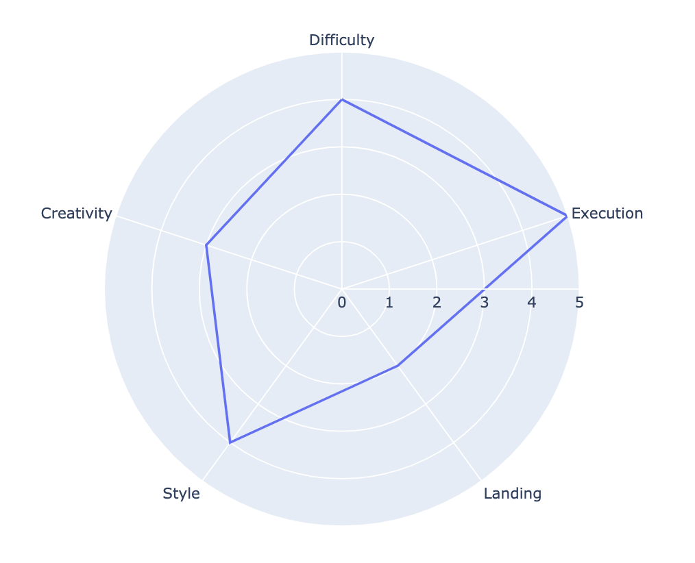
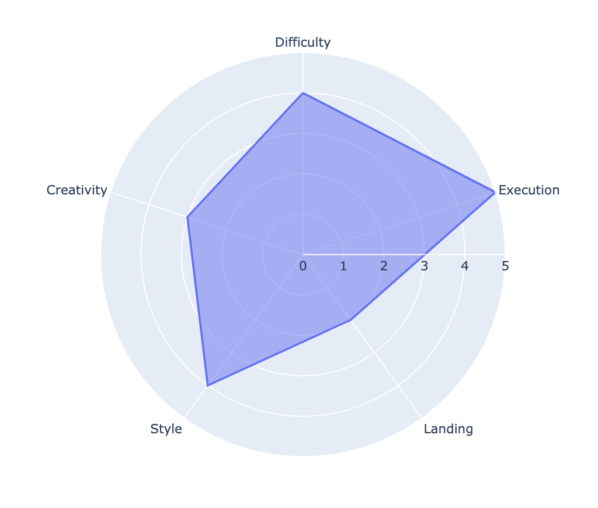
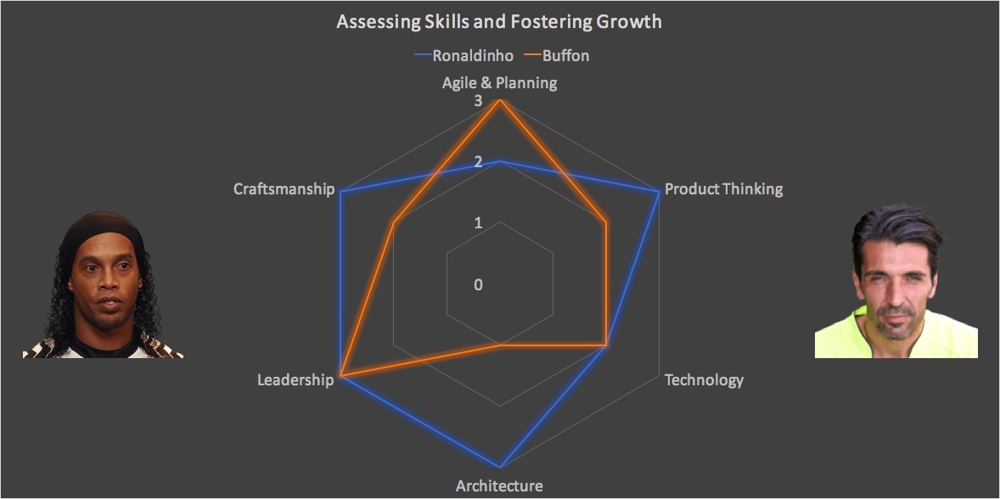

# 6.3.3 Radar Chart

**Radar charts** are a useful way to display multivariate observations with an arbitrary number of variables. Each star represents a single observation. Typically, radar charts are generated in a multi-plot format with many stars on each page, and each star representing one observation.

The data length of a spoke is proportional to the magnitude of the variable for the data point relative to the maximum magnitude of the variable across all data points. 

A line is drawn connecting the data values for each spoke. This gives the plot a star-like appearance and the origin of one of the popular names for this plot. The star plot can be used to answer the following questions:

* Which observations are most similar, i.e., are there clusters of observations?
* Are there outliers?

### 1. Simple Radar Chart

```text
import pandas as pd
df = pd.DataFrame(dict(
    r=[4, 5, 2, 4, 3],
    theta=['Difficulty','Execution','Landing',
           'Style', 'Creativity']))
       
import plotly.express as px
fig = px.line_polar(df, r='r', theta='theta', line_close=True)
fig.show()
```


We use `line_close=True` for closed lines.





For a filled line in a Radar Chart, update the figure created with `px.line_polar` with `fig.update_traces`.


```text
fig = px.line_polar(df, r='r', theta='theta', line_close=True)
fig.update_traces(fill='toself')
fig.show()
```



### 2. Multiple Trace Radar Chart

Let's try to reproduce this graph by drawing multiple traces of the radar chart.



```text
categories = ['Craftsmanship','Leadership','Architecture',
            'Product Thinking','Technology','Agile & Planning']

fig = go.Figure()

fig.add_trace(go.Scatterpolar(
      r=[3, 3, 3, 3, 3,2],
      theta=categories,
      fill='toself',
      name='Ronaldinho'))
      
fig.add_trace(go.Scatterpolar(
      r=[2, 3, 2, 2, 2,3],
      theta=categories,
      fill='toself',
      name='Buffon'))

fig.update_layout(
  polar=dict(
    radialaxis=dict(
      visible=True,
      range=[0, 3]
    )),
  font_size=16,
  legend_font_size=16,
  template = 'plotly_dark',
  title = 'Assessing Skills and Fostering Growth')
```


