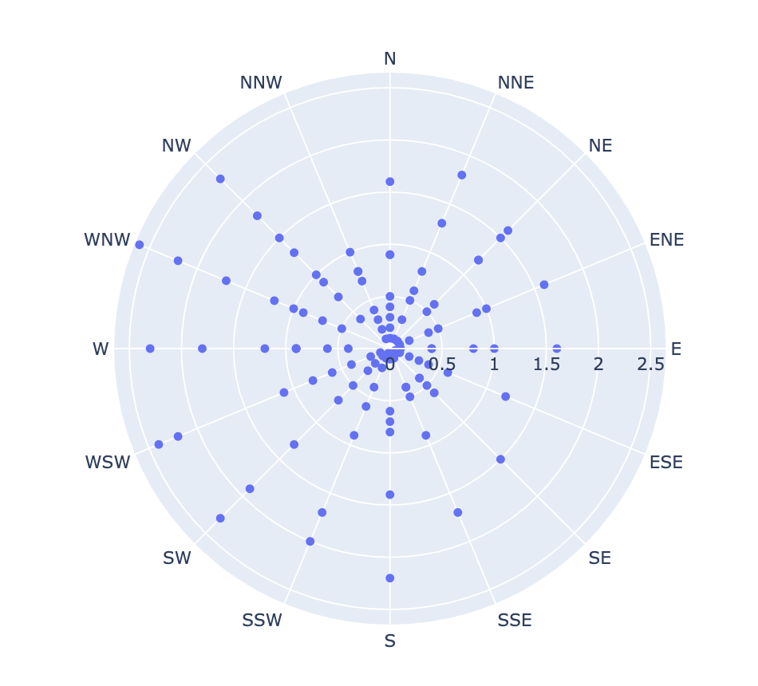
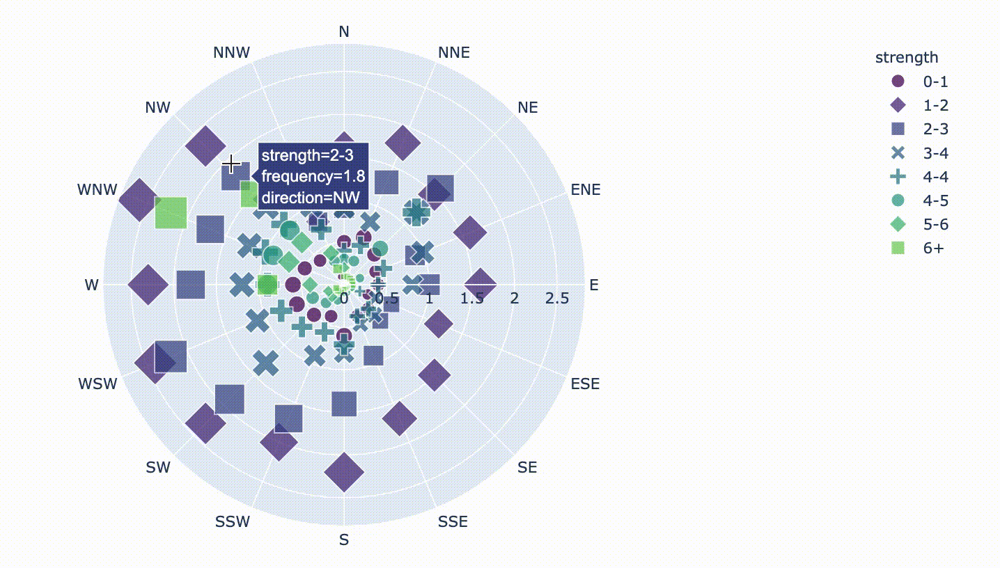
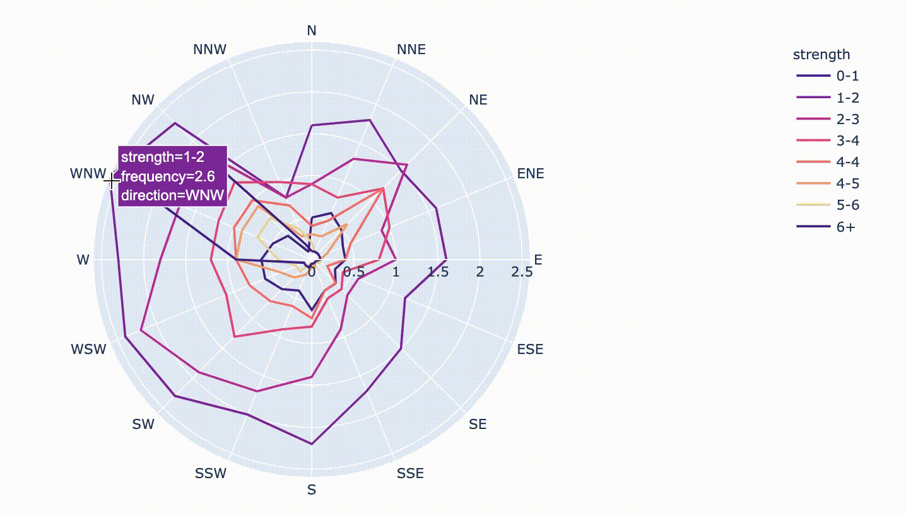
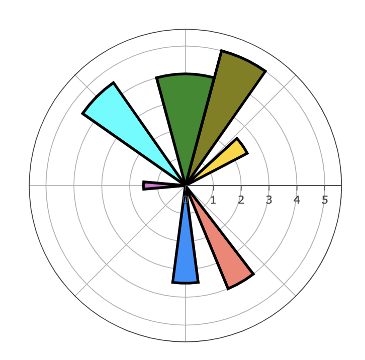

# 6.3.4 Polar Chart

**Polar Chart** is a common variation of circular graphs. It is useful when relationships between data points can be visualized most easily in terms of radiuses and angles.  
  
In **Polar Charts**, a series is represented by a closed curve that connects points in the polar coordinate system. Each data point is determined by the distance from the pole \(the radial coordinate\) and the angle from the fixed direction \(the angular coordinate\).

A polar chart represents data along the radial and angular axes. In Plolty, there are three types of polar chart: **Scatter polar chart, Line polar chart, and Bar polar chart.**

### 1. Scatter Polar Chart

```text
import plotly.express as px
df = px.data.wind()
fig = px.scatter_polar(df, r="frequency", theta="direction")
fig.show()
```



The "strength" column corresponds to strengthen wind categories, and there is a frequency value for each direction and strength. Below we use the strength column to **encode the color, symbol,  and size of the markers.**

```text
fig = px.scatter_polar(df, r="frequency", theta="direction",
                       color="strength", symbol="strength", size="frequency",
                       color_discrete_sequence=px.colors.sequential.Viridis)
fig.show()
```



### 2. Line Polar Chart

```text
fig = px.line_polar(df, r="frequency", theta="direction", color="strength", line_close=True,
                    color_discrete_sequence=px.colors.sequential.Agsunset)
fig.show()
```



### 3. Bar Polar Chart

```text
import plotly.graph_objects as go

fig = go.Figure(go.Barpolar(
    r=[5, 2.5, 1.5, 4.5, 4, 4, 3.5],
    theta=[65, 35, 180, 135, 300, 90, 270],
    width=[20,15,10,20,15,30,15,],
    marker_color=["olive", 'gold', 'orchid', 'cyan', 'salmon', 'forestgreen', 'dodgerblue'],
    marker_line_color="black",
    marker_line_width=3
))

fig.update_layout(
    template=None,
    polar = dict(
        radialaxis = dict(range=[0, 5.6], ),
        angularaxis = dict(showticklabels=False, ticks='')
))
fig.show()
```



### 4. Windrose Chart

A wind rose chart \(also known as a polar bar chart\) is a graphical tool used to visualize how wind speed and direction are typically distributed at a given location. We can use  `px.bar_polar` , or  use `go.Barpolar` .


