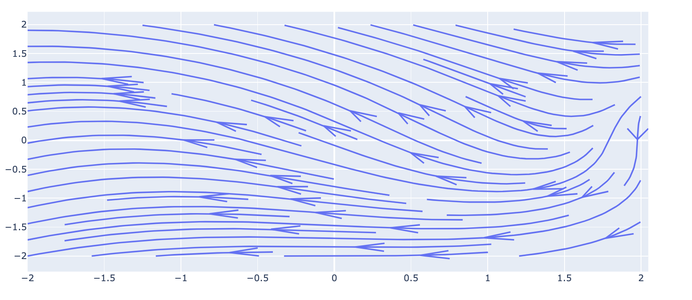
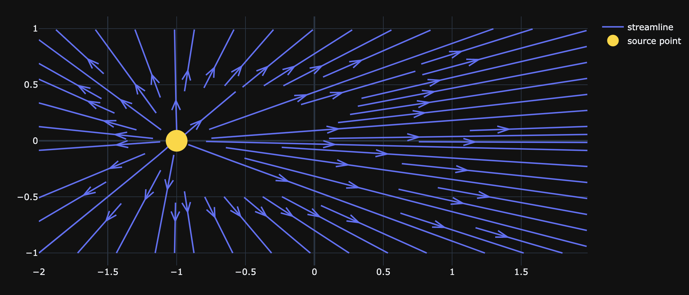
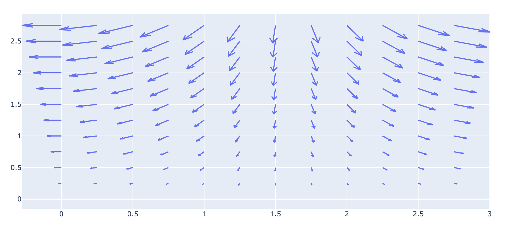
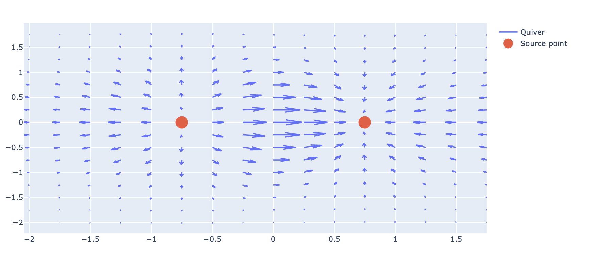

# 6.3.5 Streamline Chart

### 1. Streamline Plot

Streamlines are a family of curves that are instantaneously tangent to the velocity vector of the flow. These show the direction in which a massless fluid element will travel at any point in time. 

Streamlines can be useful in fluid dynamics. For example, Bernoulli's principle, which describes the relationship between pressure and velocity in an inviscid fluid, is derived for locations along a streamline.


**It needs to provide:**

* uniformly spaced ranges of `x` and `y` values \(1D\)
* 2-D velocity values `u` and `v` defined on the cross-product \(`np.meshgrid(x, y)`\) of `x` and `y`.


#### Basic streamline plot

```text
import plotly.figure_factory as ff
import numpy as np

x = np.linspace(-2, 2, 100)
y = np.linspace(-2, 2, 100)
Y, X = np.meshgrid(x, y)
u = -2 - X**2 + Y
v = 2 + X - Y**2

# Create streamline figure
fig = ff.create_streamline(x, y, u, v, arrow_scale=.2)
fig.show()
```



#### Streamline with source points

```text
import plotly.figure_factory as ff
import plotly.graph_objects as go
import numpy as np

N = 50
x_start, x_end = -2.0, 2.0
y_start, y_end = -1.0, 1.0
x = np.linspace(x_start, x_end, N)
y = np.linspace(y_start, y_end, N)
X, Y = np.meshgrid(x, y)
source_strength = 5.0
x_source, y_source = -1.0, 0.0

# Compute the velocity field on the mesh grid
u = (source_strength/(2*np.pi) *
     (X - x_source)/((X - x_source)**2 + (Y - y_source)**2))
v = (source_strength/(2*np.pi) *
     (Y - y_source)/((X - x_source)**2 + (Y - y_source)**2))

# Create streamline figure
fig = ff.create_streamline(x, y, u, v,
                           name='streamline')

# Add source point
fig.add_trace(go.Scatter(x=[x_source], y=[y_source],
                          mode='markers',
                          marker_size=30,
                          name='source point',
                        marker=dict(color='gold')))
                        
fig.update_layout(template= 'plotly_dark')
fig.show()
```



### 2. Quiver Plot

A quiver plot displays velocity vectors as arrows with components \(u,v\) at the points \(x,y\). This type of plot is useful in electrical engineers to visualize electrical potential and show stress gradients in Mechanical engineering.

#### Basic quiver plot

```text
x,y = np.meshgrid(np.arange(0, 3, .25), np.arange(0, 3, .25))
u = -np.cos(x)*y
v = -np.sin(x)*y

fig = ff.create_quiver(x, y, u, v)
fig.show()
```



#### Quiver plot with source points

Just like the streamline plot, it is also possible to add source points to a quiver plot.

```text
import numpy as np
x,y = np.meshgrid(np.arange(-2, 2, .25),
                  np.arange(-2, 2, .25))
z = x*np.exp(-x**2 - y**2)
v, u = np.gradient(z, .25, .25)

# Create quiver figure
fig = ff.create_quiver(x, y, u, v,
                       scale=.25,
                       arrow_scale=.5,
                       name='quiver',
                       line_width=2)

# Add points to figure
fig.add_trace(go.Scatter(x=[-.75, .75], y=[0,0],
                    mode='markers',
                    marker_size=20,
                    name='source point'))
fig.show()
```



### 3. 3-D Quiver Plot

To make the graph more interesting and intuitive, we can draw a 3-D quiver plot, which is also called the "cone plot". Cone plots \(also known as 3-D quiver plots\) represent vector fields defined in some region of the 3-D space.

A vector field associates to each point of coordinates \(x, y, z\) a vector of components \(u, v, w\). 

#### Simple 3-D quiver plot

```text
fig = go.Figure(data=go.Cone(x=[1], y=[1], z=[1], u=[1], v=[1], w=[0],
                                colorscale='hot'))
fig.update_layout(scene_camera_eye=dict(x=-0.75, y= 0.75, z=1.5))
fig.show()
```


#### Customized 3-D quiver plot

```text
import pandas as pd
df = pd.read_csv("https://raw.githubusercontent.com/plotly/datasets/master/vortex.csv")

fig = go.Figure(data = go.Cone(
    x=df['x'],
    y=df['y'],
    z=df['z'],
    u=df['u'],
    v=df['v'],
    w=df['w'],
    colorscale='Blues',
    sizemode="absolute",
    sizeref=60))

fig.update_layout(scene=dict(aspectratio=dict(x=1, y=1, z=0.8),
                             camera_eye=dict(x=1.2, y=1.2, z=0.6)),
                  template = 'plotly_dark' )

fig.show()
```


#### 

