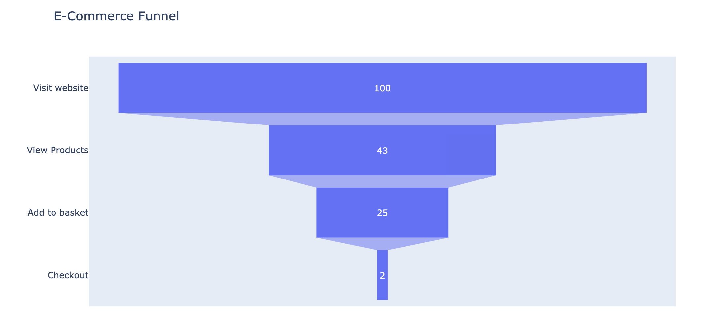
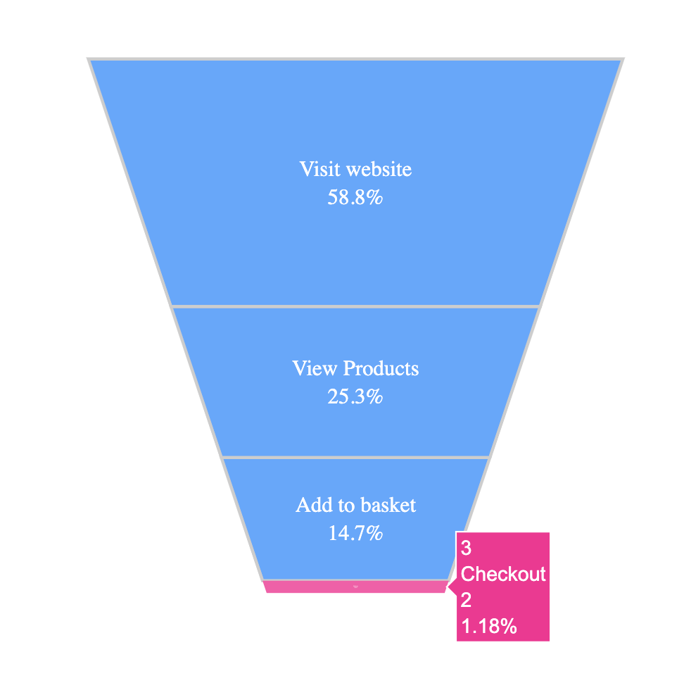
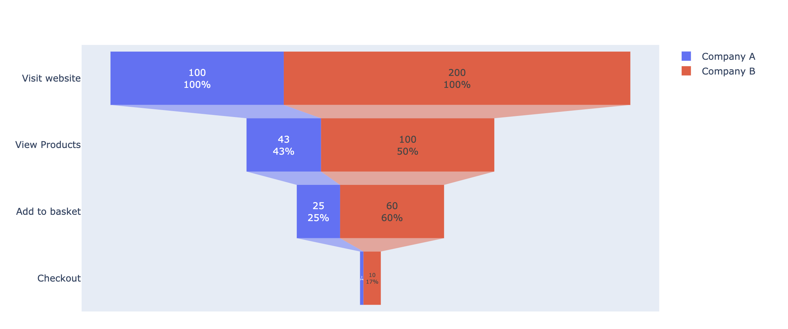

# 6.4.1 Funnel Chart

Funnel charts are often used to represent data in different stages of a business process. It’s an important mechanism in Business Intelligence to identify potential problem areas of a process. For example, it’s used to observe the revenue or loss in a sales process for each stage and display values that are decreasing progressively. Each stage is illustrated as a percentage of the total of all values.

Let's use an E-commerce case for example. From visitors randomly visit a website to complete a purchase, the process can divide into four stages: **Visit, View, Add to basket, and Checkout.** 

### 1. Basic Funnel Chart

```text
import plotly.express as px
data = dict(
    Values=[100, 43, 25, 2],
    Stage=["Visit website", "View Products", "Add to basket", "Checkout"])
fig = px.funnel(data, x='Values', y='Stage',  title='E-Commerce Funnel')
fig.show()
```



### 2. Customized Funnel Chart

If we want to emphasize one or several parts, we can use different colors to highlight it.

```text
import plotly.graph_objects as go
fig = go.Figure(go.Funnelarea(
      values =[100, 43, 25, 2] , 
      text = ["Visit website", "View Products", "Add to basket", "Checkout"],
      marker = {"colors": ["dodgerblue", "dodgerblue", "dodgerblue","deeppink" ],
                "line": {"color": ["silver", "silver", "silver"], "width": [2, 2, 2]}},
      textfont = {"family": "Old Standard TT, serif", "size": 14, "color": "white"}, opacity = 0.8))
fig.show()
```



### 3. Stacked Funnel Chart

It's also possible to compare two or more companies, products, or performance by Funnel Chart. We just need to create a stacked funnel chart, putting them together.

```text
fig = go.Figure()

fig.add_trace(go.Funnel(
    name = 'Company A',
    y = ["Visit website", "View Products", "Add to basket", "Checkout"],
    x = [100, 43, 25, 2],
    textinfo = "value+percent initial"))

fig.add_trace(go.Funnel(
    name = 'Company B',
    orientation = "h",
    y = ["Visit website", "View Products", "Add to basket", "Checkout"],
    x = [200, 100, 60, 10],
    textposition = "inside",
    textinfo = "value+percent previous"))
fig.show()
```

From below we can see company B has better performance than company A, its traffic and conversion performance are way ahead of company A.



