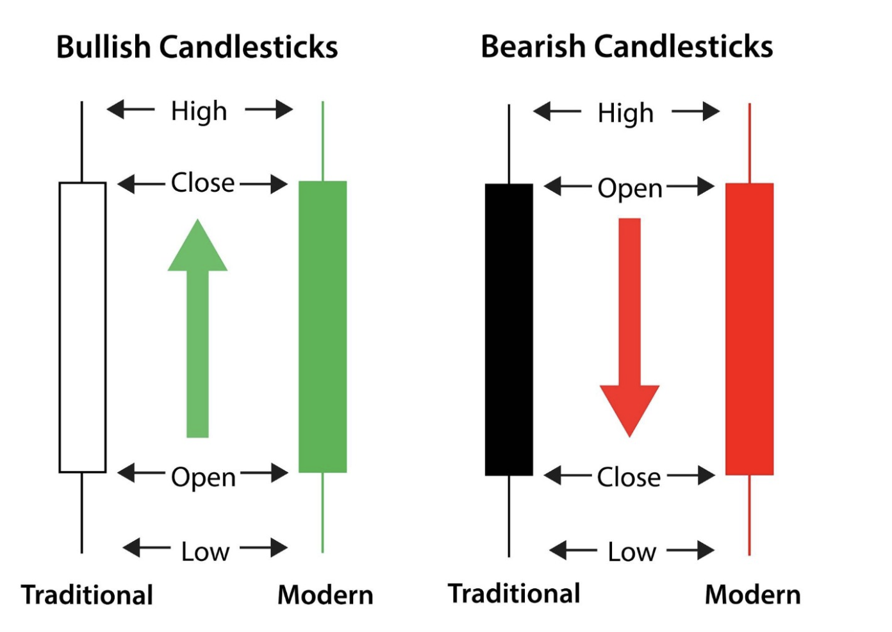
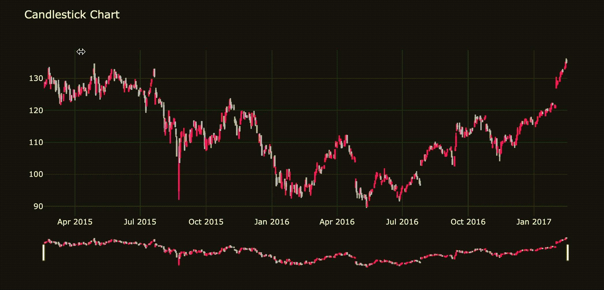

# 6.4.2 Candlestick Chart

A candlestick pattern is a graphical representation of a movement in the price of a stock or commodity. Studying candlestick patterns is one of the widely used methods of price action trading. Some traders believe that these patterns can predict a particular market movement.

Candlesticks are very similar to box plots. They encompass a body and wicks, also known as shadows.



Let's create a customized and modern candlestick chart. As we discussed above, it needs **open, high, low, and close** four-parameter to draw the candle.

```text
import plotly.graph_objects as go
import pandas as pd

# load dataset
df = pd.read_csv('https://raw.githubusercontent.com/plotly/datasets/master/finance-charts-apple.csv')

fig = go.Figure(data=[go.Candlestick(
    x=df['Date'],
    open=df['AAPL.Open'], high=df['AAPL.High'],
    low=df['AAPL.Low'], close=df['AAPL.Close'],
    increasing_line_color= 'deeppink', decreasing_line_color= 'silver'
)])
fig.update_layout(template= 'plotly_dark', title = 'Candlestick Chart')
fig.show()
```



