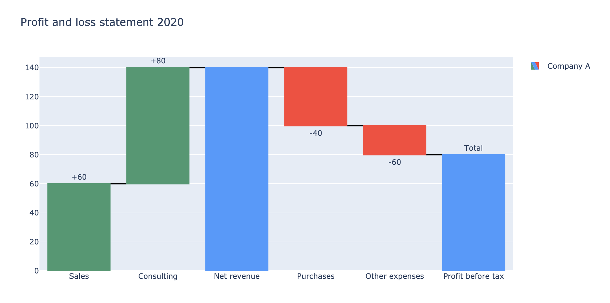
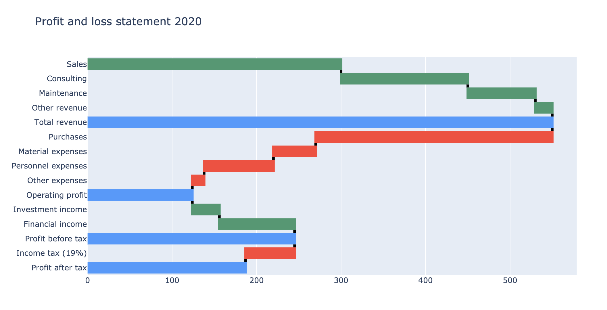

# 6.4.3 Waterfall Chart

A waterfall chart is a form of data visualization that helps in understanding the cumulative effect of sequentially introduced positive or negative values. It shows how a value changes after being affected by various factors that either increase the value or decrease it.

Let's use a company's financial statement for example.

### 1. Vertical Waterfall Chart


**Measure in waterfall chart**

* Relative: default values
* Total: to compute sums
* Absolute: to reset the computed total or to declare an initial value


```text
import plotly.graph_objects as go

fig = go.Figure(go.Waterfall(
    name = "Company A", orientation = "v",
    measure = ["relative", "relative", "total", "relative", "relative", "total"],
    x = ["Sales", "Consulting", "Net revenue", "Purchases", "Other expenses", "Profit before tax"],
    textposition = "outside",
    text = ["+60", "+80", "", "-40", "-60", "Total"],
    y = [60, 80, 0, -40, -20, 0],
    connector = {"line":{"color":"black"}},
))

fig.update_layout(
        title = "Profit and loss statement 2020",
        showlegend = True)
fig.show()
```




### 2. Horizontal Waterfall Chart

It's also possible to create a horizontal waterfall chart. If the variable is more than 5, I would recommend using a horizontal one. 

```text
fig = go.Figure(go.Waterfall(
    name = "2020", orientation = "h", measure = ["relative", "relative", "relative", "relative", "total", "relative",
                                              "relative", "relative", "relative", "total", "relative", "relative", "total", "relative", "total"],
    y = ["Sales", "Consulting", "Maintenance", "Other revenue", "Total revenue", "Purchases", "Material expenses",
       "Personnel expenses", "Other expenses", "Operating profit", "Investment income", "Financial income",
       "Profit before tax", "Income tax (19%)", "Profit after tax"],
    x = [300, 150, 80, 20, None, -280, -50, -82, -14, None, 32, 89, None, -58, None],
    connector = {"mode":"between", "line":{"width":4, "color":"rgb(0, 0, 0)", "dash":"solid"}}
))

fig.update_layout(title = "Profit and loss statement 2020")
# reverse the Y-axis, make the chart more clear
fig['layout']['yaxis']['autorange'] = "reversed"

fig.show()
```



