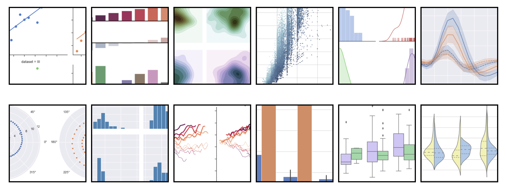

# 4. Seaborn

**Seaborn** is a Python data visualization library based on [matplotlib](https://matplotlib.org/). It provides a high-level interface for drawing attractive and informative statistical graphics.

## Content











