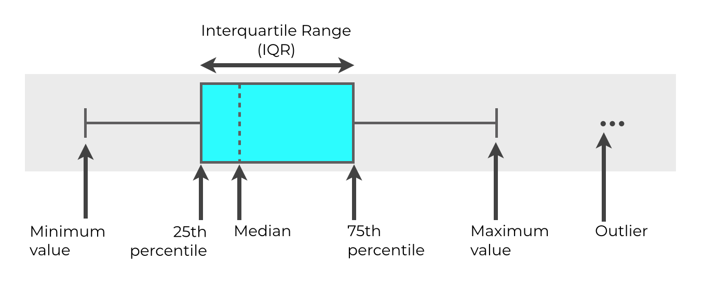
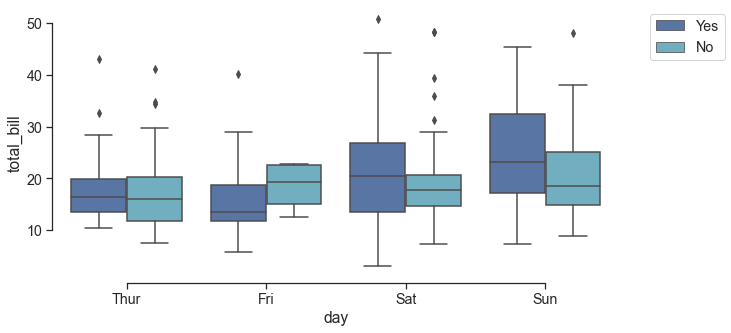

# 4.5.1 Boxplot



```text
sns.set(style="ticks",font_scale=1.3 )

sns.boxplot(x="day", y="total_bill",
            hue="smoker", palette=["b", "c"],
            data=tips)
            
sns.despine(offset=5, trim=True)
plt.legend(bbox_to_anchor=(1.05, 1), loc=2)
```



```text
sns.boxenplot(x="day", y="total_bill",
            hue="time", palette=["b", "r"],
            data=tips)
            
sns.despine(offset=10, trim=True)
plt.legend(bbox_to_anchor=(1.05, 1), loc=2)
```


