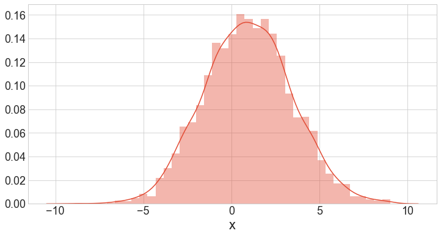
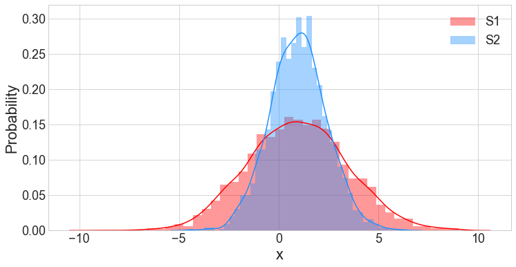
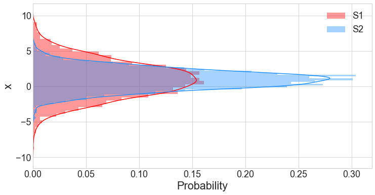
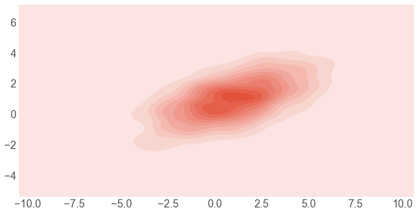

# 4.5.3 Histogram plot

### 1. Basic Histogram



```text
# Create a simple dataset
d = np.random.multivariate_normal([1, 1], [[6, 2], [2, 2]], size=3000)
df = pd.DataFrame(d, columns=['S1', 'S2'])
```

### 2. Univariate Distribution

```text
sns.distplot(df['S1'])
plt.xlabel('x')
```



### 3. Multivariate Distribution

```text
sns.distplot(df['S1'],color = 'r',label = 'S1')
sns.distplot(df['S2'],color = 'dodgerblue', label = 'S2')

plt.xlabel('x')
plt.ylabel('Probability')
plt.legend()
```



### 4. Vertical Distribution

It is quite straightforward to make a vertical histogram with seaborn, just add **`vertical=True`** .

```text
sns.distplot(df['S1'],color = 'r',label = 'S1',vertical=True)
sns.distplot(df['S2'],color = 'dodgerblue',label = 'S2',vertical=True)

plt.ylabel('x')
plt.xlabel('Probability')
plt.legend()
```



### 5. Two Dimensional Distribution

```text
sns.kdeplot(df, color ='r', shade=True)
```




