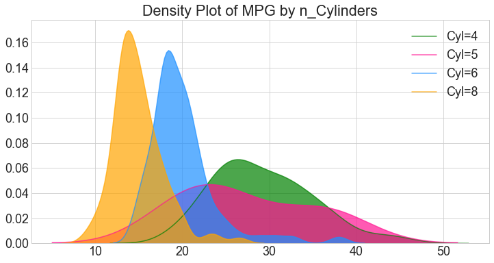
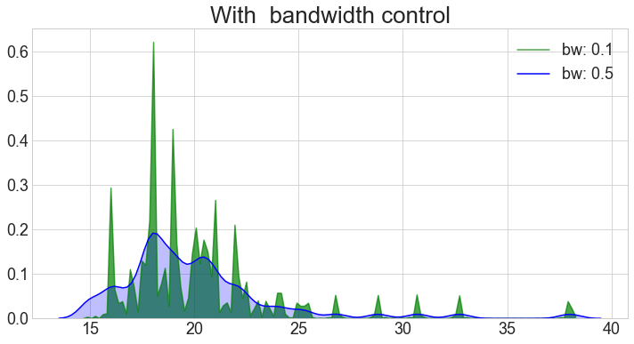

# 4.5.4 Density plot

Density plots are a commonly used tool to visualize the distribution of a continuous variable.

```text
mpg = sns.load_dataset('mpg')   # load  the  embedded  dataset
```

### 1. Simple Density Chart

```text
# Draw Density Plot

sns.kdeplot(mpg.loc[mpg['cylinders'] == 4, "mpg"], shade=True, color="g", label="Cyl=4", alpha=.7)
sns.kdeplot(mpg.loc[mpg['cylinders'] == 5, "mpg"], shade=True, color="deeppink", label="Cyl=5", alpha=.7)
sns.kdeplot(mpg.loc[mpg['cylinders'] == 6, "mpg"], shade=True, color="dodgerblue", label="Cyl=6", alpha=.7)
sns.kdeplot(mpg.loc[mpg['cylinders'] == 8, "mpg"], shade=True, color="orange", label="Cyl=8", alpha=.7)
plt.title('Density Plot of MPG by n_Cylinders')
```



```text
sns.distplot(mpg.loc[mpg['origin'] == 'usa', "horsepower"],  color="g", label="USA", hist_kws={'alpha':.6})
sns.distplot(mpg.loc[mpg['origin'] == 'europe', "horsepower"],  color="deeppink", label="Europe",hist_kws={'alpha':.6})
sns.distplot(mpg.loc[mpg['origin'] == 'japan', "horsepower"], color="dodgerblue", label="Japan", hist_kws={'alpha':.6})
plt.title('Density Plot of Horsepower by origins')
plt.legend()
```

### 2. Density Curves with Histogram <a id="23.-Density-Curves-with-Histogram"></a>


### 3. Bandwidth Control  \(Bins\)

Just like [`bins`](https://app.gitbook.com/@ivy-wang/s/crash-visulisation/~/drafts/-MBipx4bc8WGYUTo-gGD/matplotlib/1.4-histogram-plot#bins) in `matplotlib`, in seaborn, this is controlled using the **`bw`** argument of the **`kdeplot`** function.

```text
sns.kdeplot(mpg.loc[mpg['cylinders'] == 6, "mpg"], shade=True, color="g", label="bw: 0.1", alpha=.7,bw=.1)
sns.kdeplot(mpg.loc[mpg['cylinders'] == 6, "mpg"], shade=True, color="b", label="bw: 0.5", bw=.5)
plt.title('With  bandwidth control')
```



