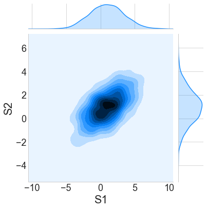
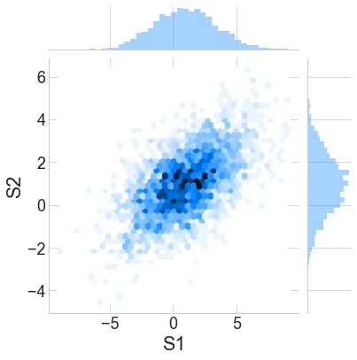

# 4.5.5 Joint plot

Seaborn’s `jointplot` displays a relationship between 2 variables \(bivariate\) as well as 1D profiles \(univariate\) in the margins. The **multivariate normal distribution** is a nice tool to demonstrate this type of plot as it is sampling from a multidimensional Gaussian and there is natural clustering.

Draw a plot of two variables with bivariate and univariate graphs.

### 1. Scatter Histogram Plot <a id="Two-Dimensional-Histograms-and-Binnings"></a>

```text
sns.jointplot(x="S1", y="S2", data=df,  color = 'dodgerblue')
```


### 2. Density Histogram Plot

It is also possible to use the kernel density estimation procedure described above to visualize a bivariate distribution.

```text
sns.jointplot("S1", "S2", data = df, kind='kde', color = 'dodgerblue')
```



### 3. Hex Histogram Plot

A bivariate analog of a histogram is known as a “Hexbin” plot because it shows the counts of observations that fall within hexagonal bins. This plot works best with relatively large datasets.

```text
sns.jointplot("S1", "S2", data = df, kind='hex', color = 'dodgerblue')
```



