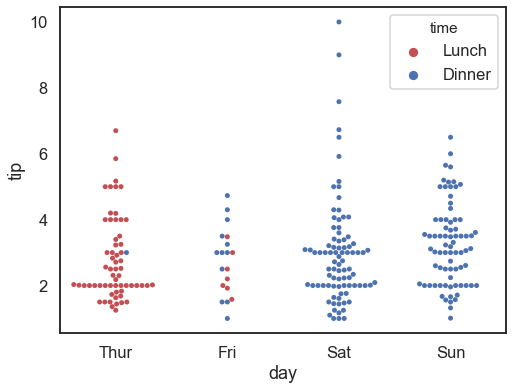

# 4.4.1 Scatter Plot

A scatter plot uses dots to represent values for two different numeric variables. The position of each dot on the horizontal and vertical axis indicates values for an individual data point. Scatter plots are used to observe relationships between variables.

The primary uses of the scatter plot are to observe and show relationships between two numeric variables. The dots in a scatter plot not only report the values of individual data points but also patterns when the data are taken as a whole.

```text
import seaborn as sns    #  import the library
plt.style.use('seaborn-pastel')  #  set the style  and color palette

# set the font size and figure size at once
plt.rcParams.update({'font.size': 18,'figure.figsize':(8, 6)})
```

### 1. Simple Scatterplot

```text
tips = sns.load_dataset("tips")   #  load the embedded  dataset

# Draw a simple scatter plot between two variables
sns.scatterplot(x="total_bill", y="tip", data=tips,s = 80)
```


### 2. Differentiate groups by color

```text
fferentiate Groups by Color# Group by another variable and show the groups with different colors:
sns.scatterplot(x="total_bill", y="tip", hue="time", data=tips, s= 80)
```


### 3. Differentiate groups by color and marker

```text
# Show the grouping variable by varying both color and marker:
sns.scatterplot(x="total_bill", y="tip", hue="time", style="time", data=tips, s= 200)
```


```text
sns.relplot(x="total_bill", y="tip",
                 col="time", hue="day", style="day",
                 kind="scatter", data=tips)
```


### 4. Categorical Scatterplot

The swarm plot can draw a categorical scatterplot with non-overlapping points. It gives a better representation of the distribution of values. In addition, it is also a good complement to a box or violin plot in cases where you want to show all observations along with some representation of the underlying distribution.

```text
sns.swarmplot(x="day", y="tip", hue="time",
              palette=["r", "b", "y",'m'], data=  tips)
```



### 5. Differentiate the quantitative variable by size

```text
# Load the example mpg dataset
mpg = sns.load_dataset("mpg")
```

```text
sns.scatterplot(x="horsepower", y="mpg", size="weight", data=mpg)
```


### 6. Differentiate the quantitative variable by size and color

```text
sns.scatterplot(x="horsepower", y="mpg", hue ='origin',size="weight", data=mpg)
```


### 7. More complex

```text
# Plot miles per gallon against horsepower with other semantics

sns.relplot(x="horsepower", y="mpg", hue="origin", size="weight",
            sizes=(40, 400), alpha=.7, palette="muted",
            height=6, data=mpg)
```


