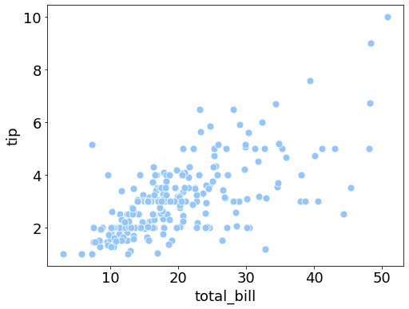
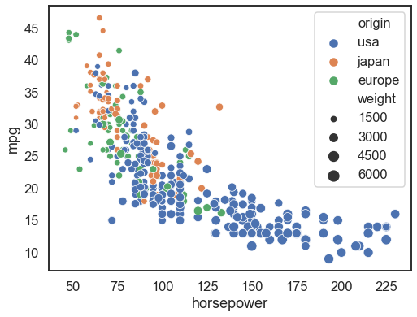

# 4.4.1 Scatter plot

```text
import seaborn as sns    #  import the library
plt.style.use('seaborn-pastel')  #  set the style  and color palette

# set the font size and figure size at once
plt.rcParams.update({'font.size': 18,'figure.figsize':(8, 6)})
```

```text
tips = sns.load_dataset("tips")   #  load the embedded  dataset

# Draw a simple scatter plot between two variables
sns.scatterplot(x="total_bill", y="tip", data=tips,s = 80)
```



```text
# Group by another variable and show the groups with different colors:
sns.scatterplot(x="total_bill", y="tip", hue="time", data=tips, s= 80)
```


```text
# Show the grouping variable by varying both color and marker:
sns.scatterplot(x="total_bill", y="tip", hue="time", style="time", data=tips, s= 200)
```


```text
sns.relplot(x="total_bill", y="tip",
                 col="time", hue="day", style="day",
                 kind="scatter", data=tips)
```


```text
# Load the example mpg dataset
mpg = sns.load_dataset("mpg")
```

```text
sns.scatterplot(x="horsepower", y="mpg", size="weight", data=mpg)
```


```text
sns.scatterplot(x="horsepower", y="mpg", hue ='origin',size="weight", data=mpg)
```



```text
# Plot miles per gallon against horsepower with other semantics

sns.relplot(x="horsepower", y="mpg", hue="origin", size="weight",
            sizes=(40, 400), alpha=.7, palette="muted",
            height=6, data=mpg)
```


