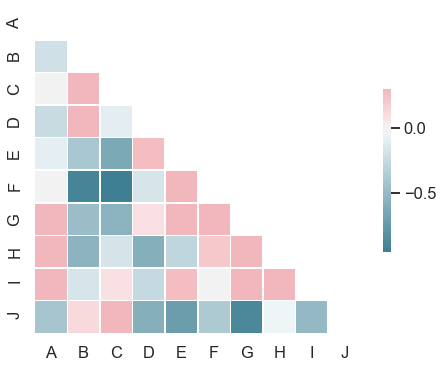

# 4.4.2 Heatmap plot

The heatmap is a way of representing the data in a 2-dimensional form. The data values are represented as colors in the graph. The goal of the heatmap is to provide a colored visual summary of information.

### 1. Heatmap and Annotation

We will create a random dataset and a subplot. The left one is the default mode heatmap, the right one shows the annotation.

```text
# Create a random dataset 
data = np.random.rand(5, 10)
```

```text
f,axes = plt.subplots(1,2, figsize = (20,6))
sns.heatmap(data, ax=axes[0])
sns.heatmap(data, annot=True, ax=axes[1])
```


### 2. Horizontal Bar Heatmap

Meanwhile, we can change the color bar to horizontal.

```text
sns.heatmap(data, annot=True, 
        cbar_kws={'label': 'Horizontal Colorbar', 'orientation': 'horizontal'})
```



In General, the darker color represents the larger value, the lighter color represent the smaller value. The above example violates the principle. So, we need to modify the color set by**`cmap`**`parameter`

Also, with the annotation display, we can read the information directly. To make the graph as clean and simple as possible, we can remove the color bar.


```text
f,axes = plt.subplots(1,2, figsize = (20,6))
sns.heatmap(data,cmap="YlGnBu",ax=axes[0])
sns.heatmap(data,cmap="YlGnBu",annot=True, cbar=False,ax=axes[1])
```


### 3. Categorical Heatmap \(in Triangle\)

```text
# create a simple dataset,giving the column names.
d = pd.DataFrame(data,
                 columns=['A','B','C','D','E','F','G','H','I','J'])
                 
# Compute the correlation matrix
corr = d.corr()

# Generate a mask for the upper triangle
mask = np.triu(np.ones_like(corr, dtype=np.bool))

# Generate a custom diverging colormap
cmap = sns.diverging_palette(220, 10, as_cmap=True)

# Draw the heatmap with the mask and correct aspect ratio
sns.heatmap(corr,mask = mask,cmap=cmap, vmax=.3, center=0,
            square=True, linewidths=.5, cbar_kws={"shrink": .5})
```



