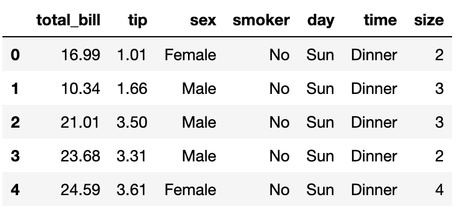

# 4.4.4 Pair plot

A pair plot pairwise relationships in a dataset. The pair plot function creates a grid of Axes such that each variable in data will be shared in the y-axis across a single row and in the x-axis across a single column. The diagonal Axes are treated differently, drawing a plot to show the univariate distribution of the data for the variable in that column.

```text
import seaborn as sns
plt.rcParams.update({'font.size': 18,'figure.figsize':(8, 6)})
tips = sns.load_dataset("tips")
```



Let's draw a simple scatterplot for joint relationships and univariate distribution.

```text
sns.pairplot(tips)
```


If you have a large dataset, you may consider a "**small and specific**" method to illustrate a subset of variables. Then we can use `vars`. Compare to the whole dataset, below only shows the relationship between tip and table size.

```text
sns.pairplot(tips, vars=["tip", "size"])
```


Considering the simplicity, it's possible to remove the repetitive part and leave a lower triangle of bivariate axes.

```text
sns.pairplot(tips,corner = True)
```


If you want to represent an additional level of conditionalization. Then we can use the parameter`hue` , which plots different subsets of data in different colors. Here is an example of showing different levels of a categorical variable by colors.

```text
sns.pairplot(tips, kind="reg",hue = 'smoker',palette = 'husl')
```


Also, we can use different`markers`for each level of the hue variable, to illustrate the difference.

```text
sns.pairplot(tips, kind="scatter",hue ='sex',markers=["o", "s"],palette = 'husl')
```


