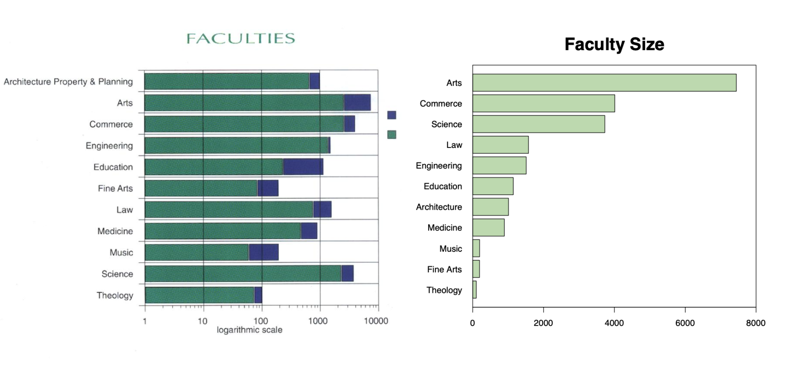

# 2.3 Misleading Graph

Our brain is prewired to process visual content much quicker than text, which is why data design is so effective. By “seeing” the data, it is easier for your brain to intake, synthesize, and retain the information presented.

While graphs can be a valuable tool to help summarize data into a compelling story, they can also inadvertently be used incorrectly or worse, to mislead. This can make results appear different than they actually are and/or lead others to draw incorrect conclusions.  Here are a few typical tricks in visulization.

### 1. Irrelevant Data

Anyone who has taken an intro to psych or a statistics class has heard the old adage, “[correlation does not imply causation](http://en.wikipedia.org/wiki/Correlation_does_not_imply_causation).” Just because two trends seem fluctuate in tandem, these rule posits, that doesn’t prove that they are meaningfully related to one another. 

### 2. Misuse Graph

We know that pie charts are for slices which, together, make up 100%. If the numbers don’t add up to 100%, the pie chart has been misused. As you can see below, the percentages from each section add up to more than 100% and it 's difficult to extract information at once. This is a common problem when people try to visualize survey data that has multiple answers.

### 3. Manipulate Axes

A common misleading feature in graphs is a skewed scale of axes.

#### Omit Baseline

In most cases,  the baseline for a graph is 0. But sometimes writer can make it a different number to skew the graph.This  is known as  "**truncated graph**". The two graphs below show the exact same data, but use different scales for the y-axis.

#### Manipulate X-Axis

Even  though the left  graph tries to show the number of  male faculty and female faculty, it has a fatal mistake, that the X-Axis is not even.  It  could distort the graph and lead misunderstanding.

#### Manipulate Y-Axis

Expanding  or compressing  the scale on  a  graph can make changes in  data seem more or less significant than they actually are.

### 4. Manipulate Data

#### Missing Points

#### Cherry-Picking Data

### 5. Complexity 

