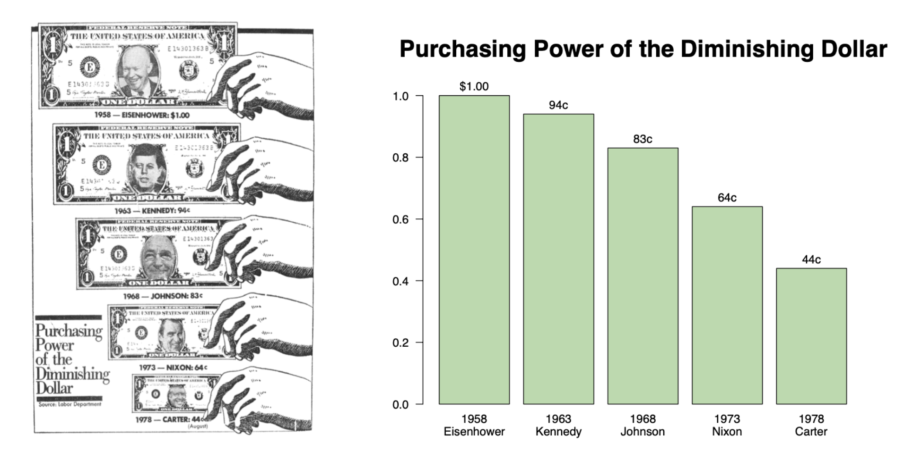
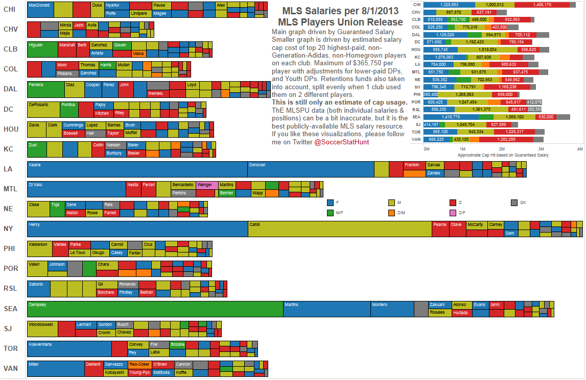
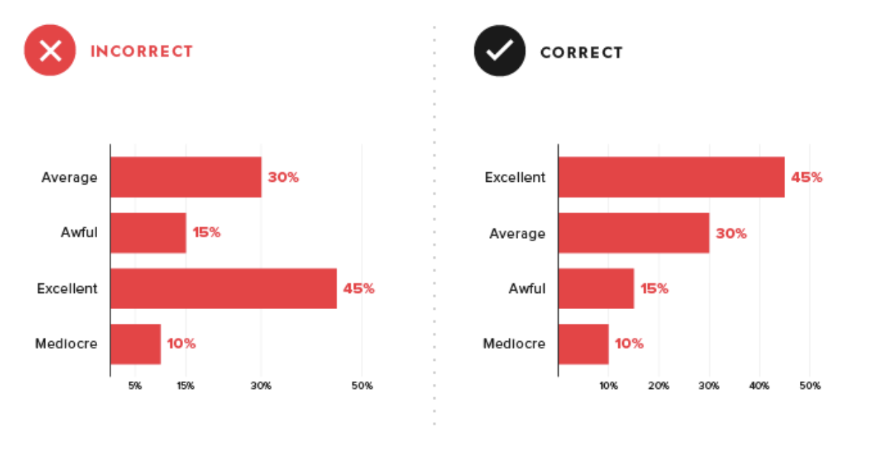

# 2.4 Tips in Visualization

Data is valuable when people can understand them. When done right, data visualization is a great way to display large amounts of information simply and intuitively. However, to ensure that visualizations are effective, it’s important to follow a few important standards and avoid a few all-too-common mistakes.

### Rules  No.1


Every data visualization should **enhance your reader’s experience**, not yours.


### **1. Know your point**

One of the first and easiest ways to approach data visualization is to know your concluding point before you start spending any time creating graphs, charts, or infographics.

Knowing your point before you do the work will ensure the visualizations you choose will be relevant to the point that you’re making. If you know what point you’re trying to drive home, you can then make sure the data visualizations you choose support your points or conclusions.

### **2. Tell a data story**

One common misconception about data visualization is that the visualization tells the audience what they need to know on its own without much additional context.

> _**People don’t simply want to see numbers. They want to know the story behind them.**_

However, helping the audience build the picture through a story \(and not have the focus solely on the visualization\) will make your visualizations stronger, will make your data more accessible to your audience, and will help them remember the information for a longer period.

### **3. Keep it Simple**


* If the “story” is simple, keep it simple. 
* If the “story” is complex, make it look simple. 
* Tell the truth – don’t distort the data.


There may be more than one way to visualize the data accurately. Good visualization should simplify messages and make the main data points as easy to understand as possible. 

**Simple, effective visualizations often follow these guidelines:**

* Minimize colors and other attention-grabbing elements that aren’t directly related to the data of interest.
* Show the full scale of the graph, then zoom to show the data of interest, if necessary.
* Use traditional line graphs, bar charts, and pie charts; these are simple and popular for a reason!
* Aim to grab attention and make their points in under five seconds.
* Include clear labels and titles to explain important chart elements.

### 4. Properly use  color

Using color effectively, and intentionally, will help you to get your point across.

Consider using shades of the same color for comparisons, limiting the number of colors to minimize distraction, and using colors related to the topic being discussed, if applicable. Be mindful of colors that have strong connotations, like red and green, as well as colors with specific cultural associations that may be misleading or confusing for your audience.

For example, it's hard to extract useful information from the fancy and colorful chart.

### 5. Make it understandable

**Double-check these elements before determining that visualization is complete:**

* Make sure labels are accurate, graphs are to scale, and the data displayed adds up to the total \(if it is a pie chart\).
* Ask someone unfamiliar with the data what they understand from the visualization. Is it consistent with what you’re trying to communicate? This includes asking them if the colors used are appropriate and make sense.
* Data visualization is meant to help make sense. Random patterns that are difficult to interpret are frustrating and detrimental to what you’re trying to communicate. You should consider ordering it **intuitively, consistently, or evenly.**

