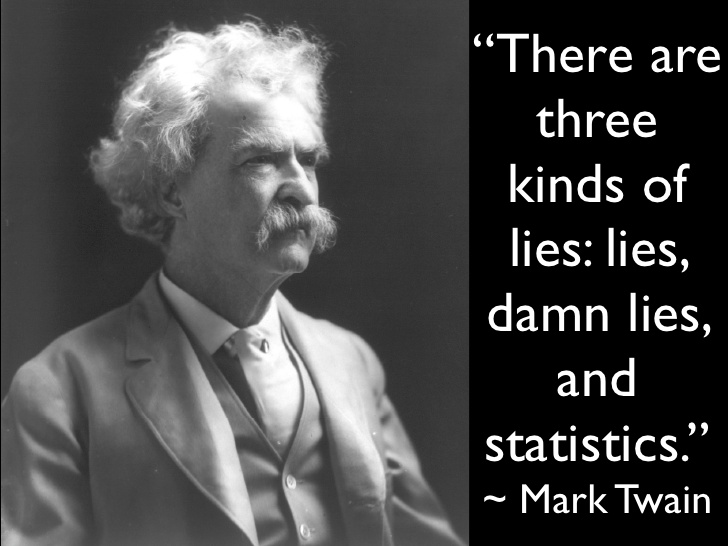

# 2. Tricks in Visualization

## **Content**

* [2.1 Choose Appropriate Chart](how-to-choose-right-chart-or-graph.md)
* [2.2 Features of Charts](features-of-different-charts/)
* [2.3 Misleading Graph](2.3-tricks-in-visualization.md)
* [2.4 Tips in Visualization](2.5-dos-and-donts-in-visualization.md)

