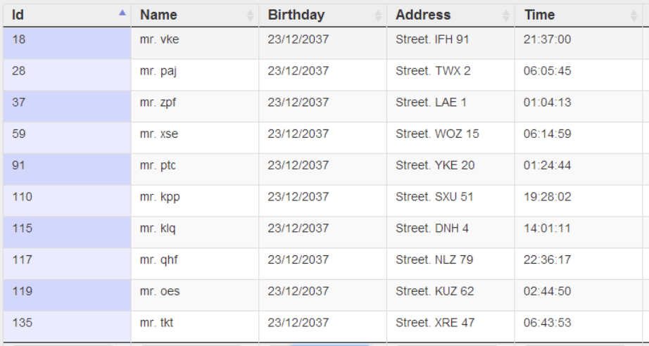

# 2.2.1 Table

### Table

Tables are essentially the source of all the charts. They are best used for **comparison, composition, or relationship analysis** when there are only a few variables and data points.

**Use table** **when:**

* You need to compare or look up individual values.
* You require precise values.
* Values involve multiple units of measure.
* The data has to communicate quantitative information, but not trends.

