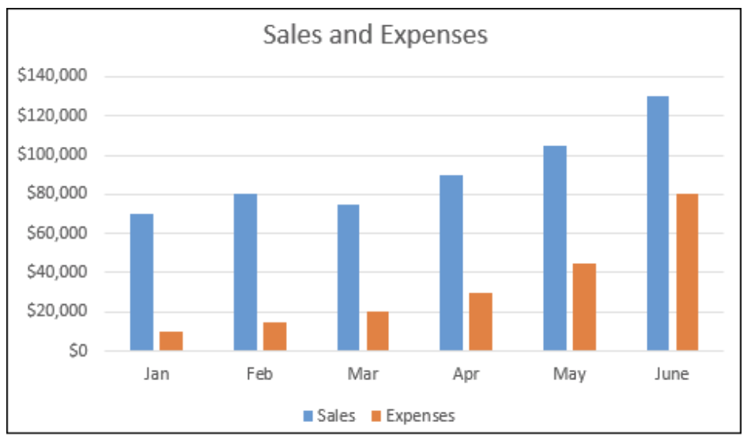
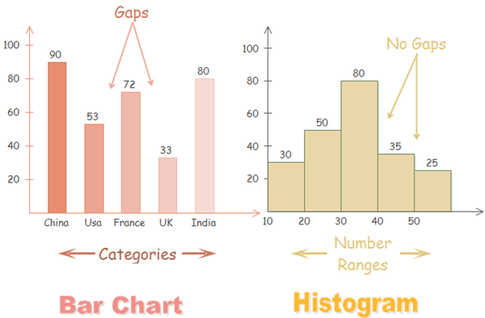
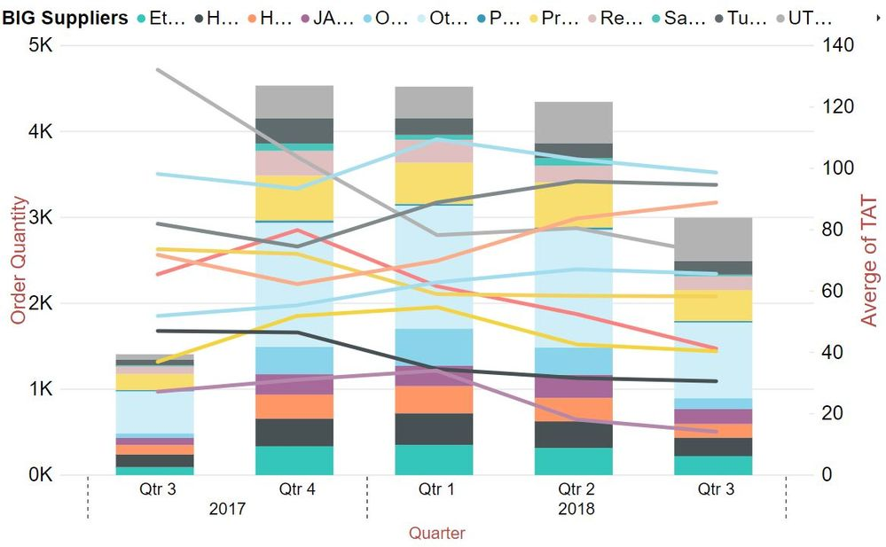

# 2.2.2 Column Chart

### Column Chart

This chart is best used to compare different values when specific values are important, and it is expected that users will look up and compare individual values between each column. With a column chart, you could compare values for different categories or compare value changes over a period of time for a single category.

**Use column chart** **when:**

* For comparison, if the number of categories is quite small — up to seven categories.
* In charts,  always set time dimension on the horizontal axis, from left to right.
* For column charts, **the numerical axis must start at zero**. 
* Only use column charts to show trends if there are a reasonably-low number of data points 

### Histogram Column Chart

Histogram is a common variation of column charts used to present the **distribution and relationships of a single variable over a set of categories.**

\*\*\*\*

### Stacked Column Chart

Stacked column charts are to show a composition. **Do not use too many composition items \( up to 4 \)** and make sure the composing parts are relatively similar in size. It can get messy very quickly.


Here is a  very messy example.


