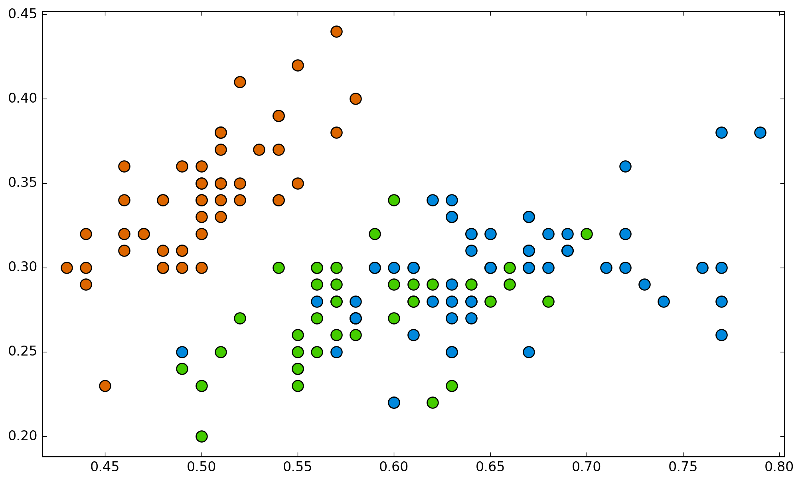
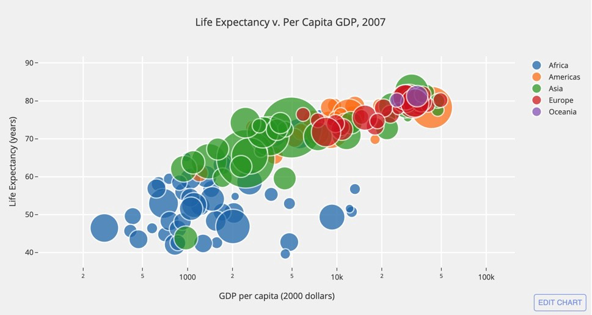

# 2.2.5 Scatter Chart

### Scatter Chart

Scatter charts are primarily used for correlation and distribution analysis. Good for showing the relationship between two different variables where one correlates to another \(or doesn’t\).


There are generally three types of correlation


**Positive -** This is when the variables move in the same direction. As one variable increases so does the other. Height and shoe size as an example are positively correlated.  
**Negative -** This is when the variables move in opposite directions. As one variable increases, the other decreases. Time spent studying and time spent on playing games as an example are negatively correlated.  
**No correlation -** There is when there is no apparent relationship between the variables. Video game scores and yearly salary as an example will appear to have no correlation; as one increases, the other has no effect.


Scatter charts can also show the data distribution or clustering trends and help you spot anomalies or outliers.


### Bubble Chart

A bubble chart is a great option if you need to add another dimension to a scatter plot chart. Scatter plots compare two values, but you can add bubble size as the third variable and thus enable comparison. If the bubbles are very similar in size, use labels.

**Use Scatter and Bubble charts when:**

* Present relationships between two \(scatter\) or three \(bubble\) numerical variables,
* Plot two or three sets of variables on one x-y coordinate plane,
* Turn the horizontal axis into a logarithmic scale, thus showing the relationships between more widely distributed elements.
* Present patterns in large sets of data, linear or non-linear trends, correlations, clusters, or outliers.
* Compare large number of data points without regard to time. The more data you include in a scatter chart, the better comparisons you can make.
* Present relationships, but not exact values for comparisons.

