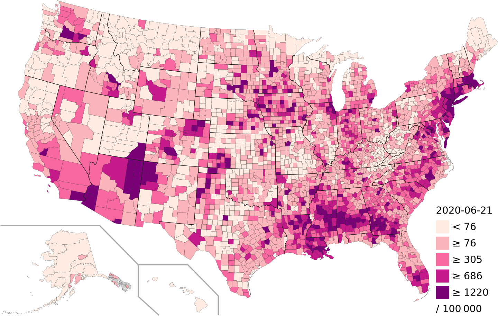
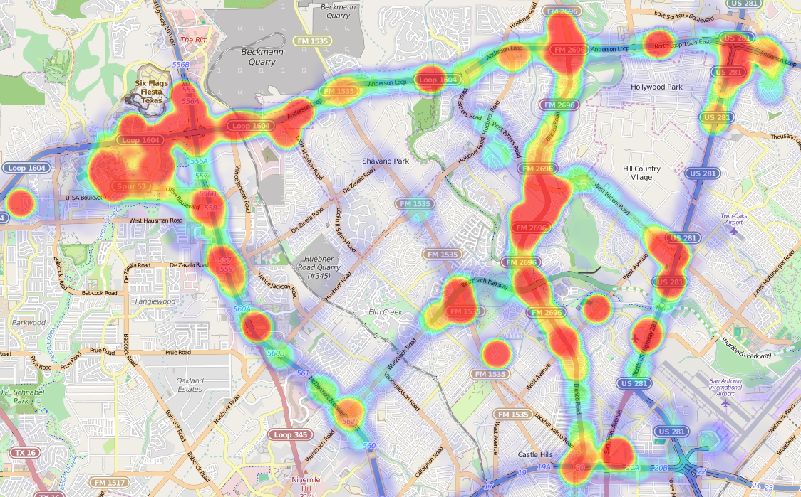

# 2.2.6  Map Chart

Map charts are good for giving your numbers a geographical context to quickly spot best and worst-performing areas, trends, and outliers. If you have any kind of location data like coordinates, country names, state names or abbreviations, or addresses, you can plot-related data on a map.

Maps are not the top choice for comparing exact values. Because map charts are usually color scaled and humans are quite bad at distinguishing shades of colors. Sometimes it’s better to use overlay bubbles or numbers if you need to convey exact values or enable comparison.

However, **don’t use maps for absolutely everything that has a geographical dimension.** Today, almost any data has a geographical dimension, but it doesn’t mean that you should display all on a map.

